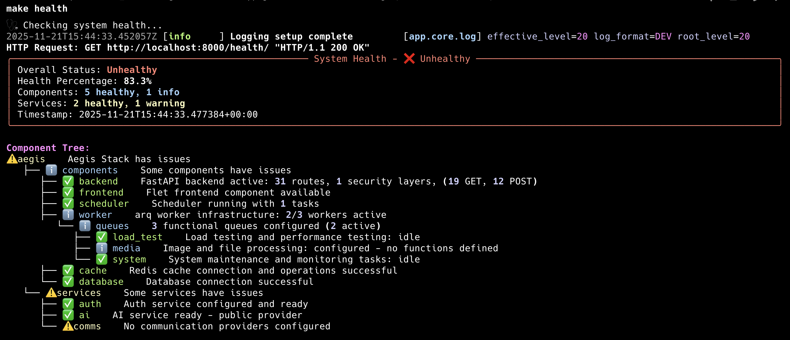

<picture>
  <source media="(prefers-color-scheme: dark)" srcset="docs/images/aegis-manifesto-dark.png">
  
</picture>

[](https://github.com/lbedner/aegis-stack/actions/workflows/ci.yml)
[](https://github.com/lbedner/aegis-stack/actions/workflows/docs.yml)
[](https://www.python.org/downloads/)

You need to ship reliable software, but management only gave you 2 weeks.

No time for health checks, proper testing, or clean architecture. Just enough time for duct tape and hope.

**What if you could go from idea to working prototype in the time it takes to grab coffee?**


Aegis Stack is a modular Python framework that grows with your projects — start with an API, add Auth, Scheduler, Workers, or AI services when you need them.

## Quick Start

```bash
# Run instantly without installation
uvx aegis-stack init my-api

# Create with user authentication
uvx aegis-stack init user-app --services auth

# Create with background processing
uvx aegis-stack init task-processor --components scheduler,worker

# Start building
cd my-api && uv sync && cp .env.example .env && make serve
```

**Installation alternatives:** See the [Installation Guide](docs/installation.md) for `uv tool install`, `pip install`, and development setup.

## 🌱 Your Stack Grows With You

**Your choices aren't permanent.** Start with what you need today, add components when requirements change, remove what you outgrow.

```bash
# Monday: Ship MVP
aegis init my-api

# Week 3: Add scheduled reports
aegis add scheduler --project-path ./my-api

# Month 2: Need async workers
aegis add worker --project-path ./my-api

# Month 6: Scheduler not needed
aegis remove scheduler --project-path ./my-api
```

| Framework | Add Later? | Remove Later? | Git Conflicts? |
|-----------|------------|---------------|----------------|
| **Others** | ❌ Locked at init | ❌ Manual deletion | ⚠️ High risk |
| **Aegis Stack** | ✅ One command | ✅ One command | ✅ Auto-handled |


Most frameworks lock you in at `init`. Aegis Stack doesn't. See **[Evolving Your Stack](docs/evolving-your-stack.md)** for the complete guide.

## See It In Action

### Overseer


Real-time monitoring dashboard showing how every component and service is performing with detailed health metrics and status information.

### CLI Health Monitoring



Rich terminal output showing detailed component status, health metrics, and system diagnostics.

## Available Components & Services

### Infrastructure Components
| Component | Purpose | Status |
|-----------|---------|--------|
| **Core** (FastAPI + Flet) | Web API + Frontend | ✅ **Always Included** |
| **Database** | SQLite + SQLModel ORM | ✅ **Available** |
| **Scheduler** | Background tasks, cron jobs | ✅ **Available** |
| **Worker** | Async task queues (arq + Redis) | 🧪 **Experimental** |
| **Cache** | Redis caching and sessions | 🚧 **Coming Soon** |

### Business Services
| Service | Purpose | Status |
|---------|---------|--------|
| **[Auth](docs/services/auth/index.md)** | User authentication & JWT | ✅ **Available** |
| **[AI](docs/services/ai/index.md)** | Multi-provider AI chat | 🧪 **Experimental** |
| **[Comms](docs/services/comms/index.md)** | Email, SMS, voice calls | 🧪 **Experimental** |

**See detailed documentation:** [Components →](docs/components/index.md) | [Services →](docs/services/index.md)

## Learn More

- **[CLI Reference](docs/cli-reference.md)** - Complete command reference
- **[About](docs/about.md)** - The philosophy and vision behind Aegis Stack
- **[Evolving Your Stack](docs/evolving-your-stack.md)** - Add/remove components as needs change
- **[Technology Stack](docs/technology.md)** - Battle-tested technology choices

## For The Veterans


No magic. No reinventing the wheel. Just the tools you already know, pre-configured and ready to compose.

Aegis Stack respects your expertise. We maintain existing standards - FastAPI for APIs, SQLModel for databases, arq for workers. No custom abstractions or proprietary patterns to learn. Pick your components, get a production-ready foundation, and build your way.

The framework gets out of your way so you can get started.