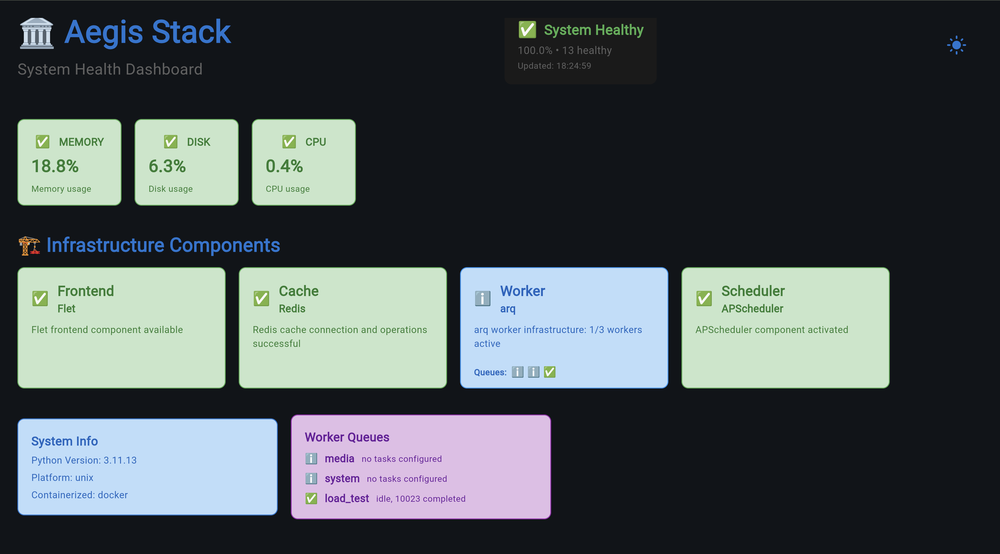

<picture>
  <source media="(prefers-color-scheme: dark)" srcset="docs/images/aegis-manifesto-dark.png">
  
</picture>

**Build production-ready Python applications with your chosen components and services.**

[](https://github.com/lbedner/aegis-stack/actions/workflows/ci.yml)
[](https://github.com/lbedner/aegis-stack/actions/workflows/docs.yml)
[](https://www.python.org/downloads/)

Aegis Stack is a CLI-driven framework for creating custom Python applications. Select exactly the components you need - no bloat, no unused dependencies.

## Quick Start

```bash
# Run instantly without installation
uvx aegis-stack init my-api

# Create with user authentication
uvx aegis-stack init user-app --services auth

# Create with background processing
uvx aegis-stack init task-processor --components scheduler,worker

# Start building
cd my-api && uv sync && cp .env.example .env && make server
```

## Installation

Choose the method that works best for your workflow:

**Instant usage (recommended):**
```bash
uvx aegis-stack init my-project
```

**Install globally with uv:**
```bash
uv tool install aegis-stack
aegis init my-project
```

**Traditional pip:**
```bash
pip install aegis-stack
aegis init my-project
```

## Available Components & Services

### Infrastructure Components
| Component | Purpose | Status |
|-----------|---------|--------|
| **Core** (FastAPI + Flet) | Web API + Frontend | ✅ **Always Included** |
| **Database** | SQLite + SQLModel ORM | ✅ **Available** |
| **Scheduler** | Background tasks, cron jobs | ✅ **Available** |
| **Worker** | Async task queues (arq + Redis) | 🧪 **Experimental** |
| **Cache** | Redis caching and sessions | 🚧 **Coming Soon** |

### Business Services
| Service | Purpose | Status |
|---------|---------|--------|
| **Auth** | User authentication & JWT | ✅ **Available** |
| **AI** | OpenAI integration | 🚧 **Coming Soon** |

## See It In Action

### System Health Dashboard



Real-time monitoring with component status, health percentages, and cross-platform deployment (web, desktop, mobile).

### CLI Health Monitoring


Rich terminal output showing detailed component status, health metrics, and system diagnostics.

## Learn More

- **[📖 CLI Reference](docs/cli-reference.md)** - Complete command reference
- **[🏗️ Components](docs/components/index.md)** - Deep dive into available components
- **[🔧 Services](docs/services/index.md)** - Business services (auth, AI)
- **[🧠 Philosophy](docs/philosophy.md)** - Architecture and design principles

## For The Veterans


No magic. No reinventing the wheel. Just the tools you already know, pre-configured and ready to compose.

Aegis Stack respects your expertise. We maintain existing standards - FastAPI for APIs, SQLModel for databases, arq for workers. No custom abstractions or proprietary patterns to learn. Pick your components, get a production-ready foundation, and build your way.

The framework gets out of your way so you can get started.