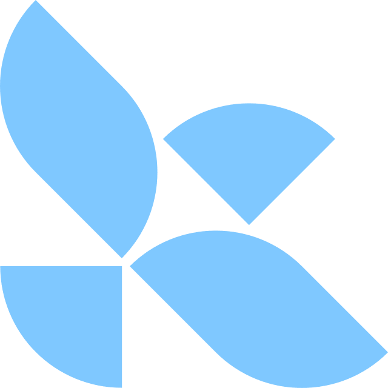
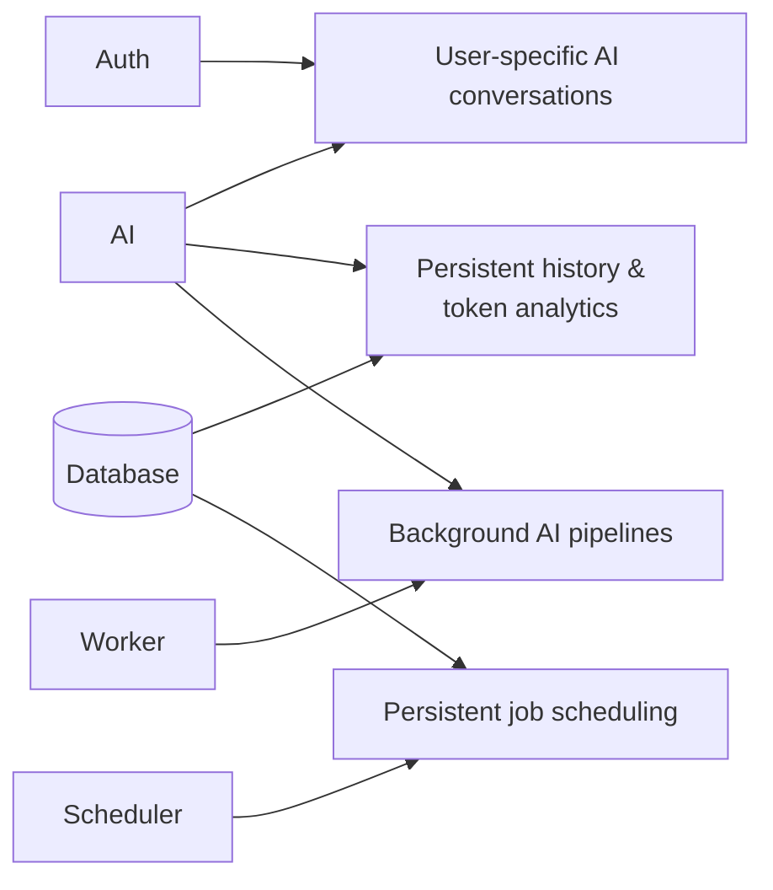

[](https://github.com/lbedner/aegis-stack/actions/workflows/ci.yml)
[](https://github.com/lbedner/aegis-stack/actions/workflows/docs.yml)
[](https://www.python.org/downloads/)
[](https://github.com/copier-org/copier)
<br>
[](https://pypi.org/project/aegis-stack/)
[](https://pepy.tech/project/aegis-stack)
<br>
[](https://github.com/lbedner/aegis-stack/commits)
[](https://github.com/lbedner/aegis-stack/commits)
[](https://github.com/lbedner/aegis-stack/commits)

You need to ship reliable software, but management only gave you 2 weeks.

No time for health checks, proper testing, or clean architecture. Just enough time for duct tape and hope.

**What if you could go from idea to working prototype in the time it takes to grab coffee?**


**Ship FastAPI apps that grow with you.**

Aegis Stack scaffolds complete FastAPI applications with auth, payments, workers, AI, and a built-in control plane. Add what you need, remove what you don't, update when the framework improves.

## Quick Start

```bash
uvx aegis-stack init my-api && cd my-api && make serve
```

<details>
<summary><strong>More examples</strong></summary>

```bash
# Add user authentication out of the box
uvx aegis-stack init user-app --services auth

# Add background processing + scheduling
uvx aegis-stack init task-processor --components scheduler,worker

# Everything wired up at init
uvx aegis-stack init full-app --services auth,payment,comms --components worker,scheduler
```

</details>

> **CLI in 9 languages:** English, German, Spanish, French, Japanese, Korean, Russian, Simplified Chinese, Traditional Chinese. Use `aegis --lang <code>` or set `AEGIS_LANG`.

**Installation alternatives:** See the [Installation Guide](https://docs.aegis-stack.io/installation/) for `uv tool install`, `pip install`, and development setup.

## Customizing Your Stack

**Components** are infrastructure pieces (database, workers, scheduler, cache). **Services** are business capabilities (auth, AI, payments, comms).

**Don't worry about what you pick today.** Add anything later with a single command, remove what you outgrow, no rework required.

### Components

| Component | What you get | |
|---|---|---|
| **[Backend](https://docs.aegis-stack.io/components/backend/)** | FastAPI + lifecycle hooks, in-memory request metrics, API load testing for every route |  |
| **[CLI](https://docs.aegis-stack.io/cli-reference/)** | Typer, first-class system interface |  |
| **[Frontend](https://docs.aegis-stack.io/components/frontend/)** | Flet, ships with the Overseer system dashboard |  |
| **[Cache](https://docs.aegis-stack.io/components/)** | Redis for caching, sessions, pub/sub |  |
| **[Database](https://docs.aegis-stack.io/components/database/)** | Postgres or SQLite + SQLModel ORM |  |
| **[Inference](https://docs.aegis-stack.io/components/)** | Local AI models via Ollama |  |
| **[Ingress](https://docs.aegis-stack.io/components/ingress/)** | Traefik v3 reverse proxy with TLS |  |
| **[Observability](https://docs.aegis-stack.io/components/observability/)** | Pydantic Logfire tracing + metrics + logging |  |
| **[Scheduler](https://docs.aegis-stack.io/components/scheduler/)** | APScheduler with persistent jobs |  |
| **[Worker](https://docs.aegis-stack.io/components/worker/)** | Pluggable Arq, Taskiq, or Dramatiq |  |

[Components Docs →](https://docs.aegis-stack.io/components/)

### Services

| Service | What you get | |
|---|---|---|
| **[AI](https://docs.aegis-stack.io/services/ai/)** | Conversational agents, RAG, model catalog, TTS and STT (PydanticAI / LangChain across 7 providers) |  |
| **[Auth](https://docs.aegis-stack.io/services/auth/)** | Persistent sessions with refresh-token rotation, GitHub/Google sign-in, RBAC, multi-tenant Organizations |  |
| **[Blog](https://docs.aegis-stack.io/services/blog/)** | Markdown publishing with drafts, tags, and an Overseer editor |  |
| **[Comms](https://docs.aegis-stack.io/services/comms/)** | Transactional email (Resend) + SMS / voice (Twilio) |  |
| **[Insights](https://docs.aegis-stack.io/services/insights/)** | Adoption metrics across GitHub, PyPI, Plausible, Reddit |  |
| **[Payments](https://docs.aegis-stack.io/services/payment/)** | Stripe checkout, subscriptions, refunds, disputes |  |

[Services Docs →](https://docs.aegis-stack.io/services/)

## Integrations

Aegis Stack is the orchestration layer. Services and components wire into best-in-class tools you already trust, so you keep your vendor choices and your data.

<table width="100%">
<tr>
<td align="center" width="16.66%"><a href="https://www.anthropic.com"><picture><source media="(prefers-color-scheme: dark)" srcset="docs/images/integrations/anthropic-dark.svg"></picture></a></td>
<td align="center" width="16.66%"><a href="https://astral.sh"><picture><source media="(prefers-color-scheme: dark)" srcset="docs/images/integrations/astral-dark.svg"></picture></a></td>
<td align="center" width="16.66%"><a href="https://www.trychroma.com"><picture><source media="(prefers-color-scheme: dark)" srcset="docs/images/integrations/chromadb-dark.svg"></picture></a></td>
<td align="center" width="16.66%"><a href="https://dramatiq.io"><picture><source media="(prefers-color-scheme: dark)" srcset="docs/images/integrations/dramatiq-dark.png"></picture></a></td>
<td align="center" width="16.66%"><a href="https://fastapi.tiangolo.com"></a></td>
<td align="center" width="16.66%"><a href="https://flet.dev"></a></td>
</tr>
<tr>
<td align="center" width="16.66%"><a href="https://github.com"><picture><source media="(prefers-color-scheme: dark)" srcset="docs/images/integrations/github-dark.svg"></picture></a></td>
<td align="center" width="16.66%"><a href="https://www.google.com"></a></td>
<td align="center" width="16.66%"><a href="https://www.langchain.com"></a></td>
<td align="center" width="16.66%"><a href="https://neon.tech"></a></td>
<td align="center" width="16.66%"><a href="https://ollama.com"><picture><source media="(prefers-color-scheme: dark)" srcset="docs/images/integrations/ollama-dark.svg"></picture></a></td>
<td align="center" width="16.66%"><a href="https://plausible.io"></a></td>
</tr>
<tr>
<td align="center" width="16.66%"><a href="https://www.postgresql.org"></a></td>
<td align="center" width="16.66%"><a href="https://pydantic.dev"></a></td>
<td align="center" width="16.66%"><a href="https://www.reddit.com"></a></td>
<td align="center" width="16.66%"><a href="https://redis.io"></a></td>
<td align="center" width="16.66%"><a href="https://resend.com"><picture><source media="(prefers-color-scheme: dark)" srcset="docs/images/integrations/resend-dark.svg"></picture></a></td>
<td align="center" width="16.66%"><a href="https://www.sqlite.org"></a></td>
</tr>
<tr>
<td align="center" width="16.66%"><a href="https://stripe.com"></a></td>
<td align="center" width="16.66%"><a href="https://supabase.com"></a></td>
<td align="center" width="16.66%"><a href="https://taskiq-python.github.io"><picture><source media="(prefers-color-scheme: dark)" srcset="docs/images/integrations/taskiq-dark.svg"></picture></a></td>
<td align="center" width="16.66%"><a href="https://traefik.io"></a></td>
<td align="center" width="16.66%"><a href="https://www.twilio.com"></a></td>
<td align="center" width="16.66%"><a href="https://typer.tiangolo.com"><picture><source media="(prefers-color-scheme: dark)" srcset="docs/images/integrations/typer-dark.svg"></picture></a></td>
</tr>
</table>

## CI/CD for Your Stack

Every generated project ships with GitHub Actions and developer tooling pre-wired, so the first push to GitHub runs checks automatically, and one command wires up continuous deployment to your server.

<table>
<thead>
<tr><th>Capability</th><th>What you get</th><th width="80">Status</th></tr>
</thead>
<tbody>
<tr><td><b>CI Workflow</b></td><td>Lint, type checking, and tests on every push and PR (parallel jobs, cached)</td><td></td></tr>
<tr><td><b>Code Scanning</b></td><td>CodeQL static analysis on every PR and on a weekly schedule</td><td></td></tr>
<tr><td><b>Pre-commit</b></td><td>Ruff, ruff-format, and type-check hooks (opt-in)</td><td></td></tr>
<tr><td><b>Continuous Deploy</b></td><td>Generates a dedicated SSH deploy key, installs it on your server, pushes secrets to GitHub, and scaffolds a deploy workflow (manual trigger by default)</td><td></td></tr>
</tbody>
</table>

## Deploying Your Stack

| Capability | What you get | |
|---|---|---|
| **[Deploy CLI](https://docs.aegis-stack.io/deployment/)** | One-command deploys to any VPS over SSH (rsync + Docker), no PaaS lock-in |  |
| **[Server Setup](https://docs.aegis-stack.io/deployment/#aegis-deploy-setup)** | `aegis deploy-setup` provisions Ubuntu, Debian, or Fedora boxes (Docker + firewall) |  |
| **[Backups & Rollback](https://docs.aegis-stack.io/deployment/#backup-and-rollback)** | `pg_dump` before every deploy, retention policy, automatic rollback on failed health checks |  |
| **[TLS / HTTPS](https://docs.aegis-stack.io/deployment/#tlshttps-with-lets-encrypt)** | Let's Encrypt via the Traefik ingress component, zero config when a domain is set |  |

[Deployment Docs →](https://docs.aegis-stack.io/deployment/)

Components compose into capabilities you didn't have to build:


```mermaid
graph LR
    Auth[Auth] --> A[User-specific AI conversations]
    AI[AI] --> A
    AI --> B[Persistent history &<br/>token analytics]
    DB[(Database)] --> B
    AI --> C[Background AI pipelines]
    Worker[Worker] --> C
    Scheduler[Scheduler] --> D[Persistent job scheduling]
    DB --> D
```

## Your Stack Grows With You

**Your choices aren't permanent.** Start with what you need today, add when requirements change, remove what you outgrow.

```bash
# Monday: Ship MVP
aegis init my-api

# Week 3: Add scheduled reports
aegis add scheduler --project-path ./my-api

# Month 2: Need async workers
aegis add worker --project-path ./my-api

# Month 6: Scheduler not needed
aegis remove scheduler --project-path ./my-api

# Stay current with template improvements
aegis update
```

| Starter | Add Later? | Remove Later? | Git Conflicts? |
|-----------|------------|---------------|----------------|
| **Others** | Locked at init | Manual deletion | High risk |
| **Aegis Stack** | One command | One command | Auto-handled |


Most starters lock you in at `init`. Aegis Stack doesn't. See **[Evolving Your Stack](https://docs.aegis-stack.io/evolving-your-stack/)** for the complete guide.

## Overseer - Your Application's Control Plane


<sub>[Live Demo: sector-7g.dev/dashboard](https://sector-7g.dev/dashboard/)</sub>

**[Overseer](https://docs.aegis-stack.io/overseer/)** is the embedded control plane that ships with every Aegis Stack project.

- Live health of every component and service in one view
- Worker queues, scheduled jobs, recent runs
- Database schema, tables, and migration state
- AI token usage and conversation history
- Auth sessions and user activity
- No external tooling, no vendor integrations, no setup

## CLI - First-Class System Interface


The Aegis CLI is a first-class interface to your running system. Not just a health check, but a full inspection layer.

- Component-aware commands for every running subsystem
- Inspect worker queues, scheduler runs, database state
- Query AI usage, auth sessions, service configuration
- Same data Overseer sees, terminal-native
- Built into every generated project, no extra installs

## Illiana - Optional System Operator


When the AI service is enabled, Aegis exposes an additional interface: **Illiana**, a conversational operator over your running system.

- Ask questions in plain language about live system state
- Backed by live telemetry from Overseer and the CLI
- Optional RAG over your codebase for code-aware answers
- Opt-in: only available when the AI service is on
- Nothing in the stack depends on her being there

## Powered By Aegis Stack

- **[Aegis Pulse](https://pulse.aegis-stack.io/)** - Package analytics with honest decomposition (Total / Filtered / Human)
- **[Sector 7G](https://sector-7g.dev/dashboard/)** - Live demo: millions of tasks on a single $5 VPS, zero restarts
- **[NWVault Revival](https://167.99.48.44/)** - Searchable archive of the original Neverwinter Vault (2002-2014), built in 24 hours

## Learn More

- **[Overseer](https://docs.aegis-stack.io/overseer/)** - Built-in system dashboard
- **[Deployment](https://docs.aegis-stack.io/deployment/)** - Deploy with backups, rollback, and health checks
- **[CLI Reference](https://docs.aegis-stack.io/cli-reference/)** - Complete command reference
- **[Evolving Your Stack](https://docs.aegis-stack.io/evolving-your-stack/)** - Add/remove components as needs change
- **[Technology Stack](https://docs.aegis-stack.io/technology/)** - Battle-tested technology choices
- **[About](https://docs.aegis-stack.io/about/)** - The philosophy and vision behind Aegis Stack

## For The Veterans


No reinventing the wheel. Just the tools you already know, pre-configured and ready to compose.

Aegis Stack respects your expertise. No custom abstractions or proprietary patterns to learn. Pick your components, get a production-ready foundation, and build your way.

Aegis gets out of your way so you can get started.
