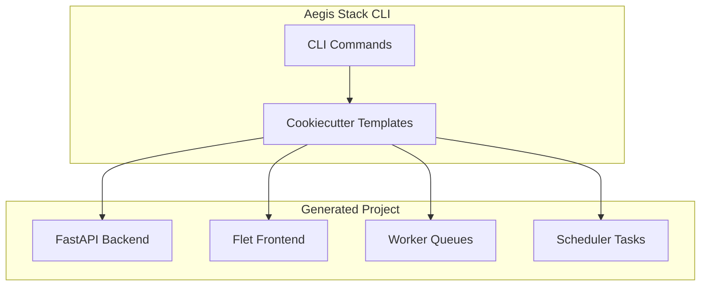
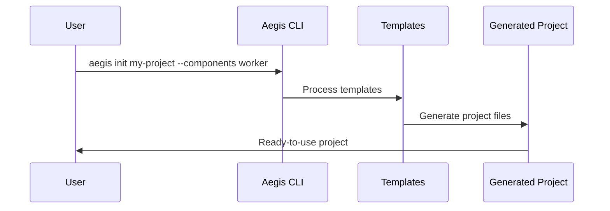
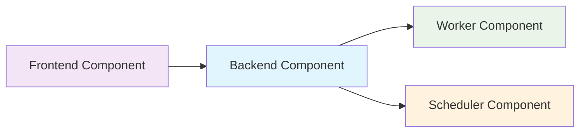

# Documentation Development Guide

This guide covers documentation standards and patterns for Aegis Stack component documentation.

## Documentation Standards

### Progressive Documentation Philosophy (v0.1.0+)

**Architecture-First Documentation**: Documentation should trail real implementations, not lead them.

**Core Principles:**
- **Lean Start**: Begin with infrastructure capabilities and basic setup
- **Real Examples**: Add concrete examples only after building actual services  
- **Avoid Hypotheticals**: No theoretical User/Post models until auth exists
- **Progressive Enhancement**: Documentation grows as the system evolves

**Implementation Strategy:**
- **Database Component**: Infrastructure setup only, real patterns come with User service
- **Worker Component**: Task execution patterns, real examples with scheduler integration  
- **Scheduler Component**: Basic scheduling, real patterns with job persistence
- **Integration Docs**: Added when multiple components work together

### Components Documentation (Voltron Philosophy)

**Components represent swappable capabilities** (web serving, scheduling, caching) with multiple implementation choices.

**Documentation Structure:**
```
docs/components/
├── index.md           # Overview of all components
├── webserver.md       # Web server capability (FastAPI impl)
├── database.md        # Database capability (SQLite/SQLModel impl) - v0.1.0
├── frontend.md        # Frontend capability (Flet impl)  
├── worker.md          # Worker capability (arq/Redis impl)
├── scheduler.md       # Scheduler capability (APScheduler impl)
└── future/            # Future components as needs emerge
```

**Component Documentation Pattern:**
1. **Current Implementation**: What's currently chosen and why
2. **Integration**: How it fits into Aegis Stack architecture
3. **Usage Examples**: Common patterns and code examples
4. **Alternative Implementations**: Other options that could be swapped in
5. **When to Choose**: Trade-offs between different implementations

**Key Principles:**
- Each component docs explains the **capability** not just the implementation
- Always document **why this choice** vs alternatives
- Include **swapping guidance** for when needs change
- Show **integration patterns** with component hook systems

**Component Generation Impact:**
When creating projects with components (`aegis init my-project --components scheduler`):
- Component-specific files included in generated project
- Docker services configured for component requirements
- Tests generated for selected components
- Documentation reflects chosen component stack

## MkDocs Configuration

### Site Structure
The documentation follows a hierarchical structure:
- **Root** (`docs/index.md`) - Project overview and getting started
- **Components** (`docs/components/`) - Component-specific documentation
- **Integration Patterns** (`docs/integration-patterns.md`) - How components work together
- **Technology** (`docs/technology.md`) - Technology choices and rationale

### Navigation Configuration
```yaml
# mkdocs.yml
nav:
  - Home: index.md
  - Components:
    - Overview: components/index.md
    - Web Server: components/webserver.md
    - Frontend: components/frontend.md
    - Worker: components/worker/index.md
  - Technology: technology.md
  - Integration Patterns: integration-patterns.md
```

### Material Theme Settings
```yaml
theme:
  name: material
  features:
    - navigation.tabs
    - navigation.sections
    - navigation.expand
    - content.code.copy
    - content.code.annotate
```

## Mermaid Diagram Patterns

### Architecture Diagrams


### Component Flow Diagrams


### Component Relationship Diagrams


## Writing Component Documentation

### Documentation Template
```markdown
# Component Name

Brief description of what this component provides.

## What This Component Adds

### Core Functionality
- Feature 1: Description
- Feature 2: Description
- Feature 3: Description

### Integration Points
- How it connects to other components
- Configuration requirements
- Service dependencies

## Usage Examples

### Basic Usage
```python
# Example code showing basic usage
```

### Advanced Patterns
```python
# Example code showing advanced patterns
```

## Configuration

### Environment Variables
- `ENV_VAR_1`: Description and default value
- `ENV_VAR_2`: Description and default value

### Component Settings
```python
# Settings example
```

## Best Practices

1. **Best Practice 1** - Description
2. **Best Practice 2** - Description
3. **Best Practice 3** - Description

## Troubleshooting

### Common Issues
- **Issue 1**: Solution
- **Issue 2**: Solution

### Debugging Commands
```bash
# Debugging command examples
```
```

### Documentation Sections

**Required Sections:**
- **Overview** - What the component does
- **Integration** - How it fits with other components
- **Usage Examples** - Practical code examples
- **Configuration** - Settings and environment variables
- **Best Practices** - Recommended patterns
- **Troubleshooting** - Common issues and solutions

**Optional Sections:**
- **Architecture** - Detailed internal structure
- **API Reference** - Function/class documentation
- **Migration Guide** - Upgrading between versions
- **Performance** - Optimization tips

## Documentation Development Workflow

### Adding New Component Documentation
1. **Create component directory** in `docs/components/`
2. **Write index.md** with component overview
3. **Add navigation** to `mkdocs.yml`
4. **Include examples** from real usage
5. **Test locally** with `make docs-serve`
6. **Update component index** to reference new component

### Updating Existing Documentation
1. **Check current state** - Ensure documentation matches code
2. **Update examples** - Verify code examples still work
3. **Check links** - Ensure internal links are valid
4. **Test locally** - View changes with live reload
5. **Consider backwards compatibility** - Note breaking changes

### Documentation Testing
```bash
# Serve documentation locally
make docs-serve

# Build static documentation
make docs-build

# Check for broken links (if configured)
mkdocs build --strict
```

## Content Style Guidelines

### Writing Style
- **Clear and concise** - Avoid unnecessary complexity
- **Action-oriented** - Use active voice and imperative mood
- **Example-driven** - Show, don't just tell
- **User-focused** - Write from the user's perspective

### Code Examples
- **Complete examples** - Show full working code
- **Commented code** - Explain complex parts
- **Real-world usage** - Use realistic scenarios
- **Copy-pasteable** - Examples should work as-is

### Formatting Standards
- **Consistent headings** - Use proper heading hierarchy
- **Code blocks** - Always specify language for syntax highlighting
- **Links** - Use descriptive link text
- **Lists** - Use parallel structure in lists

### Technical Accuracy
- **Test examples** - Verify all code examples work
- **Current versions** - Keep version numbers up to date
- **Accurate commands** - Test all command examples
- **Valid links** - Check external links regularly

## Documentation Maintenance

### Regular Updates
- **Component changes** - Update docs when components change
- **Version updates** - Update version numbers and compatibility
- **Link checking** - Verify internal and external links
- **Example validation** - Test code examples for accuracy

### Content Review
- **Technical accuracy** - Ensure information is correct
- **Clarity** - Check if explanations are clear
- **Completeness** - Verify all necessary information is present
- **Consistency** - Maintain consistent style and terminology

### User Feedback Integration
- **Common questions** - Add FAQ sections for repeated questions
- **User suggestions** - Incorporate feedback from users
- **Gap analysis** - Identify missing documentation
- **Usage patterns** - Document common use cases