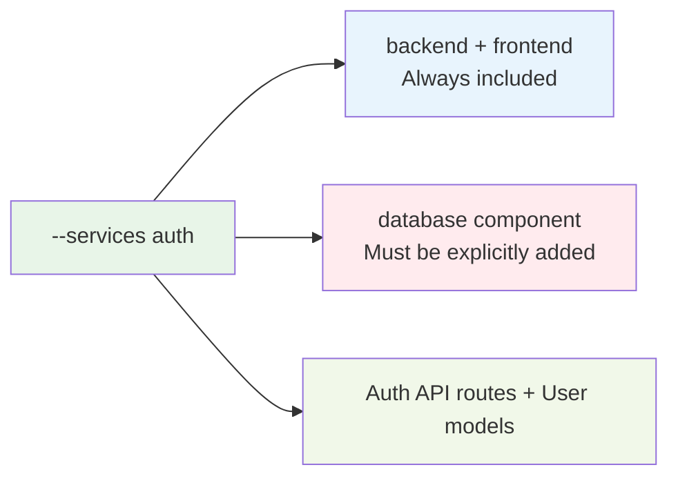

# CLI Reference

Complete reference for the Aegis Stack command-line interface.

## aegis init

Create a new Aegis Stack project with your chosen components.

**Usage:**
```bash
aegis init PROJECT_NAME [OPTIONS]
```

**Arguments:**

- `PROJECT_NAME` - Name of the new project to create (required)

**Options:**

- `--components, -c TEXT` - Comma-separated list of components (scheduler,worker,database,cache)
- `--services, -s TEXT` - Comma-separated list of services (auth,payment,ai,analytics)
- `--interactive / --no-interactive, -i / -ni` - Use interactive component selection (default: interactive)
- `--force, -f` - Overwrite existing directory if it exists
- `--output-dir, -o PATH` - Directory to create the project in (default: current directory)
- `--yes, -y` - Skip confirmation prompt

**Examples:**
```bash
# Simple API project
aegis init my-api

# Background processing system with scheduler
aegis init task-processor --components scheduler

# Background processing system with worker
aegis init task-processor --components worker

# User authentication system
aegis init user-app --services auth --components database

# Full business application
aegis init business-app --services auth,payment --components database,worker

# Non-interactive with custom location
aegis init my-app --services auth --components database --no-interactive --output-dir /projects --yes

# Combined services and components (must include auth's required components)
aegis init full-stack --services auth --components database,scheduler,worker
```

**Available Components:**

| Component | Status | Description |
|-----------|--------|-------------|
| `scheduler` | ✅ Available | APScheduler-based async task scheduling |
| `worker` | ✅ Available | Pure arq worker with multiple queues for background processing |
| `database` | ✅ Available | SQLite database with SQLModel ORM |
| `cache` | 🚧 Coming Soon | Redis-based async caching |

**Available Services:**

| Service | Status | Description | Auto-Added Components |
|---------|--------|-------------|---------------------|
| `auth` | ✅ Available | User authentication and authorization with JWT tokens | database *(backend+frontend always included)* |
| `ai` | 🚧 Coming Soon | OpenAI integration for AI features | worker *(backend+frontend always included)* |

**Service Auto-Resolution:**

When you select services, required components are automatically included:



**Important CLI Behavior:**
- `backend` and `frontend` components are always included in every project
- **All modes**: Services require their dependencies to be explicitly specified
- **Required components**: `--services auth` requires `--components database`
- Example: Must use `--services auth --components database` (auth requires database)

## aegis services

List available services and their dependencies.

**Usage:**
```bash
aegis services
```

**Example Output:**
```
🔧 AVAILABLE SERVICES
========================================

🔐 Authentication Services
----------------------------------------
  auth         - User authentication and authorization with JWT tokens
               Requires components: backend, database

💰 Payment Services
----------------------------------------
  No services available yet.

🤖 AI & Machine Learning Services
----------------------------------------
  No services available yet.
```

## aegis version

Show the Aegis Stack CLI version.

**Usage:**
```bash
aegis version
```

**Example Output:**
```
Aegis Stack CLI v1.0.0
```

## Global Options

**Help:**
```bash
aegis --help          # Show general help
aegis COMMAND --help  # Show help for specific command
```

## Exit Codes

- `0` - Success
- `1` - Error (invalid arguments, project creation failed, etc.)

## Environment

The CLI respects these environment variables:

- Standard Python environment variables
- UV environment variables (for dependency management)

## Project Structure

Projects created with `aegis init` follow this structure:

```
my-project/
├── app/
│   ├── components/
│   │   ├── backend/        # FastAPI backend
│   │   ├── frontend/       # Flet frontend  
│   │   ├── scheduler.py    # APScheduler (if included)
│   │   └── worker/         # arq worker queues (if included)
│   ├── core/              # Framework utilities
│   ├── services/          # Business logic
│   └── integrations/      # App composition
├── tests/                 # Test suite
├── docs/                  # Documentation
├── pyproject.toml         # Project configuration
├── Dockerfile             # Container definition
├── docker-compose.yml     # Multi-service orchestration
├── Makefile              # Development commands
└── .env.example          # Environment template
```

## aegis add

Add components to an existing Aegis Stack project.

**Usage:**
```bash
aegis add COMPONENTS [OPTIONS]
```

**Arguments:**

- `COMPONENTS` - Comma-separated list of components to add (scheduler,worker,database)

**Options:**

- `--backend, -b TEXT` - Scheduler backend: 'memory' (default) or 'sqlite' (enables persistence)
- `--interactive, -i` - Use interactive component selection
- `--project-path, -p PATH` - Path to the Aegis Stack project (default: current directory)
- `--yes, -y` - Skip confirmation prompt

**Examples:**
```bash
# Add scheduler with default (memory) backend
aegis add scheduler

# Add scheduler with SQLite persistence
aegis add scheduler --backend sqlite
# or using bracket syntax
aegis add "scheduler[sqlite]"

# Add multiple components at once
aegis add scheduler,database

# Add worker (auto-includes redis dependency)
aegis add worker

# Add database component
aegis add database

# Add database with other components
aegis add database,scheduler

# Add to specific project
aegis add scheduler --project-path ../my-project

# Interactive mode
aegis add --interactive
```

**Adding Database Component:**

The database component provides SQLite database with SQLModel ORM:

```bash
# Add database to existing project
aegis add database

# Add with other components
aegis add database,scheduler
```

**What Gets Added:**
- `app/core/db.py` - Database connection and session management
- SQLite database configuration (currently the only supported engine)
- Health check integration
- Shared files regenerated with database conditionals

**Database Engine:**
- Currently only SQLite is supported
- PostgreSQL and MySQL support coming in future releases

**How It Works:**

1. Validates project was generated with Copier (required)
2. Checks component dependencies (e.g., scheduler[sqlite] requires database)
3. Renders component templates with Jinja2
4. Copies files to project (skips existing files)
5. Updates `.copier-answers.yml` with new configuration
6. Regenerates shared files (docker-compose.yml, pyproject.toml)
7. Runs `uv sync` to install new dependencies
8. Runs `make fix` to format code

**Notes:**

- Components are added incrementally without breaking existing code
- Shared template files (docker-compose.yml, pyproject.toml) are automatically regenerated
- Backup files are created for shared files before overwriting (`.backup` extension)
- Changes are non-destructive (commit before running for easy rollback)

---

## aegis add-service

Add services to an existing Aegis Stack project.

**Usage:**
```bash
aegis add-service SERVICES [OPTIONS]
```

**Arguments:**

- `SERVICES` - Comma-separated list of services to add (auth,ai)

**Options:**

- `--interactive, -i` - Use interactive service selection
- `--project-path, -p PATH` - Path to the Aegis Stack project (default: current directory)
- `--yes, -y` - Skip confirmation prompt

**Examples:**
```bash
# Add auth service (auto-adds database if not present)
aegis add-service auth

# Add AI service
aegis add-service ai

# Add multiple services
aegis add-service auth,ai

# Add with custom project path
aegis add-service auth --project-path ../my-project

# Interactive service selection
aegis add-service --interactive

# Non-interactive with auto-yes
aegis add-service auth --yes
```

**Service Auto-Resolution:**

Services automatically add their required components:
- `auth` → Requires `database` component (auto-added if missing)
- `ai` → Requires `backend` component (always present)

**Post-Addition Setup:**

After adding services, follow these steps:

```bash
# For auth service
make migrate                       # Apply auth migrations
my-project auth create-test-users  # Create test users

# For AI service
# Set AI_PROVIDER in .env (openai, anthropic, google, groq)
# Set provider API key (OPENAI_API_KEY, etc.)
my-project ai chat                 # Test CLI chat interface
```

**Important Notes:**
- Only works with Copier-generated projects (default since v0.2.0)
- Requires git repository (for change tracking)
- Services require their dependencies - they will be auto-added
- Review changes with `git diff` before committing

## aegis remove

Remove components from an existing Aegis Stack project.

**Usage:**
```bash
aegis remove COMPONENTS [OPTIONS]
```

**Arguments:**

- `COMPONENTS` - Comma-separated list of components to remove (scheduler,worker,database)

**Options:**

- `--interactive, -i` - Use interactive component selection
- `--project-path, -p PATH` - Path to the Aegis Stack project (default: current directory)
- `--yes, -y` - Skip confirmation prompt

**Examples:**
```bash
# Remove scheduler component
aegis remove scheduler

# Remove multiple components
aegis remove scheduler,worker

# Remove from specific project
aegis remove scheduler --project-path ../my-project

# Interactive mode
aegis remove --interactive
```

**How It Works:**

1. Validates project was generated with Copier (required)
2. Checks component is currently enabled
3. Deletes component files and directories
4. Cleans up empty parent directories
5. Updates `.copier-answers.yml` to disable component
6. Regenerates shared files (docker-compose.yml, pyproject.toml)
7. Runs `uv sync` to clean up unused dependencies
8. Runs `make fix` to format code

**Important Warnings:**

- **THIS OPERATION DELETES FILES** - Make sure you have committed your changes to git
- Core components (backend, frontend) cannot be removed
- Removing scheduler with SQLite persistence leaves `data/scheduler.db` intact
- Shared template files are regenerated (backups created automatically)

---

## Development Workflow

After creating a project:

```bash
cd my-project
uv sync                    # Install dependencies and create virtual environment
source .venv/bin/activate  # Activate virtual environment (important!)
cp .env.example .env       # Configure environment
make server               # Start development server
make test                  # Run test suite
make check                 # Run all quality checks
```

### Evolving Your Project

```bash
# Add components as you need them
aegis add scheduler
aegis add worker

# Remove components you don't need
aegis remove scheduler

# Always commit before making changes
git add . && git commit -m "Add scheduler component"
```