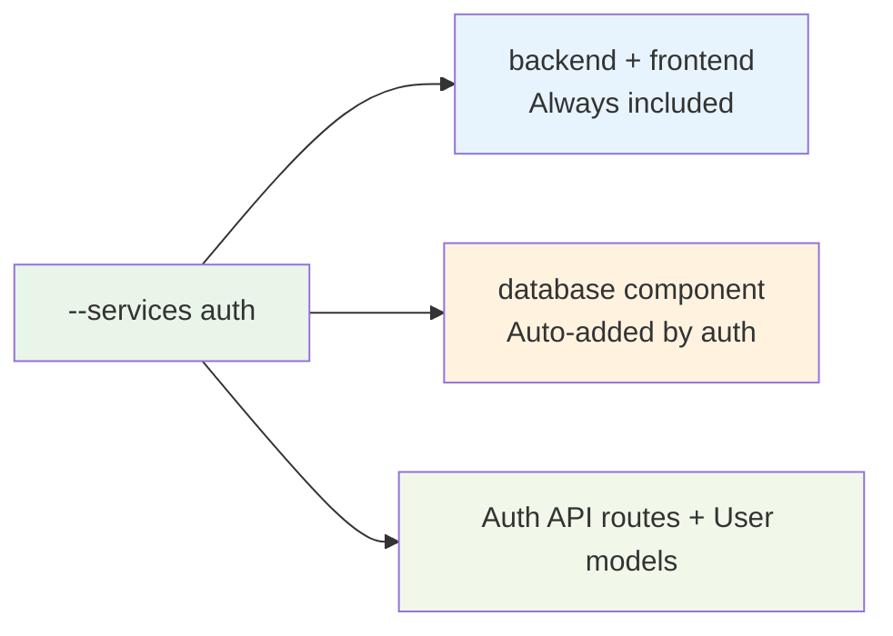

# CLI Reference

Complete reference for the Aegis Stack command-line interface.

## aegis init

Create a new Aegis Stack project with your chosen components.

**Usage:**
```bash
aegis init PROJECT_NAME [OPTIONS]
```

**Arguments:**

- `PROJECT_NAME` - Name of the new project to create (required)

**Options:**

- `--components, -c TEXT` - Comma-separated list of components (scheduler,worker,database,cache)
- `--services, -s TEXT` - Comma-separated list of services (auth,payment,ai,analytics)
- `--interactive / --no-interactive, -i / -ni` - Use interactive component selection (default: interactive)
- `--force, -f` - Overwrite existing directory if it exists
- `--output-dir, -o PATH` - Directory to create the project in (default: current directory)
- `--yes, -y` - Skip confirmation prompt

**Examples:**
```bash
# Simple API project
aegis init my-api

# Background processing system with scheduler
aegis init task-processor --components scheduler

# Background processing system with worker
aegis init task-processor --components worker

# User authentication system
aegis init user-app --services auth

# Full business application
aegis init business-app --services auth,payment --components worker

# Non-interactive with custom location
aegis init my-app --services auth --no-interactive --output-dir /projects --yes

# Combined services and components (must include auth's required components)
aegis init full-stack --services auth --components database,scheduler,worker
```

**Available Components:**

| Component | Status | Description |
|-----------|--------|-------------|
| `scheduler` | ✅ Available | APScheduler-based async task scheduling |
| `worker` | ✅ Available | Pure arq worker with multiple queues for background processing |
| `database` | ✅ Available | SQLite database with SQLModel ORM |
| `cache` | 🚧 Coming Soon | Redis-based async caching |

**Available Services:**

| Service | Status | Description | Auto-Added Components |
|---------|--------|-------------|---------------------|
| `auth` | ✅ Available | User authentication and authorization with JWT tokens | database *(backend+frontend always included)* |
| `ai` | 🚧 Coming Soon | OpenAI integration for AI features | worker *(backend+frontend always included)* |

**Service Auto-Resolution:**

When you select services, required components are automatically included:



**Important CLI Behavior:**
- `backend` and `frontend` components are always included in every project
- **Interactive mode** (`aegis init project`): Services auto-add their required components
- **Non-interactive mode** (`--components` specified): You must explicitly include all required components
- Example: `--services auth` requires `--components database` (auth won't auto-add it)

## aegis services

List available services and their dependencies.

**Usage:**
```bash
aegis services
```

**Example Output:**
```
🔧 AVAILABLE SERVICES
========================================

🔐 Authentication Services
----------------------------------------
  auth         - User authentication and authorization with JWT tokens
               Requires components: backend, database

💰 Payment Services
----------------------------------------
  No services available yet.

🤖 AI & Machine Learning Services
----------------------------------------
  No services available yet.
```

## aegis version

Show the Aegis Stack CLI version.

**Usage:**
```bash
aegis version
```

**Example Output:**
```
Aegis Stack CLI v1.0.0
```

## Global Options

**Help:**
```bash
aegis --help          # Show general help
aegis COMMAND --help  # Show help for specific command
```

## Exit Codes

- `0` - Success
- `1` - Error (invalid arguments, project creation failed, etc.)

## Environment

The CLI respects these environment variables:

- Standard Python environment variables
- UV environment variables (for dependency management)

## Project Structure

Projects created with `aegis init` follow this structure:

```
my-project/
├── app/
│   ├── components/
│   │   ├── backend/        # FastAPI backend
│   │   ├── frontend/       # Flet frontend  
│   │   ├── scheduler.py    # APScheduler (if included)
│   │   └── worker/         # arq worker queues (if included)
│   ├── core/              # Framework utilities
│   ├── services/          # Business logic
│   └── integrations/      # App composition
├── tests/                 # Test suite
├── docs/                  # Documentation
├── pyproject.toml         # Project configuration
├── Dockerfile             # Container definition
├── docker-compose.yml     # Multi-service orchestration
├── Makefile              # Development commands
└── .env.example          # Environment template
```

## Development Workflow

After creating a project:

```bash
cd my-project
uv sync                    # Install dependencies and create virtual environment
source .venv/bin/activate  # Activate virtual environment (important!)
cp .env.example .env       # Configure environment
make server               # Start development server
make test                  # Run test suite
make check                 # Run all quality checks
```