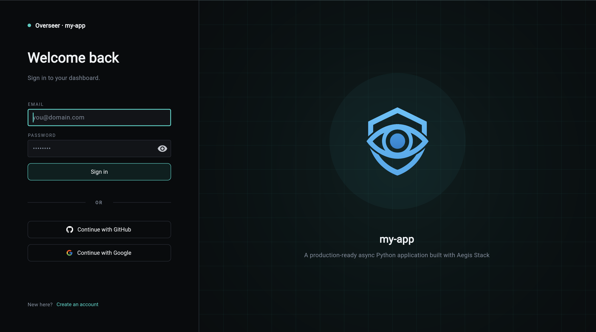

# Authentication Integration

This page covers how the auth service plugs into the **backend**: which
middleware it adds, where its rate limiting comes from, and how its
routers are registered. For the auth service itself (auth levels, JWT
configuration, OAuth providers, password hashing), see the
[Authentication service docs](../../services/auth/index.md).

When the auth service is enabled at `aegis init` time, three things
happen on the backend side. None of them require manual wiring; they
flow out of Aegis's discovery model.

## 1. SessionMiddleware (OAuth Only)

If you enable an OAuth social provider,
`app/components/backend/middleware/session.py` is generated. The
[middleware auto-discovery](middleware.md) loop picks it up and
registers Starlette's `SessionMiddleware`.

Why a session cookie when JWTs handle the post-login flow? Authlib's
`authorize_redirect` stashes the OAuth `state` token and the PKCE
verifier in the session between `/start` and `/callback`. Without the
middleware the round-trip cannot be verified and login silently fails.

Two settings:

- `OAUTH_SESSION_SECRET`: signs the session cookie. Generate a fresh
  value per environment.
- `SESSION_COOKIE_SECURE`: explicit override of the `https_only` flag.
  When unset, Aegis marks the cookie secure in every environment except
  `APP_ENV=dev`. Set it to `false` only if you are intentionally serving
  production over plain HTTP, otherwise the browser will silently drop
  the cookie and OAuth round-trips will fail.

This middleware affects **all** requests, not just OAuth ones, because
it has to be in the stack before the OAuth router runs. The cookie is
only set when an OAuth flow actually uses it.

## 2. Rate Limiting On Auth Endpoints

Rate limiting lives in
`app/components/backend/security/rate_limit.py`. The module exposes
three shared in-memory `RateLimiter` instances plus a thin
`Depends`-able wrapper for each:

```python
# app/components/backend/security/rate_limit.py
login_limiter           = RateLimiter(...)
register_limiter        = RateLimiter(...)
password_reset_limiter  = RateLimiter(...)

def login_rate_limit(request: Request) -> None: ...
def register_rate_limit(request: Request) -> None: ...
def password_reset_rate_limit(request: Request) -> None: ...
```

The dependency callables are re-exported from
`app/components/backend/api/deps.py`, which is the canonical import
surface for FastAPI deps. Route handlers stay ignorant of the
implementation module:

```python
from fastapi import APIRouter, Depends
from app.components.backend.api.deps import login_rate_limit

router = APIRouter()

@router.post("/login")
async def login(_: None = Depends(login_rate_limit), ...):
    ...
```

The auth routes use this pattern out of the box. To rate-limit your own
endpoint with a different budget, define a new limiter and dependency
in `security/rate_limit.py`, re-export from `api/deps.py`, and add the
`Depends(...)` to your route signature.

The limiter's window and burst are pulled from settings, so tuning
happens in `.env` rather than in code:

| Setting | What it controls |
| --- | --- |
| `RATE_LIMIT_LOGIN_MAX` / `RATE_LIMIT_LOGIN_WINDOW` | Login attempts per window |
| `RATE_LIMIT_REGISTER_MAX` / `RATE_LIMIT_REGISTER_WINDOW` | Registration and password-reset attempts |
| `TRUST_PROXY_HEADERS` | Read client IP from `X-Forwarded-For` when behind a reverse proxy |

Because the state is in-process, this is appropriate for single-instance
deployments. If you horizontally scale the backend, swap the in-memory
counter for a Redis-backed implementation — the dependency shape stays
the same.

## 3. Router Registration

[`api/routing.py`](routes.md) mounts the auth surface explicitly under
`/api/v1`:

```python
if include_auth:
    app.include_router(auth_router, prefix="/api/v1")

if include_oauth:
    app.include_router(oauth_router, prefix="/api/v1")

if include_auth_org:
    app.include_router(org_router, prefix="/api/v1")
```

The inner routers bring their own tags, so they group correctly in
Swagger and in Overseer's Routes tab without needing a tag at the
registration call site.

## What Changes In Overseer When Auth Is Enabled

The most immediate change is the front door: Overseer itself stops
being open. The dashboard route is gated on an authenticated session,
so visiting `/dashboard/` redirects to a login screen.



The email and password form and the "Create an account" link ship
with the base auth service. The OAuth panel below the divider only
exists when the project was generated with `auth[oauth]`, which is
what brings the SessionMiddleware and OAuth routes online. See
[Authentication Integration](#1-sessionmiddleware-oauth-only) above.

Once you're signed in, the dashboard surfaces the rest of the
auth-aware changes:

- **Protected modals**: service modals that expose sensitive data
  (auth, insights, anything with PII or write actions) require an
  authenticated session before they open. An unauthenticated session
  sees the cards but cannot drill into them.
- **Lifecycle tab**: an additional middleware row for `SessionMiddleware`
  (OAuth only). The `component_health` startup hook also registers an
  auth service health check, which surfaces on the dashboard.
- **Routes tab**: a new tag group for `authentication` (and `oauth`,
  `orgs` where enabled). Protected endpoints display a security badge
  because they declare a dependency on the auth resolver.
- **Health endpoints**: `/health` continues to be open. The auth
  service's internal checks (JWT secret presence, password hashing
  backend) are surfaced through the Overseer dashboard rather than the
  public `/health` payload.

## What This Page Does **Not** Cover

The service-level concerns live in the
[Authentication service docs](../../services/auth/index.md):

- Auth levels and per-endpoint protection.
- JWT signing keys and cookie behavior.
- Password hashing.
- OAuth provider configuration.
- The auth CLI commands.

If you are extending the auth surface, start there. If you are wiring a
new component or service that needs to know what the backend already
adds on auth's behalf, this page is the right reference.
