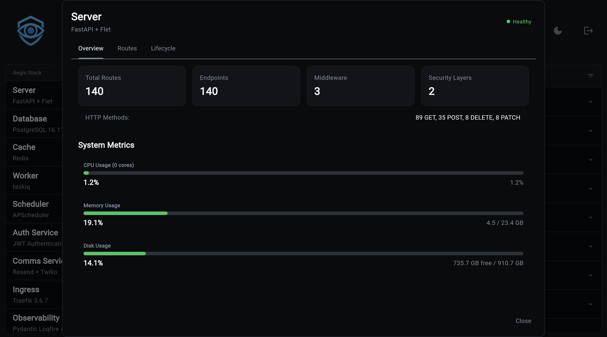

# Backend Component

The **Backend Component** is the HTTP surface of your Aegis project. It is
[FastAPI](https://fastapi.tiangolo.com/) underneath, but Aegis ships an app
factory and three drop-in directories that turn the backend into a
composition point for the rest of the stack: services register routes,
infrastructure components register middleware, and the lifespan is owned by
auto-discovered startup and shutdown hooks.

!!! example "Musings: On Backend Choices (November 2025)"
    Most of my experience is with [FastAPI](https://fastapi.tiangolo.com/), but I did have the chance to do some [Flask](https://flask.palletsprojects.com/) work in a production environment this past summer, and it was rather fun.

    Regarding using it as a backend, I mean, it's just another backend to learn, and if I can just deal with the sync/async stuff, it's something I can confidently say I wouldn't mind throwing in as an option.

    Of course, with Flet as the frontend (though perhaps forced dependency goes away?), FastAPI will always be there as its own backend. But all API related stuff is handled in Flask... In theory...

## What Aegis Adds On Top Of FastAPI

If you have used FastAPI before, you have written something like:

```python
app = FastAPI()
app.add_middleware(CORSMiddleware, ...)
app.include_router(my_router)

@app.on_event("startup")
async def on_startup(): ...
```

Aegis splits that single call site into four:

| Concern | Where it lives | Discovery |
| --- | --- | --- |
| App factory | `app/components/backend/main.py` | Explicit |
| Middleware | `app/components/backend/middleware/*.py` | Auto-discovered |
| Startup / shutdown | `app/components/backend/startup/*.py`, `shutdown/*.py` | Auto-discovered |
| Routers | `app/components/backend/api/routing.py` | Explicit |

The reasoning is asymmetric on purpose. Middleware and lifecycle hooks are
infrastructure: components and services should be able to drop one in
without editing a central file. Routers are the public surface of the
application, so they stay in one explicit registry where you can see the
whole API shape at a glance.

## Request Flow

```
HTTP request
    |
    v
+---------------------------------------+
| Middleware stack (auto-discovered)    |
|   CORS                                |
|   SessionMiddleware  (if auth+oauth)  |
|   Logfire tracing    (if observ.)     |
|   ...your middleware...               |
+---------------------------------------+
    |
    v
+---------------------------------------+
| Router (explicit in api/routing.py)   |
|   /health, /api/v1/*, /events/*, ...  |
+---------------------------------------+
    |
    v
+---------------------------------------+
| Endpoint function -> service layer    |
+---------------------------------------+
```

The lifespan wraps this whole flow. On boot, `startup_hook` functions in
`startup/*.py` run in discovery order. On shutdown, `shutdown_hook`
functions in `shutdown/*.py` run in **reverse** order so resources unwind
in the opposite order they were acquired.

## Anatomy Of `app/components/backend/`

```
app/components/backend/
├── main.py              # create_backend_app() + get_configured_app()
├── hooks.py             # BackendHooks: discovery + execution machinery
├── middleware/          # Auto-discovered middleware modules
├── startup/             # Auto-discovered startup hooks
├── shutdown/            # Auto-discovered shutdown hooks
└── api/
    ├── routing.py       # The single explicit router registry
    ├── health.py        # Health endpoints (always present)
    └── ...              # Service routers (auth, ai, payment, etc.)
```

`create_backend_app(app)` in `main.py` is the single entry point: it stashes
the configured app for later introspection, runs middleware discovery
against `middleware/`, and calls `include_routers(app)` from
`api/routing.py`. Lifespan hooks are wired separately so they run inside
FastAPI's lifespan context, not at import time.

## Inspecting The Backend In Overseer

Open the Aegis dashboard and click the **Backend** card. The modal has
three tabs that mirror the four concerns above:

- **Overview**: route count, endpoint count, middleware count, security
  layer count, plus host system metrics (CPU, memory, disk).
- **Routes**: every registered route, grouped by OpenAPI tag, with method
  badges, path parameters, response models, and dependency info. See
  [Routes](routes.md).
- **Lifecycle**: a flow diagram of startup hooks, middleware stack, and
  shutdown hooks, with an inspector panel for the selected item. See
  [Lifecycle](lifecycle.md).




The dashboard pulls this data from cached metadata that the
`component_health` startup hook builds when the app boots. If you add a
new middleware or hook, restart the backend and it shows up automatically.

## Next Steps

- [Middleware](middleware.md): the auto-discovery contract, the middleware
  that ships in the templates, and how to add your own.
- [Lifecycle](lifecycle.md): startup and shutdown hooks, ordering rules,
  and the Overseer Lifecycle tab.
- [Routes](routes.md): how routers are registered, what each conditional
  block maps to, and how to add one.
- [Authentication Integration](auth.md): how the auth service plugs into
  the backend through SessionMiddleware, rate limiting, and router
  registration.
