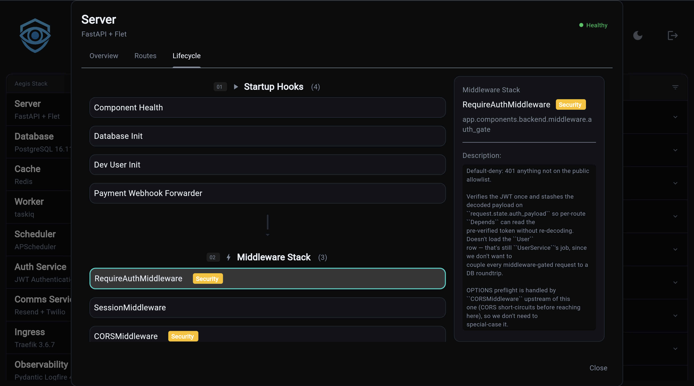

# Lifecycle

The backend's lifespan is composed of **startup hooks** and **shutdown
hooks**, auto-discovered from
`app/components/backend/startup/` and `app/components/backend/shutdown/`.
This is the place to open a database connection, register health checks,
spawn a supervised subprocess, or release any of the above on the way
out.

## The Auto-Discovery Contract

`app/components/backend/hooks.py` walks both directories at startup,
imports every `*.py` module whose name does not begin with `_`, and binds
any module-level `startup_hook` callable into the lifespan. Same for
`shutdown_hook` in `shutdown/`.

```python
# app/components/backend/startup/your_hook.py
from app.core.log import logger

async def startup_hook() -> None:
    """Description shows up in Overseer's Lifecycle inspector."""
    logger.info("Doing the thing...")
```

```python
# app/components/backend/shutdown/your_hook.py
from app.core.log import logger

async def shutdown_hook() -> None:
    """Description shows up in Overseer's Lifecycle inspector."""
    logger.info("Releasing the thing...")
```

Important details:

- **The function name is exact: `startup_hook` or `shutdown_hook`.** A
  module that does not export one of those is ignored. You can give the
  real implementation any name you want and assign it at the bottom of
  the module (`startup_hook = my_real_function`) — that is how the
  built-in `database_init.py` and `payment_webhook_forwarder.py` modules
  are structured.
- **Sync or async, both are supported.** `hooks.py` inspects the
  callable and awaits it when it is a coroutine function.
- **Startup runs in discovery order. Shutdown runs in reverse.** That
  way a hook that depends on something a later startup hook produced
  will tear down before the producer does.
- **Failures behave differently.** A startup hook that raises **stops
  the boot** (the exception propagates out of the lifespan). A shutdown
  hook that raises is logged and the remaining shutdown hooks continue
  to run — you should never lose a cleanup because an earlier one
  blew up.
- **The hook's docstring is what Overseer shows in its Lifecycle
  inspector.** Write it as a description, not a free-form note.

## Startup vs Middleware

If you find yourself reaching for a startup hook, sanity-check the
choice against middleware:

| Concern | Use |
| --- | --- |
| Add an ASGI layer around every request | Middleware |
| Configure or instrument the FastAPI app object | Middleware |
| Open a resource, spawn a subprocess, populate a cache | Startup hook |
| Register a health check, scheduled job, or feature flag | Startup hook |
| Bind a route conditionally | Router registration (see [Routes](routes.md)) |

Middleware registration is sync and happens at import time. Startup
hooks run inside the event loop, so they are where you do anything
async or anything that needs the database to be reachable.

## Hooks That Ship In The Templates

The following modules live under `app/components/backend/startup/` and
`shutdown/` in a generated project, gated on the components and services
you enabled.

### `startup/component_health.py`

Always present. Caches route metadata, middleware metadata, and
lifecycle metadata once at boot using introspection helpers from
`app.services.backend.*_inspector`. Then registers health check
callables for every component and service in the stack against
`app.services.system.health`. The cached metadata is what feeds
Overseer's Overview, Routes, and Lifecycle tabs — if you add a
middleware or router after boot, restart so this hook re-caches it.

### `startup/database_init.py` (database only)

Always present when the database component is included. Behavior
varies by engine:

- **SQLite:** creates the database directory, calls
  `SQLModel.metadata.create_all(engine)`, then runs a schema mismatch
  check that compares SQLModel metadata against the live schema and
  logs missing tables or columns.
- **Postgres without migrations:** same `create_all` flow.
- **Postgres with services that own migrations** (auth, blog, insights,
  payment, AI with non-memory backend): runs Alembic `upgrade head`
  programmatically. Before running, it checks for stale revisions left
  behind by `-f` regenerations and for pre-existing tables left behind
  by persisted Docker volumes, stamping them as applied so migrations
  can converge.

Failures here re-raise. A backend that cannot reach its database has
no business serving traffic.

### `startup/payment_webhook_forwarder.py` (payment only)

Spawns `stripe listen` as a supervised subprocess when all of:

1. `STRIPE_SECRET_KEY` starts with `sk_test_`.
2. `STRIPE_WEBHOOK_SECRET` is empty.
3. The `stripe` CLI is on `PATH`.

Captures the `whsec_...` signing secret stripe-cli prints on first
connection and injects it into the payment provider so a fresh project
with only `STRIPE_SECRET_KEY` set can receive end-to-end test webhooks
with zero extra configuration. Missing any of the three gates logs a
single line and no-ops; this hook must degrade silently in CI, Docker
without stripe-cli, and production.

### `shutdown/cleanup.py`

Always present. Placeholder graceful-shutdown logger. Add code here for
any teardown that does not have a dedicated module.

### `shutdown/payment_webhook_forwarder.py` (payment only)

Pairs with the startup forwarder. Sends SIGTERM, waits up to 3
seconds, then escalates to SIGKILL. No-op when the startup gate
didn't pass.

## Authoring A Hook

A common pattern: open a resource on startup, close it on shutdown.
The two modules share state via a module-level variable in the
startup module that the shutdown module imports.

```python
# app/components/backend/startup/cache_warmer.py
from app.core.log import logger

_warm_task = None

async def _warm_loop() -> None:
    # ... periodic warm-up work ...
    pass

async def startup_hook() -> None:
    """Spawn the background cache warmer."""
    global _warm_task
    import asyncio
    _warm_task = asyncio.create_task(_warm_loop())
    logger.info("Cache warmer started")
```

```python
# app/components/backend/shutdown/cache_warmer.py
from app.components.backend.startup import cache_warmer as _warmer
from app.core.log import logger

async def shutdown_hook() -> None:
    """Cancel the background cache warmer."""
    task = _warmer._warm_task
    if task is not None:
        task.cancel()
        logger.info("Cache warmer stopped")
```

Restart the backend and both hooks show up in Overseer's Lifecycle
tab, with their docstrings as descriptions.

## Inspecting Lifecycle In Overseer

The Backend modal's **Lifecycle** tab renders the boot pipeline as three
lanes:

```
[ Startup Hooks ]  ->  [ Middleware Stack ]  ->  [ Shutdown Hooks ]
```

Each lane shows a card per registered item with its name and module
path. Clicking a card opens the inspector on the right with the full
docstring and any extra metadata the introspector exposed. Middleware
cards additionally show a security badge for layers that participate in
auth (SessionMiddleware, anything tagged as security in the route
metadata).



If a hook you added is not visible, three things to check:

1. The function is named exactly `startup_hook` or `shutdown_hook`.
2. The filename does not start with `_`.
3. The backend was restarted after the file was created — the cache
   is built once at boot.

## Reference

- `app/components/backend/hooks.py`: discovery and execution
  (`_discover_startup_hooks`, `_discover_shutdown_hooks`,
  `execute_startup_hooks`, `execute_shutdown_hooks`).
- `app/components/backend/startup/component_health.py`: where the
  Lifecycle tab metadata originates.
- [Middleware](middleware.md): for sync, request-path concerns.
- [Routes](routes.md): for endpoint registration.
