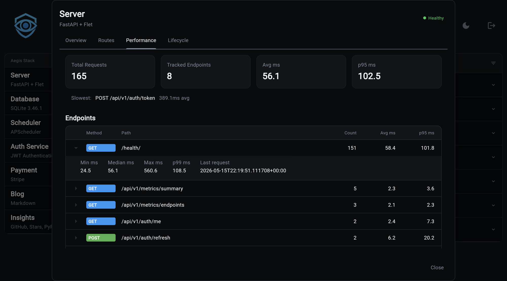

# Performance Middleware

Every Aegis project ships with built-in request timing. You don't have
to enable it, configure it, or stand anything up. Open the Server
card on the dashboard, click the Performance tab, and you see live
per-endpoint stats for your running backend.

It is meant for **live debugging of the current process**. There is
no database, no Redis, no external collector. Stats live in the
process and reset when the backend restarts. For durable,
cross-process telemetry, add the
[observability component](../../observability.md) (Logfire, OTEL);
this is the always-on view that does not need it.

## What You Get

Every HTTP request is timed and bucketed by its route pattern
(`/users/{id}`, not `/users/123`), so many real requests collapse
into one row. For each endpoint you see:

- Request count
- Average, min, max response time
- Median, p95, p99 response time
- Time of the most recent request

Plus a cross-endpoint roll-up: total requests, slowest endpoint,
global average and p95.

Every response also carries an `X-Response-Time` header in
milliseconds, so the same data is available to clients without
opening the dashboard.

## Where You See It

### Performance Tab

Dashboard, Server card, Performance tab. The tab fetches the latest
numbers on every open and renders an expandable table sorted by
call count. Click a row to see the full distribution.

A fresh process with no traffic yet shows an empty-state message
rather than a zero-row table.

### Metrics API

| Endpoint | Returns |
|---|---|
| `GET /api/v1/metrics/summary` | Cross-endpoint roll-up |
| `GET /api/v1/metrics/endpoints` | Per-endpoint detail, keyed by `"<METHOD> <pattern>"` |

Both are auth-gated when the auth service is included, and open
otherwise.

## Caveats

!!! warning "One counter per worker"
    Under multiple worker processes (gunicorn `-w 4`,
    uvicorn `--workers 4`), each worker keeps its own independent
    counter. The modal shows whichever worker happened to handle
    your request, and successive opens can disagree. For aggregated
    cross-worker telemetry, route through the observability
    component instead.

!!! warning "Resets on restart"
    No persistence. Restart the backend and every count drops to
    zero. This is intentional: the goal is "what's slow right now,"
    not historical trend analysis. If you want history, use
    observability.

## Percentiles Are A Recent Window

Counts, averages, min, and max are all-time over the current
process. **Percentiles (median, p95, p99) are computed over the most
recent 100 samples per endpoint**, which keeps the math cheap and
the memory bounded. The trade-off: percentiles track recent
behavior rather than the whole lifetime, so a deploy that slowed
down an hour ago stops showing in p95 once 100 newer requests have
landed.

This is usually what you want when you're looking at "is the app
slow *right now*."

## When To Reach For Observability Instead

This middleware is great at: live debugging, cheap percentiles per
endpoint, sanity-checking a deploy, finding the obviously slow
route. It is not a replacement for proper observability, and is bad
at: anything that needs history, anything that needs to aggregate
across worker processes, anything that needs alerting, anything
involving traces or downstream calls.

Add observability when you outgrow the in-process view. The two
coexist; you don't have to pick.
