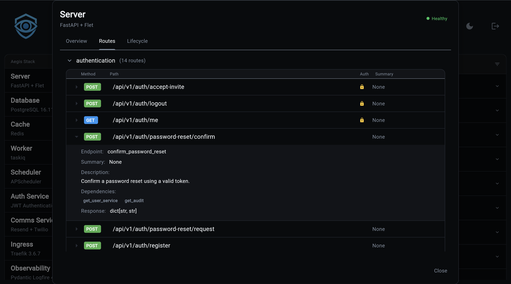

# Routes

Unlike [middleware](middleware.md) and [lifecycle hooks](lifecycle.md),
routers in Aegis are **explicitly** registered. There is exactly one
place in the backend where every public route is wired up:
`app/components/backend/api/routing.py`.

That asymmetry is intentional. Middleware and hooks are infrastructure
that services drop in; the public surface of the application should be
visible in a single registry so you can audit it at a glance.

## The Registry

`include_routers(app)` is called by `create_backend_app()` after
middleware discovery. The template version reads roughly:

```python
# app/components/backend/api/routing.py
def include_routers(app: FastAPI) -> None:
    app.include_router(health.router, prefix="/health", tags=["health"])

    # Worker (if include_worker)
    app.include_router(worker.router, prefix="/api/v1")
    app.include_router(task_history.router, prefix="/api/v1")
    app.include_router(worker_events.router, prefix="/events", tags=["events"])

    # Scheduler (if scheduler_backend != "memory")
    app.include_router(scheduler.router, prefix="/api/v1")

    # Auth (if include_auth)
    app.include_router(auth_router, prefix="/api/v1")
    # OAuth (if include_oauth)
    app.include_router(oauth_router, prefix="/api/v1")
    # Orgs (if include_auth_org)
    app.include_router(org_router, prefix="/api/v1")

    # AI service routers (if include_ai)
    app.include_router(ai_router)
    app.include_router(voice_router, prefix="/api/v1")   # ai_voice
    app.include_router(llm_router, prefix="/api/v1")     # ai_backend != memory + ollama
    app.include_router(rag_router, prefix="/api/v1")     # ai_rag

    # Other service routers
    app.include_router(comms_router, prefix="/api/v1")   # include_comms
    app.include_router(insights_router, prefix="/api/v1")
    app.include_router(payment_router, prefix="/api/v1") # include_payment
    app.include_router(payment_pages_router)
    app.include_router(blog_router, prefix="/api/v1")    # include_blog

    # Plugin routers
    for router in plugin_routers:
        app.include_router(router, ...)
```

(The actual file is a Copier template; the `if include_*` gates are
Jinja conditionals, so a generated project only contains lines for the
services it enabled.)

A few conventions to notice:

- **`/health` is always present.** It carries no version prefix because
  the health surface is used by orchestrators (Docker, Kubernetes,
  Overseer) that should not have to know about API versions.
- **Versioned APIs live under `/api/v1`.** Every service-owned router
  mounts there. When the API contract changes incompatibly, the next
  router goes under `/api/v2` and lives alongside the old one until
  consumers migrate.
- **Tags are set at registration time when the inner router does not
  set them.** The auth, AI, payment, and similar routers bring their
  own `tags=` declarations because their internal grouping is more
  nuanced than a single top-level tag.
- **Worker events mount at `/events`.** Server-Sent Events are not a
  versioned REST surface.

## Adding A Router

The pattern is the one already used by every service:

**1. Define the router.**

```python
# app/components/backend/api/reports.py
from fastapi import APIRouter

from app.services.reports import generate_weekly_summary

router = APIRouter()

@router.get("/reports/weekly")
async def weekly() -> dict[str, object]:
    return await generate_weekly_summary()
```

**2. Register it explicitly.**

```python
# app/components/backend/api/routing.py
from app.components.backend.api import reports

def include_routers(app: FastAPI) -> None:
    # ... existing registrations ...
    app.include_router(reports.router, prefix="/api/v1", tags=["reports"])
```

Restart the backend. The route appears in the OpenAPI schema at
`/openapi.json`, in Swagger at `/docs`, and in Overseer's Routes tab.

## Inspecting Routes In Overseer

The Backend modal's **Routes** tab renders the full registered surface
grouped by OpenAPI tag. Each route card shows:

- HTTP method badge (color-coded by method).
- Path with parameter slots highlighted.
- Response model name (if declared).
- Dependency chain (`Depends(...)` callables that resolve before the
  endpoint runs).
- A security badge when the endpoint requires authentication.

Because the Routes tab reads from cached metadata built by the
`component_health` startup hook, anything you add at runtime (rare, but
possible via the FastAPI app object) will not appear until the next
restart. Anything registered through `include_routers` shows up
automatically.



## Standard Endpoints Provided By FastAPI

Aegis does not strip FastAPI's defaults:

- `/openapi.json`: machine-readable schema.
- `/docs`: Swagger UI.
- `/redoc`: ReDoc UI.

These are excluded from Logfire's HTTP instrumentation along with
`/health/*` and `/dashboard/*`. See
[middleware -> logfire_tracing](middleware.md#logfire_tracingpy-observability-only).

## Reference

- `app/components/backend/api/routing.py`: the registry above.
- `app/components/backend/api/health.py`: the health endpoints, always
  present.
- `app/components/backend/main.py`: `create_backend_app` calls
  `include_routers(app)` right after middleware discovery.
- Service-owned routers live under `app/components/backend/api/<service>/`
  for services that ship multiple sub-routers (auth, AI, payment,
  comms, blog, insights, orgs).
