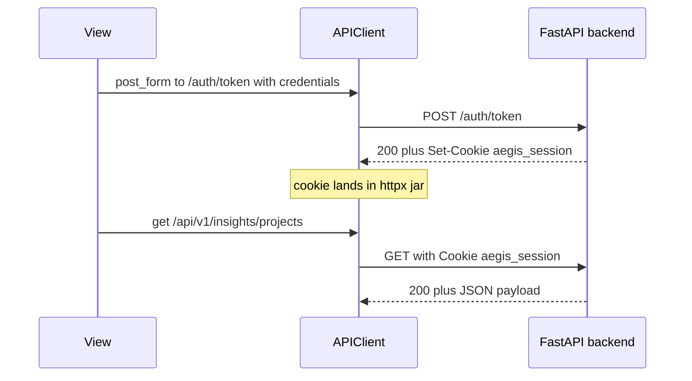

# API Client

`APIClient` (in `app/core/client.py`) is the **One True Client** for the
Aegis frontend. Every server call from a view, modal, or service should go
through it. Raw `httpx.AsyncClient` use outside this module is a code smell.

It does three things that the rest of the frontend relies on:

1. Wraps a long-lived `httpx.AsyncClient` whose cookie jar persists across
   requests within a session.
2. Carries the HttpOnly `aegis_session` cookie automatically once the
   backend issues it.
3. Calls an `on_unauthorized` handler on 401, which is what drives the
   "session expired, send the user to /login" path.

Although this lives under `app/core/`, the pattern is frontend-agnostic.
A future htmx or other Python front end would use the same client; the
fact that Flet hosts it is incidental.

## Shape

```python
class APIClient:
    def __init__(
        self,
        base_url: str | None = None,
        timeout: float = 10.0,
        on_unauthorized: UnauthorizedHandler | None = None,
    ) -> None: ...

    async def get(self, endpoint: str, params: dict | None = None) -> dict | list | None: ...
    async def post(self, endpoint: str, json: dict | None = None) -> dict | list | None: ...
    async def post_form(self, endpoint: str, data: dict[str, str]) -> dict | list | None: ...
    async def aclose(self) -> None: ...
    def clear_cookies(self) -> None: ...
```

The verbs return parsed JSON (`dict | list`) on 2xx and `None` on error.
Errors are logged inside the client; callers check for `None` (or for the
expected type) rather than catching exceptions on every call.

## One client per session

`APIClient` is constructed once during the per-session bootstrap and
attached to [`SessionState`](state.md):

```python
# app/components/frontend/main.py (excerpt)
api_client = APIClient(on_unauthorized=_handle_unauthorized)
init_session_state(page, api_client=api_client)
```

Why per-session rather than per-call:

- **The cookie jar has to persist.** A fresh `httpx.AsyncClient` on every
  call would mean a fresh empty jar on every call. The `aegis_session`
  cookie would never make it back to the server.
- **Connection pooling.** httpx reuses keep-alive connections inside an
  `AsyncClient`. Constructing a new client per call defeats it.
- **Isolation between sessions.** Two browser tabs (two Flet sessions)
  get two `APIClient` instances, so their cookie jars cannot bleed into
  each other. Sign-in as User A in one tab does not authenticate User B's
  tab.

`APIClient.aclose()` releases the underlying connection pool and runs
exactly once per session, from `clear_session_state(page)`. See
[Session State](state.md#teardown) for why it does not fire on
`on_disconnect`.

## The cookie jar and the auth flow

The backend issues `Set-Cookie: aegis_session=<token>; HttpOnly` on:

- `POST /api/v1/auth/token` (username + password sign-in)
- `POST /api/v1/auth/register`
- The OAuth callback redirect

`httpx.AsyncClient` parses `Set-Cookie` and adds the cookie to its jar
automatically. Every subsequent request on the same client includes it
in the `Cookie:` header. The view code does not need to know about it.



Logout (`sign_out(page)` in `app/components/frontend/auth/session.py`):

1. POSTs `/api/v1/auth/logout` so the backend can revoke server-side.
2. Calls `api.clear_cookies()` to drop the jar locally. This is
   belt-and-braces against a partial-failure replay even if the
   server-side `delete-cookie` response was honored.

## `on_unauthorized`: the 401 handler

`APIClient` accepts a callback that fires when the backend returns 401.
The Aegis bootstrap wires this to a handler that signs the user out
locally and routes them to `/login`. The contract:

- The handler can be sync or async; `APIClient` dispatches both.
- A re-entry guard (`_in_unauthorized`) stops the canonical recursive
  case from looping forever. `sign_out` itself calls `/auth/logout`,
  which 401s when the cookie is already stale, which is exactly when the
  handler is firing.
- A second guard (`_in_refresh`) covers the refresh-on-401 retry layer:
  if `/auth/refresh` itself returns 401, the client does not try to
  refresh again.

## What the API client deliberately does not do

- **No response model coercion.** Endpoints return JSON; the client
  returns `dict | list | None`. Views are free to pass the payload to a
  Pydantic model for validation, but the client does not enforce one.
  This keeps it usable across every endpoint without per-call generics.
- **No retry loop.** Exactly one retry is built in for the
  refresh-on-401 path; everything else is a single shot. Aegis does not
  silently retry user-initiated calls.
- **No caching.** The client is a thin wrapper. Caching, when wanted,
  goes one layer up (the view's `_reload` method, or a service that
  memoizes on top of the client).

## Why this lives in `app/core/` and not `frontend/`

`app/core/` is app-scoped: nothing in it takes a `page`. `APIClient`
qualifies because it has no Flet dependency; it is just an httpx wrapper.
The fact that Aegis instantiates one per Flet session is an integration
detail handled by `init_session_state`. A second front end (or a CLI
client, or a script) could import `APIClient` directly without pulling
Flet in.

## Next Steps

- [Events](events.md): the page lifecycle that triggers
  `is_authenticated()` (which uses the client) on every connect and
  protected route change.
- [Example](example.md): a view that uses the client end-to-end.
