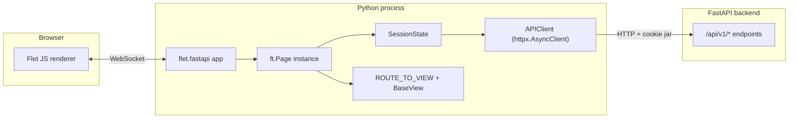

# Architecture

Flet is not a SPA. If you came in expecting React-on-the-server or
htmx-over-websocket, the mental model is different enough to matter, and
guessing wrong leads to bad assumptions about where state lives, what
"refresh" means, and why the API client exists at all.

## The runtime



The browser holds a thin renderer. It does not own state. It does not run
your Python. When the user clicks a button, the click is serialized over the
WebSocket; the handler runs in Python on the server; the resulting widget
diff is sent back. The visible UI is a projection of a Python widget tree.

## What lives where

| Lives in browser | Lives in Python process |
| --- | --- |
| Rendered DOM | `ft.Page` instance |
| `page.client_storage` (browser localStorage) | `SessionState` (`page.data["session_state"]`) |
| Cookies (HttpOnly `aegis_session`) | `APIClient` + its `httpx` cookie jar |
| Visual scroll position | Every control instance, every callback |

The cookie is the interesting case. The backend sets `aegis_session` as
HttpOnly, so JavaScript never sees it. In a Flet deployment the **server's**
httpx client carries it on outbound calls; the browser never touches it
directly. The result is that auth feels seamless to view code (`api.get(...)`
just works) and the token is unreachable from any browser-side JS.

## One WebSocket per session

Each browser tab gets its own Flet session, its own `ft.Page`, and its own
`SessionState`. There is no cross-session sharing by default. If two tabs
sign in as the same user, the two sessions are independent: separate
`APIClient` instances, separate `current_user`, separate widget trees.

**Reconnect:** if the WebSocket drops (laptop closes, network blip, server
restart) Flet fires `on_disconnect` and then `on_connect` on reconnect. The
session may or may not be the same one: a transient blip preserves it; a
real restart creates a fresh `SessionState`. Aegis treats `on_connect` as
"check whether this session is still authenticated and tell the active view
to refresh its data" rather than "mount everything from scratch".

**Refresh:** a browser refresh tears the WebSocket down and starts a new
one. The Python session is fresh; the cookie comes back from the browser on
the first request inside the new session, so auth survives, but in-memory
state does not. This is why `BaseView` has both `on_enter` (mount) and
`on_refresh` (re-mount on browser refresh) — see
[Routing & Views](routing.md).

## Mounting onto FastAPI

The Flet app is mounted as a sub-application of the same FastAPI process
that serves the API:

```python
# app/integrations/main.py
import flet.fastapi as flet_fastapi
from app.components.frontend.main import create_frontend_app
from app.core.config import settings

session_handler = create_frontend_app()
flet_app = flet_fastapi.app(session_handler, assets_dir=settings.FLET_ASSETS_DIR)
app.mount("/dashboard", flet_app)
```

`flet_fastapi.app_manager.start()` and `shutdown()` are wired into FastAPI's
lifespan so Flet's worker tasks come up and tear down with the rest of the
backend. One Python process, one Docker container, one deploy.

Because the Flet app and the API endpoints share the process, when the
frontend calls `api.get("/api/v1/auth/me")` the request is going to the
same host on the loopback. Cookies on the httpx jar are valid because the
backend issued them; nothing crosses a real network boundary.

## Implications for how you write views

A few things follow from the runtime model and are worth internalizing
before reading the rest of the docs:

- **Controls are Python objects, not templates.** You construct them, hold
  references, mutate their attributes, and call `.update()` to push a diff.
  There is no virtual DOM, no JSX, no template language.
- **Event handlers are async functions in the same process as your services.**
  `on_click` can `await` a database call directly. Whether you should is a
  separate question (the default in Aegis is to go through the API for
  consistency), but the option is there.
- **State that should outlive a view goes in `SessionState`.** State that
  should outlive a session goes through the backend (database, cookie).
  Anything stuffed on `self` inside a `BaseView` instance dies when the
  view is replaced.
- **Long-running async work needs to be cancelable.** Tasks you start with
  `page.run_task()` keep running after the view is gone unless you cancel
  them in `on_leave()`. See [Events](events.md).

## Next Steps

- [Routing & Views](routing.md): the route registry and view lifecycle.
- [Session State](state.md): what lives per-session and what doesn't.
