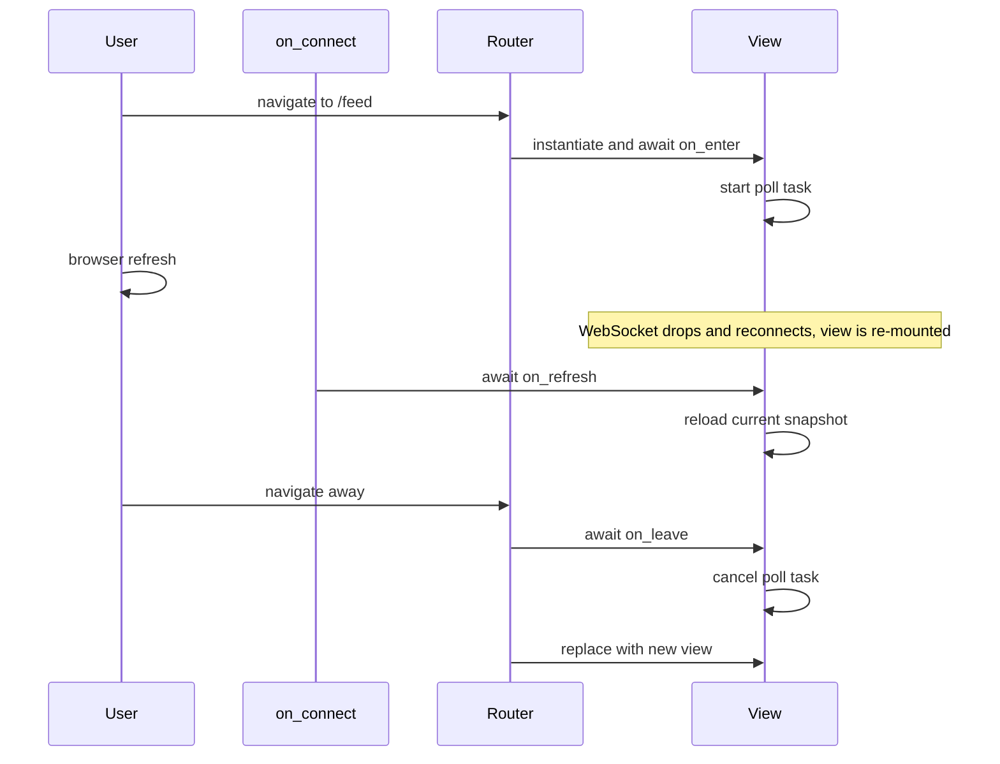

# Events

Two different event layers run in a Flet app, and conflating them is a
common source of bugs. **Page lifecycle events** fire on the `ft.Page`
itself (connect, disconnect, error, resize). **Control events** fire on
individual controls (click, change, submit). The first kind is about the
WebSocket session; the second kind is about user interaction inside a
session.

## Page lifecycle events

Aegis wires four `page.on_*` slots in `app/components/frontend/main.py`,
each pointing at a handler in `app/components/frontend/core/events.py`:

```python
page.on_connect    = frontend_events.on_connect
page.on_disconnect = frontend_events.on_disconnect
page.on_error      = frontend_events.on_error
page.on_resize     = frontend_events.on_resize
```

Centralizing them keeps the `main()` entrypoint clean and gives one place
to add cross-cutting concerns (logging, error UI) per event.

### `on_connect`: the refresh-or-redirect handler

`on_connect` fires when the WebSocket connects: initial page load, browser
refresh, and reconnect after a transient drop. It is the most important
hook to understand because it does double duty.

```python
async def on_connect(event: ft.ControlEvent) -> None:
    page = event.page

    if not await is_authenticated(page):
        redirect_to_login(page)
        return

    if page.views:
        current = page.views[-1]
        if hasattr(current, "on_refresh"):
            await current.on_refresh()
```

Two responsibilities:

1. **Auth gate on reconnect.** If the user refreshed the browser and
   their session cookie has expired (or been revoked), the very next
   `on_connect` round-trips `/auth/me`, sees a 401, and routes them to
   `/login`. The user does not get to see a stale view full of
   placeholder text while the API silently fails behind it.
2. **Refresh-or-rebuild for the active view.** If a view is already on
   the page (which happens on browser refresh: Flet rebuilds the view
   tree and then fires `on_connect`), the handler calls
   `current.on_refresh()` so the view can reload its data.

This is the connection point between the page lifecycle and the
[view lifecycle](routing.md#baseview-and-its-three-hooks). The router
fires `on_enter` on initial navigation. `on_connect` fires
`on_refresh` on browser refresh. Both delegate to the same `_reload`
method in practice.

### `on_disconnect`: logging only, and deliberately so

`on_disconnect` fires on tab close, lost connection, and transient
WebSocket blips. Aegis logs and does nothing else.

The temptation is to use `on_disconnect` as a teardown hook (close the
httpx client, clear `SessionState`, etc.). **Resist it.** Flet fires
`on_disconnect` on transient blips too: the WebSocket reconnects within
seconds, the session id is preserved, and `on_connect` fires against the
same `SessionState`. If `on_disconnect` had closed the `APIClient`, the
post-reconnect `is_authenticated()` call would hit a closed client.

The deterministic teardown path is `clear_session_state(page)`, called
from the one place the application explicitly destroys a session. See
[Session State teardown](state.md#teardown).

### `on_error`: logging

`on_error` fires on uncaught Flet runtime errors. Aegis logs and lets the
error bubble. Application-level exception handling lives inside view
methods, route handlers, and the snackbar utilities; `on_error` is a
catch-all for things Flet itself surfaces.

### `on_resize`: reserved

`on_resize` fires on viewport changes. Currently nothing UI-level depends
on it; the hook is reserved for closing overlay menus and dropdowns when
the viewport changes. The handler logs at debug.

## Control events

Control events are the familiar Flet pattern: every interactive control
takes callbacks like `on_click`, `on_change`, `on_submit`.

```python
button = ft.ElevatedButton("Save", on_click=self._save)
field  = ft.TextField(label="Title", on_change=self._on_title_change)
```

Two things worth standardizing:

### Async-first

Every event handler in Aegis is `async`. Flet awaits both sync and async
callbacks, so this is a project convention, not a Flet requirement.
Going async-first means the handler can `await` an `APIClient` call
without changing shape, and the project never grows a "is this one
sync or async" question across the codebase.

```python
async def _save(self, _: ft.ControlEvent) -> None:
    api = get_session_state(self.page).api_client
    result = await api.post("/api/v1/insights/projects", json=self._form.model_dump())
    if result is None:
        ErrorSnackBar("Could not save.").launch(self.page)
        return
    SuccessSnackBar("Saved.").launch(self.page)
    self.page.go(PROJECTS_ROUTE)
```

### `page.run_task` for fire-and-forget work

If an event handler kicks off background work that should outlive the
click (a poll loop, a streaming consumer, a long-running calculation),
launch it with `page.run_task(coro)` and **hold the returned handle on
the view**:

```python
class LiveFeedView(BaseView):
    def __init__(self, *, page: ft.Page, route: str) -> None:
        super().__init__(page=page, route=route)
        self._poll_task: asyncio.Task[None] | None = None

    async def on_enter(self, params: dict[str, Any]) -> None:
        self._poll_task = self.page.run_task(self._poll_loop())

    async def on_leave(self) -> None:
        if self._poll_task is not None:
            self._poll_task.cancel()
            self._poll_task = None
```

The failure mode this prevents is the most common Flet bug Aegis users
hit: a view starts a poll loop in `on_enter`, the user navigates away,
the view is replaced, the poll loop keeps running forever, and now the
process is leaking tasks that try to update a control that is no longer
on the page. `on_leave` is where this gets cancelled.

If the work genuinely is fire-and-forget (a single network call whose
result is shown via a snackbar), `page.run_task` without holding the
handle is fine. The discipline kicks in when the task is long-lived.

## Putting it together

A view that does live polling and survives a browser refresh exercises
all three layers:



## Next Steps

- [Example](example.md): a small worked view that puts the API client,
  the lifecycle hooks, and a control event together.
