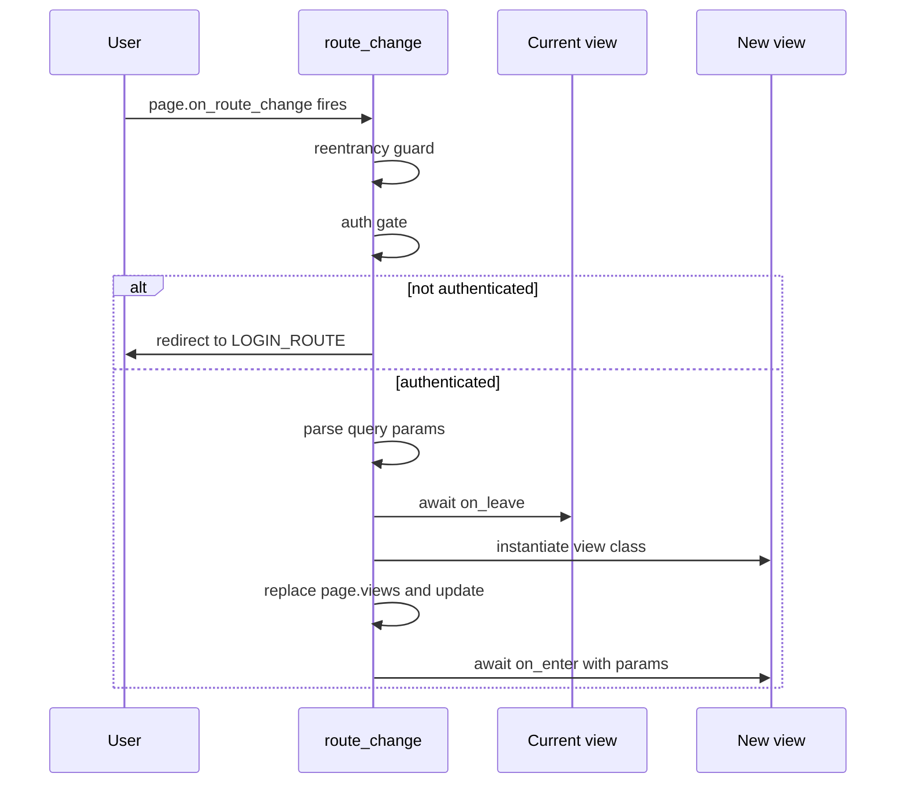

# Routing & Views

Aegis ships a tiny router on top of Flet's `page.on_route_change` slot and
a `BaseView` ABC that gives every routed view the same three lifecycle
hooks. The whole thing is about 150 lines of Python; it does not pretend
to be a framework. The point is that view transitions are predictable:
the outgoing view always gets a chance to clean up, the incoming view
always gets a chance to load its data, and a browser refresh always tells
the active view to reload.

## The route registry

`ROUTE_TO_VIEW` is a `dict[str, type[BaseView]]` populated at app bootstrap
by calling `register_route(route, view_cls)` for each routed view.

```python
# app/components/frontend/main.py (excerpt)
from app.components.frontend.core.routing import register_route
from app.components.frontend.projects.project_list_view import ProjectListView
from app.components.frontend.core.routes import PROJECTS_ROUTE

register_route(PROJECTS_ROUTE, ProjectListView)
```

`core/routes.py` holds the route constants (`PROJECTS_ROUTE`, `LOGIN_ROUTE`,
`PUBLIC_ROUTES`, ...). Public routes (login, register, the OAuth callback)
skip the auth gate; everything else triggers an `is_authenticated()` check
before the view is constructed.

## Route change flow

When `page.go("/projects?slug=x")` fires (directly, from a button, or from
the address bar), the router runs this sequence in
`app/components/frontend/core/routing.py`:



A few things to notice:

- **Reentrancy is guarded.** A second route change that fires while the
  first is still in flight is dropped with a warning. Rapid double-clicks
  on a nav button cannot tear the state down halfway.
- **`on_leave` runs before the swap.** The outgoing view is asked to clean
  up before its replacement is constructed. If `on_leave` raises, the
  swap still happens; the router logs and moves on.
- **Query params are passed in.** `on_enter(params)` receives a
  `dict[str, Any]` parsed from the URL. Single-valued params come back as
  strings; repeated params come back as lists.
- **Error handling is best-effort.** If the route is not in `ROUTE_TO_VIEW`,
  or `on_enter` raises, the router shows an `ErrorSnackBar` and logs.
  Nothing about a bad navigation can wedge the page.

## `BaseView` and its three hooks

Routed views subclass `BaseView` (defined in
`app/components/frontend/controls/views/base.py`), which is itself a
subclass of `ft.View`:

```python
class BaseView(ft.View, ABC):
    def __init__(self, *, page: ft.Page, route: str, **kwargs: Any) -> None:
        super().__init__(route=route, **kwargs)
        self.page = page

    @abstractmethod
    async def on_enter(self, params: dict[str, Any]) -> None: ...
    async def on_leave(self) -> None: return None
    @abstractmethod
    async def on_refresh(self) -> None: ...
```

| Hook | When it fires | What to do here |
| --- | --- | --- |
| `on_enter(params)` | Router has just put this view on the page. | Load data, spawn tasks, subscribe to streams. |
| `on_leave()` | Router is about to replace this view (or pop it). | Cancel tasks, close streams, release resources. |
| `on_refresh()` | User refreshed the browser; the same route is being re-shown without a router transition. | Reload data without remounting. |

`on_enter` and `on_refresh` are both abstract because every view should
think about both. A view that loads data on entry needs to reload it on
refresh, and "do nothing on refresh" should be a deliberate choice you
write down rather than a thing you forget.

`on_leave` defaults to a no-op because plenty of views genuinely have
nothing to clean up. The moment you start a `page.run_task` handle and
hold the reference on `self`, you owe `on_leave` a cancel call.

## Building a view inline

Views compose their layout inside `__init__`. There is no `_build_*`
helper convention; the body of `__init__` *is* the layout. Hold references
to anything you intend to mutate later:

```python
class ProjectListView(BaseView):
    def __init__(self, *, page: ft.Page, route: str) -> None:
        super().__init__(page=page, route=route, scroll=ft.ScrollMode.AUTO)

        self._body = ft.Column(
            controls=[BodyText("Loading...")],
            spacing=12,
            tight=True,
        )

        self.controls = [
            SectionCard(title="Owned projects", body=self._body, body_padding=16),
        ]

    async def on_enter(self, params: dict[str, Any]) -> None:
        await self._reload()

    async def on_refresh(self) -> None:
        await self._reload()

    async def _reload(self) -> None:
        api = get_session_state(self.page).api_client
        result = await api.get("/api/v1/insights/projects")
        self._body.controls = [self._build_row(p) for p in (result or [])]
        self._body.update()
```

Two patterns worth calling out:

- **Assign to `self.controls`, not `self.page.controls`.** Flet renders
  `view.controls` for routed views. Assigning to the page's controls is a
  common early-Flet mistake that "works" only by accident.
- **`on_enter` and `on_refresh` often share an implementation.** A
  private `_reload()` that both delegate to is the canonical shape.

## View pop

The router also handles `page.on_view_pop` (back button on nested views).
It calls `on_leave` on the current view, pops it from `page.views`, then
re-navigates to the now-top view's route. In a single-view-at-a-time
project this rarely fires; it exists for views that push child views
onto the stack.

## Next Steps

- [Session State](state.md): the `SessionState` that views read from in
  `on_enter`, and the helper `get_session_state(page)` you see in the
  example above.
- [Events](events.md): how `on_refresh` connects to `page.on_connect`, and
  the task-cancellation discipline that makes `on_leave` actually useful.
