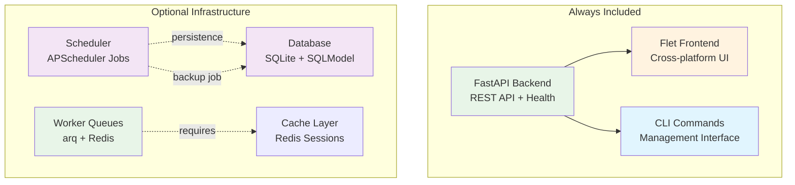
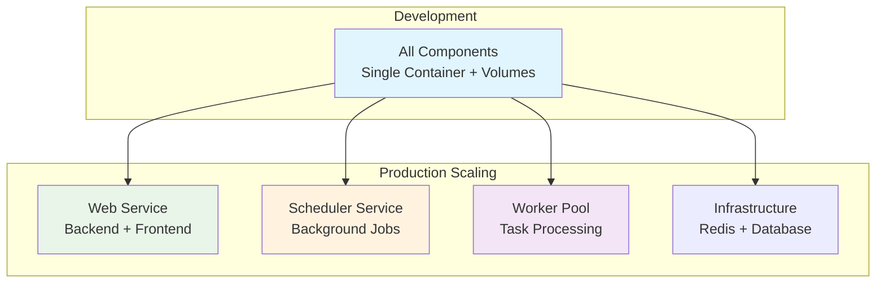

# Components Overview

Components are the **infrastructure building blocks** of your Aegis Stack application. Each component provides a specific capability like API serving, background tasks, or data persistence.

!!! info "Components vs Services"
    **Components** = Infrastructure capabilities (database, workers, scheduling)
    **Services** = Business functionality (auth, payments, AI integrations)

    See **[Services Overview](../services/index.md)** for business-level features.

> 💡 **New to Aegis Stack?** See the [Philosophy Guide](../philosophy.md) for complete component design principles.

## Component Selection

**⚠️ Important:** Components must be selected during project creation. There is currently no way to add components to existing projects.

The interactive CLI guides you through component choices and explains integration benefits:

```bash
# Basic web application (FastAPI + Flet)
aegis init my-project

# Add user authentication (requires database)
aegis init user-app --services auth --components database

# Add background task scheduling
aegis init scheduled-app --components scheduler

# Add job persistence + automatic backup job
aegis init persistent-jobs --components scheduler,database

# Full async task processing
aegis init task-processor --components worker

# Business app with auth and background processing
aegis init business-app --services auth --components database,worker,scheduler
```

## Component Architecture



## Component Deployment

Understanding how components deploy and scale is crucial for architectural decisions:



**Development:** All components run in a single container with shared volumes for simplicity.

**Production:** Components can be deployed as independent services, each scaling based on demand.

## Available Components

| Component | Purpose | Implementation | Status |
|-----------|---------|----------------|--------|
| **Core** (Backend + Frontend + CLI) | API + UI + Management | FastAPI + Flet + Typer | ✅ Always included |
| **Database** | Data persistence, ORM | SQLite + SQLModel | ✅ Available |
| **Scheduler** | Background tasks, cron jobs | APScheduler | ✅ Available |
| **Worker** | Async task queues | arq + Redis | 🧪 Experimental |
| **Cache** | Session storage, performance | Redis | 🚧 Coming soon |

!!! tip "Component Composition"
    Components can be combined to enable different capabilities. For detailed patterns on how components integrate with services and each other, see the **[Integration Patterns Reference](../integration-patterns.md)**.

---

**Next:** Choose your first component combination and see the integration in action:

- **[Database Component](./database.md)** - SQLite persistence with SQLModel ORM  
- **[Scheduler Component](./scheduler.md)** - Background tasks and cron jobs
- **[Worker Component](./worker/index.md)** - Async task processing and queues