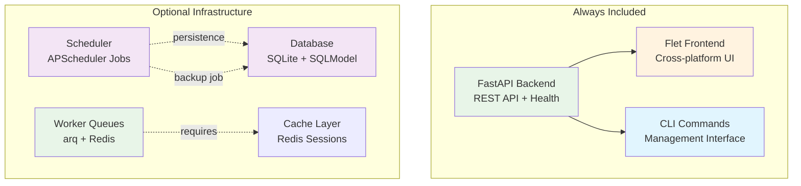
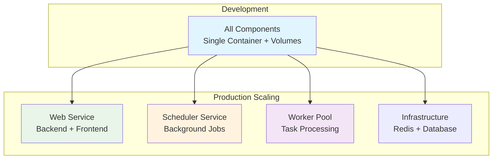

# Components Overview

Components are the **infrastructure building blocks** of your Aegis Stack application. Each component provides a specific capability like API serving, background tasks, or data persistence.

!!! info "Components vs Services"
    **Components** = Infrastructure capabilities (database, workers, scheduling)
    **Services** = Business functionality (auth, payments, AI integrations)

    See **[Services Overview](../services/index.md)** for business-level features.

> 💡 **New to Aegis Stack?** See the [Philosophy Guide](../philosophy.md) for complete component design principles.

## Component Selection

**⚠️ Important:** Components must be selected during project creation. There is currently no way to add components to existing projects.

The interactive CLI guides you through component choices and explains integration benefits:

```bash
# Basic web application (FastAPI + Flet)
aegis init my-project

# Add user authentication (requires database)
aegis init user-app --services auth --components database

# Add background task scheduling
aegis init scheduled-app --components scheduler

# Add job persistence + automatic backup job
aegis init persistent-jobs --components scheduler,database

# Full async task processing
aegis init task-processor --components worker

# Business app with auth and background processing
aegis init business-app --services auth --components database,worker,scheduler
```

## Component Architecture



## Component Deployment

Understanding how components deploy and scale is crucial for architectural decisions:



**Development:** All components run in a single container with shared volumes for simplicity.

**Production:** Components can be deployed as independent services, each scaling based on demand.

## Available Components

| Component | Purpose | Implementation | Status |
|-----------|---------|----------------|--------|
| **Core** (Backend + Frontend + CLI) | API + UI + Management | FastAPI + Flet + Typer | ✅ Always included |
| **Database** | Data persistence, ORM | SQLite + SQLModel | ✅ Available |
| **Scheduler** | Background tasks, cron jobs | APScheduler | ✅ Available |
| **Worker** | Async task queues | arq + Redis | 🧪 Experimental |
| **Cache** | Session storage, performance | Redis | 🚧 Coming soon |

## Component Composition Patterns

### Scheduler Integration

**Memory-Based Scheduling:**

```bash
aegis init simple-scheduler --components scheduler
# - APScheduler with in-memory job storage
# - Jobs reset on restart
# - Perfect for simple recurring tasks
```

**Persistent Scheduling:**

```bash  
aegis init persistent-scheduler --components scheduler,database
# - APScheduler with SQLAlchemy job storage
# - Jobs survive application restarts
# - Automatic daily database backup job included
# - SQLite with shared volumes for development
```

### Worker Integration

**Basic Task Processing:**

```bash
aegis init task-app --components worker,redis
# - arq worker queues with Redis backend
# - Async task execution with job results
# - Multiple queue support and load balancing
```

### Future Evolution Pathways

**User Authentication (Planned):**

- User service component for authentication
- Database integration for user profiles
- Role-based access control for components

**Production Database Options (Planned):**

- PostgreSQL option for multi-container deployments
- Full API access and remote management
- Production-ready concurrent access patterns

## Component Integration Guide

### Core Technologies

**Web Infrastructure:**

- **FastAPI**: Async web serving with automatic API documentation
- **Flet**: Python-native cross-platform UI development
- **Typer**: Command-line interfaces with direct Python integration

**Data & Processing:**

- **SQLModel**: Type-safe ORM with SQLAlchemy foundation
- **arq**: High-performance async task queues with Redis
- **APScheduler**: Flexible job scheduling with persistence options

**System Integration:**

- **Rich**: Terminal formatting for CLI commands and health displays
- **psutil**: Cross-platform system health monitoring

### Design Philosophy

Components are **capability interfaces** - current implementations can be replaced with alternatives while maintaining the same component API.

- **Component Independence:** Each component can be selected or omitted based on your needs.
- **Smart Dependencies:** Components automatically include required dependencies (worker → redis, scheduler+database → backup job).
- **Evolution Ready:** Component architecture supports future enhancements like user authentication, PostgreSQL, and additional processing capabilities.

---

**Next:** Choose your first component combination and see the integration in action:

- **[Database Component](./database.md)** - SQLite persistence with SQLModel ORM  
- **[Scheduler Component](./scheduler.md)** - Background tasks and cron jobs
- **[Worker Component](./worker/index.md)** - Async task processing and queues