# Components Overview

Components are the **infrastructure building blocks** of your Aegis Stack application. Each component provides a specific capability like API serving, background tasks, or data persistence.

!!! info "Components vs Services"
    **Components** = Infrastructure capabilities (database, workers, scheduling)
    **Services** = Business functionality (auth, payments, AI integrations)

    See **[Services Overview](../services/index.md)** for business-level features.

## Evolving Your Stack

**Your choices aren't permanent.** Components can be added or removed as your requirements change.

Unlike most starters that lock you in at `init`, Aegis Stack lets you evolve:

- **Add components**: `aegis add scheduler --project-path ./my-api`
- **Remove components**: `aegis remove scheduler --project-path ./my-api`
- **Update templates**: Stay current with upstream improvements

For complete workflows with real-world examples, see **[Evolving Your Stack →](../evolving-your-stack.md)**

## Component Architecture

## Component Deployment

Understanding how components deploy and scale is crucial for architectural decisions:

```mermaid
graph TB
    subgraph "Multi-Container Architecture"
        A0[Ingress<br/>Traefik Proxy]
        A1[Webserver<br/>Backend + Frontend]
        A2[Scheduler<br/>Background Jobs]
        A3[Worker Pool<br/>Task Processing]
        A4[Infrastructure<br/>Redis + Database]
    end

    subgraph "Independent Scaling"
        B0[Ingress × 1]
        B1[Webserver × N]
        B2[Scheduler × N]
        B3[Worker × N]
        B4[Infrastructure × N]
    end

    A0 --> B0
    A1 --> B1
    A2 --> B2
    A3 --> B3
    A4 --> B4

    style A0 fill:#e1f5fe
    style A1 fill:#e8f5e8
    style A2 fill:#fff3e0
    style A3 fill:#f3e5f5
    style A4 fill:#e1f5fe
    style B0 fill:#e1f5fe
    style B1 fill:#e8f5e8
    style B2 fill:#fff3e0
    style B3 fill:#f3e5f5
    style B4 fill:#e1f5fe
```

**Multi-Container Architecture:** Each component runs in its own Docker container (via docker-compose) for isolation and maintainability.

**Backend + Frontend Container:** FastAPI serves the Flet UI as an integrated web app - this is an architectural choice, not a limitation.

**Independent Scaling:** Each service can be scaled separately based on demand using Docker Compose replicas or orchestration tools.

## Available Components

| Component | Purpose | Implementation | Status |
|-----------|---------|----------------|--------|
| **Core** (Backend + Frontend + CLI) | API + UI + Management | FastAPI + Flet + Typer | ✅ Always included |
| **Database** | Data persistence, ORM | SQLite + SQLModel | ✅ Available |
| **Scheduler** | Background tasks, cron jobs | APScheduler | ✅ Available |
| **Worker** | Async task queues | arq + Redis | 🧪 Experimental |
| **Ingress** | Reverse proxy, TLS, routing | Traefik v3 | ✅ Available |
| **Cache** | Session storage, performance | Redis | 🚧 Coming soon |

!!! tip "Component Composition"
    Components can be combined to enable different capabilities. For detailed patterns on how components integrate with services and each other, see the **[Integration Patterns Reference](../integration-patterns.md)**.

**Individual components combine to form your complete application.** Database + Scheduler + Worker + Auth + AI = A unified, production-ready system.

---

**Next:** Choose your first component combination and see the integration in action:

- **[Database Component](./database.md)** - SQLite persistence with SQLModel ORM
- **[Scheduler Component](./scheduler.md)** - Background tasks and cron jobs
- **[Worker Component](./worker/index.md)** - Async task processing and queues
- **[Ingress Component](./ingress.md)** - Traefik reverse proxy and TLS