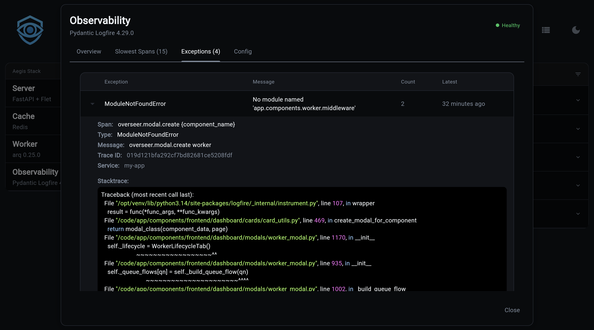
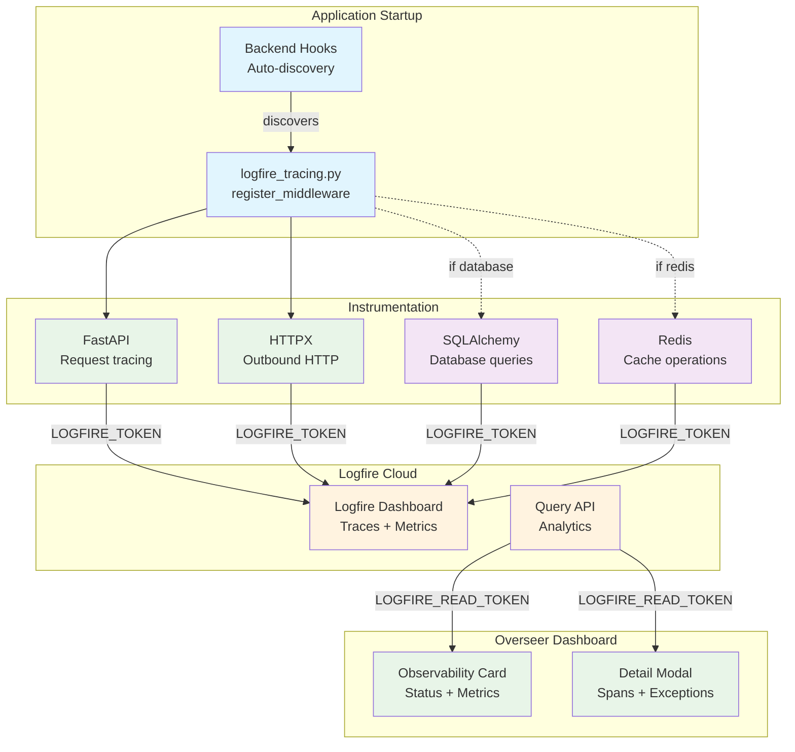
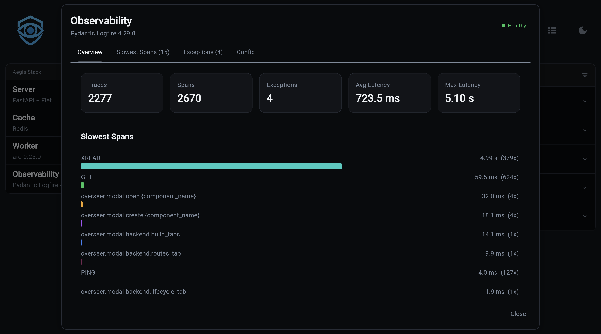
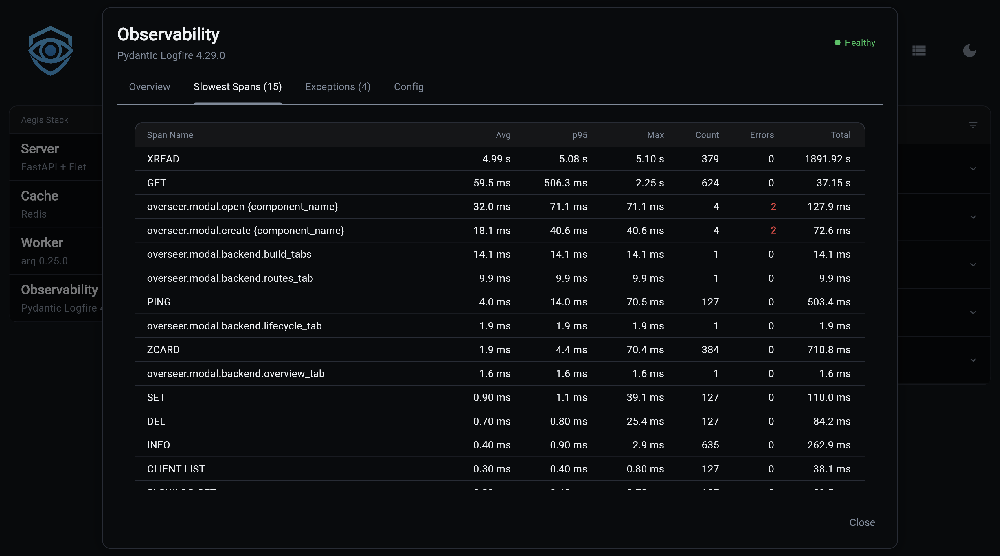

# Observability Component

!!! example "Musings: On Observability in Overseer (March 21st, 2026)"
    This is a weird one. I don't see this as a true replacement for the Logfire UI, but they do give enough useful info to warrant a spot in Overseer. I just have to find the balance.



Distributed tracing, metrics, and log correlation with [Pydantic Logfire](https://logfire.pydantic.dev/) — auto-instruments your application and adapts to whichever components you have enabled.

!!! info "Adding Observability to Your Project"
    ```bash
    aegis init my-project --components observability
    aegis add observability    # for existing projects
    ```

## What Observability Adds

When you include the observability component, your project gets:

- **Pydantic Logfire integration** with automatic configuration
- **FastAPI instrumentation** — traces every request (health/dashboard endpoints excluded)
- **HTTPX instrumentation** — traces outbound HTTP calls
- **SQLAlchemy instrumentation** — auto-enabled when the database component is present
- **Redis instrumentation** — auto-enabled when the redis component is present
- **Health check integration** with the Overseer dashboard, including Logfire Query API analytics
- **Dashboard card + detail modal** with trace metrics, slowest spans, and exception tracking
- **Graceful degradation** — works without a cloud token (local instrumentation only)

## Generated Files

```
my-project/
├── app/
│   └── components/
│       ├── backend/
│       │   └── middleware/
│       │       └── logfire_tracing.py    # Auto-discovered Logfire middleware
│       └── frontend/
│           └── dashboard/
│               ├── cards/
│               │   └── observability_card.py   # Overseer dashboard card
│               └── modals/
│                   └── observability_modal.py  # Detail modal with tabs
└── .env.example                          # Updated with Logfire variables
```

## How It Works



The middleware is auto-discovered by the backend hook system — no manual registration needed. On startup it configures Logfire with your project name and environment, then instruments each available integration.

When `LOGFIRE_TOKEN` is set, traces are sent to Logfire cloud. Without a token, instrumentation still runs locally (useful for development and structured logging).

## Environment Variables

| Variable | Default | Description |
|------------------------|---------|-------------|
| `LOGFIRE_TOKEN` | - | Enables sending traces to Logfire cloud |
| `LOGFIRE_READ_TOKEN` | - | Enables Query API analytics in the Overseer dashboard |
| `LOGFIRE_PROJECT_URL` | - | Link to your Logfire project dashboard |

Set these in your `.env` file:

```bash
# Observability (Logfire)
LOGFIRE_TOKEN=your-write-token
LOGFIRE_READ_TOKEN=your-read-token
LOGFIRE_PROJECT_URL=https://logfire.pydantic.dev/myorg/myproject
```

## Component Integrations

Observability automatically adapts its instrumentation based on which components are enabled in your project:

| Component | Integration | What Gets Traced |
|-----------|-------------|-----------------|
| **Backend** (always) | `logfire.instrument_fastapi()` | All HTTP requests (excludes `/health/*` and `/dashboard/*`) |
| **HTTPX** (always) | `logfire.instrument_httpx()` | All outbound HTTP calls |
| **Database** | `logfire.instrument_sqlalchemy()` | SQL queries via the shared engine |
| **Redis** | `logfire.instrument_redis()` | Redis commands and pub/sub |

This is handled at template generation time — the `logfire[fastapi,httpx]` dependency automatically includes extras like `sqlalchemy` and `redis` when those components are present.

## Overseer Integration

The observability component integrates with the Overseer dashboard through a status card and a detail modal.

### Dashboard Card

The card displays real-time Logfire status:

- **With Query API** (`LOGFIRE_READ_TOKEN` set): Shows trace count, exception count, average latency, and max latency for the last hour
- **Without Query API**: Shows cloud connection status with a hint to add the read token

### Detail Modal

Clicking the card opens a detail modal with four tabs:

**Overview** — Key metrics (traces, spans, exceptions, latency) plus a bar chart of the slowest spans:



**Slowest Spans** — Full table with avg, p95, and max latency per span type, with error counts highlighted in red:



**Exceptions** — Expandable table of exceptions from the last 24 hours, grouped by type. Click to expand and see the full stack trace.

**Config** — Service name, cloud status, Query API availability, and project URL link

### Health Check

The health check queries the Logfire Query API (when `LOGFIRE_READ_TOKEN` is set) and reports:

- Total spans and traces (last hour)
- Exception count
- Average and max latency
- Top 20 slowest spans
- Recent exceptions (last 24 hours)

Results are cached for 2 minutes with a 5-minute backoff on failure to respect rate limits.

## Next Steps

- **[Component Overview](./index.md)** — Understanding Aegis Stack's component architecture
- **[Integration Patterns](../integration-patterns.md)** — How components work together
- **[Pydantic Logfire Documentation](https://logfire.pydantic.dev/)** — Complete Logfire reference
