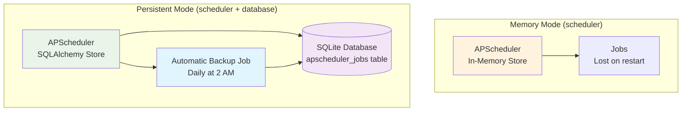

# Scheduler Component

The **Scheduler Component** provides background task scheduling and cron job capabilities using [APScheduler](https://apscheduler.readthedocs.io/).

## Component Composition Options

### Memory-Based Scheduling (Scheduler Only)

```bash
aegis init my-app --components scheduler
```

**What you get:**

- APScheduler with in-memory job storage
- Jobs are reset on application restart
- Perfect for simple recurring tasks
- Fast setup with no persistence dependencies

### Persistent Scheduling (Scheduler + Database)

```bash
aegis init my-app --components scheduler,database
```

**What you get:**

- APScheduler with SQLAlchemy job storage
- Jobs survive application restarts
- **Automatic daily database backup job included**
- SQLite with shared volumes for development
- Job history and recovery capabilities

## Component Architecture



## Adding Scheduled Tasks

### 1. Create Service Functions

Add your business logic in `app/services/`:

```python
# app/services/my_tasks.py
from app.core.log import logger

async def send_daily_report() -> None:
    """Generate and send daily reports."""
    logger.info("📊 Generating daily report")
    # Your report generation logic here
    logger.info("✅ Daily report sent successfully")

async def cleanup_temp_files() -> None:
    """Clean up temporary files."""
    logger.info("🗑️ Cleaning temporary files")
    # Your cleanup logic here
```

### 2. Schedule Your Tasks

Add jobs to the scheduler in `app/components/scheduler/main.py`:

```python
# Import your service functions
from app.services.my_tasks import send_daily_report, cleanup_temp_files

def create_scheduler() -> AsyncIOScheduler:
    """Create and configure the scheduler with all jobs."""
    scheduler = AsyncIOScheduler()
    
    # Daily report at 9 AM
    scheduler.add_job(
        send_daily_report,
        trigger="cron",
        hour=9, minute=0,
        id="daily_report",
        name="Daily Report Generation"
    )
    
    # Clean temp files every 4 hours
    scheduler.add_job(
        cleanup_temp_files,
        trigger="interval",
        hours=4,
        id="temp_cleanup", 
        name="Temporary Files Cleanup"
    )
    
    return scheduler
```

## Automatic Database Integration

When both scheduler and database components are selected, the scheduler automatically:

**Detects Database Availability:**

```python
# The scheduler automatically configures persistence
def create_scheduler() -> AsyncIOScheduler:
    try:
        from app.core.db import engine
        from apscheduler.jobstores.sqlalchemy import SQLAlchemyJobStore
        
        # Database available - use persistent store
        jobstore = SQLAlchemyJobStore(engine=engine, tablename='apscheduler_jobs')
        scheduler = AsyncIOScheduler(jobstores={'default': jobstore})
        logger.info("📊 Scheduler using database for job persistence")
        
    except ImportError:
        # No database - use memory store
        scheduler = AsyncIOScheduler()
        logger.info("🕒 Scheduler running in memory mode")
```

**Includes Backup Job:**  
A daily database backup job is automatically added when both components are selected, demonstrating the synergy between scheduler and database.

## Common Scheduling Patterns

### Cron-based Tasks

```python
# Daily at 6:30 AM
scheduler.add_job(my_function, trigger="cron", hour=6, minute=30)

# Weekdays at 9 AM  
scheduler.add_job(my_function, trigger="cron", day_of_week="mon-fri", hour=9)

# Every Monday at 8 AM
scheduler.add_job(my_function, trigger="cron", day_of_week="mon", hour=8)
```

### Interval-based Tasks

```python
# Every 30 minutes
scheduler.add_job(my_function, trigger="interval", minutes=30)

# Every 2 hours
scheduler.add_job(my_function, trigger="interval", hours=2)

# Every day
scheduler.add_job(my_function, trigger="interval", days=1)
```

## Best Practices

- **Keep jobs idempotent** - Safe to run multiple times
- **Use proper async patterns** - Leverage asyncio for concurrent operations  
- **Handle errors gracefully** - Log failures and implement retry logic
- **Monitor execution times** - Track job performance and resource usage

## Component Evolution

**Current:** SQLite with shared volumes for development

**Future:** PostgreSQL option for production multi-container deployments with full API access and remote job management

---

**Next:** Explore component integration patterns:

- **[Component Overview](./index.md)** - How components work together
- **[Database Component](./database.md)** - Data persistence and ORM patterns