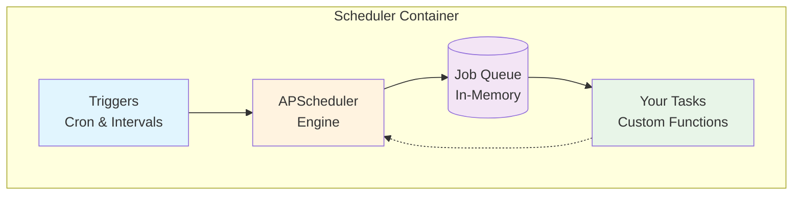

# Scheduler Component

The **Scheduler Component** provides background task scheduling and cron job capabilities using [APScheduler](https://apscheduler.readthedocs.io/).

!!! info "Memory-Based Scheduling"
    Generate a project with scheduler component and start immediately:
    
    ```bash
    aegis init my-app --components scheduler
    cd my-app
    make serve
    ```
    
    Jobs run in memory and reset on restart - perfect for development and simple deployments.

## What You Get

- **APScheduler with in-memory job storage** - Industry-standard Python scheduler
- **Cron and interval-based scheduling** - Flexible timing patterns
- **Async job execution** - Non-blocking task processing
- **Fast setup with no dependencies** - Perfect for simple recurring tasks
- **Optional extras** - Database persistence and task monitoring

## Architecture



*Jobs run in memory and reset on container restart. For persistent scheduling, see [Database Persistence](scheduler/extras/persistence.md).*

## Adding Scheduled Tasks

### 1. Create Service Functions

Add your business logic in `app/services/`:

```python
# app/services/my_tasks.py
from app.core.log import logger

async def send_daily_report() -> None:
    """Generate and send daily reports."""
    logger.info("📊 Generating daily report")
    # Your report generation logic here
    logger.info("✅ Daily report sent successfully")

async def cleanup_temp_files() -> None:
    """Clean up temporary files."""
    logger.info("🗑️ Cleaning temporary files")
    # Your cleanup logic here
```

### 2. Schedule Your Tasks

Add jobs to the scheduler in `app/components/scheduler/main.py`:

```python
# Import your service functions
from app.services.my_tasks import send_daily_report, cleanup_temp_files

def create_scheduler() -> AsyncIOScheduler:
    """Create and configure the scheduler with all jobs."""
    scheduler = AsyncIOScheduler()
    
    # Daily report at 9 AM
    scheduler.add_job(
        send_daily_report,
        trigger="cron",
        hour=9, minute=0,
        id="daily_report",
        name="Daily Report Generation"
    )
    
    # Clean temp files every 4 hours
    scheduler.add_job(
        cleanup_temp_files,
        trigger="interval",
        hours=4,
        id="temp_cleanup", 
        name="Temporary Files Cleanup"
    )
    
    return scheduler
```


## Job Management

### Listing Jobs

```python
# Get all scheduled jobs
jobs = scheduler.get_jobs()
for job in jobs:
    print(f"Job: {job.name}, Next run: {job.next_run_time}")
```

### Modifying Jobs

```python
# Pause a job
scheduler.pause_job("daily_reports")

# Resume a job  
scheduler.resume_job("daily_reports")

# Remove a job
scheduler.remove_job("old_job_id")

# Modify job schedule
scheduler.modify_job("daily_reports", hour=7)  # Change to 7 AM
```

## Configuration

The scheduler uses APScheduler's default settings. The only environment variable is:

- `SCHEDULER_FORCE_UPDATE`: Set to "true" to force update jobs from code during restart (persistence mode only)

Individual jobs can configure their own behavior when defined:

```python
scheduler.add_job(
    my_task,
    trigger="interval",
    hours=1,
    max_instances=1,      # Only one instance can run at a time
    coalesce=True,        # Coalesce missed runs into one
    misfire_grace_time=30 # Grace time for misfired jobs
)
```


## Best Practices

- **Keep jobs idempotent** - Safe to run multiple times
- **Use proper async patterns** - Leverage asyncio for concurrent operations
- **Handle errors gracefully** - Log failures and implement retry logic
- **Monitor execution times** - Track job performance and resource usage
- **Use descriptive job IDs** - Makes debugging and monitoring easier

## Component Evolution

**Current:** In-memory scheduling perfect for development and simple deployments

**Next:** Add database persistence for production deployments with the extras below

---

**Next Steps:**

- **[CLI Interface](scheduler/cli.md)** - Command-line task management (requires persistence)
- **[Examples](scheduler/examples.md)** - Real-world scheduling patterns and timing examples
- **[Database Persistence](scheduler/extras/persistence.md)** - Job persistence and monitoring
- **[Component Overview](./index.md)** - How components work together