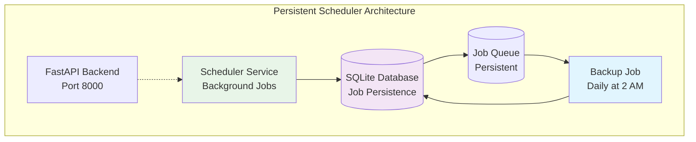

# Database Persistence Extra

Advanced job persistence and monitoring capabilities for the scheduler component.

!!! info "Database Persistence Quick Setup"
    Include both scheduler and database components for automatic persistence:
    
    ```bash
    aegis init my-app --components scheduler,database
    cd my-app
    make serve
    ```
    
    Jobs now survive container restarts with SQLAlchemy jobstore and automatic daily backups.

## What You Get

- **Job Persistence** - Jobs survive container restarts via SQLAlchemy jobstore
- **Automatic Database Backup** - Daily backup pre-configured at 2 AM UTC  
- **Real-time Task Monitoring** - CLI health checks and dashboard with statistics
- **Job History Tracking** - Query past executions and performance metrics
- **SQLite with Shared Volumes** - Fast development setup
- **Production-ready Persistence** - Container deployment ready

!!! warning "SQLite Production Considerations"
    **Cross-container visibility**: SQLite works perfectly when only the scheduler container needs database access. However, if your API containers need to query scheduler health (for health checks, dashboard, etc.), they won't be able to access the SQLite file across container boundaries.
    
    **Perfectly valid use cases**: Running a persistent scheduler with SQLite is completely production-ready for: stateless APIs (Lambda/Cloud Functions), dedicated scheduler servers, or any architecture where only the scheduler container needs database access.
    
    **When to use PostgreSQL**: Switch to PostgreSQL when you need multiple containers (API, dashboard, monitoring) to query scheduler state. Otherwise, SQLite is a simple, reliable choice.

## Architecture with Persistence



## Automatic Database Integration

When both scheduler and database components are selected, the scheduler automatically configures persistence:

### SQLAlchemy Jobstore Configuration

```python
# The scheduler automatically configures persistence
def create_scheduler() -> AsyncIOScheduler:
    try:
        from app.core.db import engine
        from apscheduler.jobstores.sqlalchemy import SQLAlchemyJobStore
        
        # Database available - use persistent store
        jobstore = SQLAlchemyJobStore(engine=engine, tablename='apscheduler_jobs')
        scheduler = AsyncIOScheduler(jobstores={'default': jobstore})
        logger.info("📊 Scheduler using database for job persistence")
        
    except ImportError:
        # No database - use memory store
        scheduler = AsyncIOScheduler()
        logger.info("🕒 Scheduler running in memory mode")
```

### Automatic Backup Job

A daily database backup job is automatically included:

```python
# Automatically added when database component is present
scheduler.add_job(
    backup_database_job,
    trigger="cron",
    hour=2,
    minute=0,
    id="database_backup",
    name="Daily Database Backup",
    max_instances=1,
    coalesce=True,
    replace_existing=True
)
```

**Backup Job Features:**

- Runs daily at 2:00 AM UTC
- Creates timestamped database backups
- Handles rotation of old backup files
- Logs backup success/failure status
- Prevents overlapping executions

## Real-Time Task Monitoring

With persistence enabled, you get comprehensive task monitoring capabilities:

### CLI Health Check

```bash
my-app health check --detailed

# Example Output:
✓ scheduler         Scheduler running with 3 tasks
  └─ Tasks: 3 total, 3 active, 0 paused  
     └─ Upcoming Tasks (Next 3):
        ├─ database_backup: Daily at 2:00 AM UTC → in 5h
        ├─ cleanup_temp: Every 6 hours → in 2h
        └─ report_gen: Weekly on Monday → in 3d
```

### Dashboard UI Card


## Production Job Management

### Environment-Based Updates

For persistent schedulers, use environment variables to control job updates:

```bash
# Force update all jobs from code configuration (useful during deployments)
SCHEDULER_FORCE_UPDATE=true docker compose up -d scheduler

# Normal startup (preserves runtime job modifications)
docker compose up -d scheduler
```

This pattern allows:

- **Development**: Jobs update automatically when code changes
- **Production**: Runtime job modifications are preserved across restarts
- **Deployments**: Force updates when needed with environment flag

### Job Existence Checking

```python
# Check for existing jobs to respect runtime modifications
force_update = os.getenv("SCHEDULER_FORCE_UPDATE", "false").lower() == "true"

if not _job_exists_in_database("daily_reports") or force_update:
    scheduler.add_job(
        func=process_daily_reports,
        trigger=CronTrigger(hour=6, minute=0),
        id="daily_reports",
        name="Daily Report Generation",
        replace_existing=True
    )
```

## Database Schema

The persistence layer creates this table automatically:

```sql
-- apscheduler_jobs table (created automatically)
CREATE TABLE apscheduler_jobs (
    id VARCHAR(191) NOT NULL PRIMARY KEY,
    next_run_time FLOAT,
    job_state BLOB NOT NULL
);

-- Indexes for performance
CREATE INDEX ix_apscheduler_jobs_next_run_time ON apscheduler_jobs (next_run_time);
```

## Next Steps

- **[Scheduler Component](../../scheduler.md)** - Return to scheduler overview
- **[Database Component](../../database.md)** - Database setup and configuration
- **[Examples](../examples.md)** - Real-world persistent job patterns