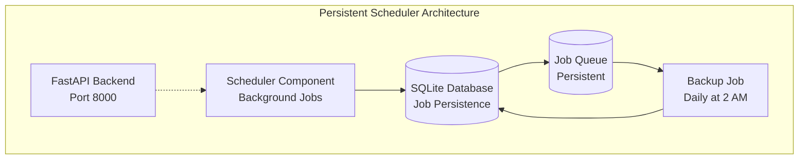

# Database Persistence Extra

Advanced job persistence and monitoring capabilities for the scheduler component.

!!! info "Database Persistence Quick Setup"
    Include both scheduler and database components for automatic persistence:
    
    ```bash
    aegis init my-app --components scheduler,database
    cd my-app
    make serve
    ```
    
    Jobs now survive container restarts with SQLAlchemy jobstore and automatic daily backups.

## What You Get

- **Job Persistence** - Jobs survive container restarts via SQLAlchemy jobstore
- **Automatic Database Backup** - Daily backup pre-configured at 2 AM UTC  
- **Real-time Task Monitoring** - CLI health checks and dashboard with statistics
- **Job History Tracking** - Query past executions and performance metrics
- **SQLite with Shared Volumes** - Fast development setup
- **Production-ready Persistence** - Container deployment ready

!!! warning "SQLite Production Considerations"
    **Cross-container visibility**: SQLite works perfectly when only the scheduler container needs database access. However, if your API containers need to query scheduler health (for health checks, dashboard, etc.), they won't be able to access the SQLite file across container boundaries.
    
    **Perfectly valid use cases**: Running a persistent scheduler with SQLite is completely production-ready for: stateless APIs (Lambda/Cloud Functions), dedicated scheduler servers, or any architecture where only the scheduler container needs database access.
    
    **When to use PostgreSQL**: Switch to PostgreSQL when you need multiple containers (API, dashboard, monitoring) to query scheduler state. Otherwise, SQLite is a simple, reliable choice.

## Architecture with Persistence



## Automatic Database Integration

When both scheduler and database components are selected, the scheduler automatically configures persistence:

### SQLAlchemy Jobstore Configuration

```python
# The scheduler automatically configures persistence
def create_scheduler() -> AsyncIOScheduler:
    try:
        from app.core.db import engine
        from apscheduler.jobstores.sqlalchemy import SQLAlchemyJobStore
        
        # Database available - use persistent store
        jobstore = SQLAlchemyJobStore(engine=engine, tablename='apscheduler_jobs')
        scheduler = AsyncIOScheduler(jobstores={'default': jobstore})
        logger.info("📊 Scheduler using database for job persistence")
        
    except ImportError:
        # No database - use memory store
        scheduler = AsyncIOScheduler()
        logger.info("🕒 Scheduler running in memory mode")
```

### Automatic Backup Job

A daily database backup job is automatically included:

```python
# Automatically added when database component is present
scheduler.add_job(
    backup_database_job,
    trigger="cron",
    hour=2,
    minute=0,
    id="database_backup",
    name="Daily Database Backup",
    max_instances=1,
    coalesce=True,
    replace_existing=True
)
```

**Backup Job Features:**

- Runs daily at 2:00 AM UTC
- Creates timestamped database backups
- Handles rotation of old backup files
- Logs backup success/failure status
- Prevents overlapping executions

## Real-Time Task Monitoring

With persistence enabled, you get comprehensive task monitoring capabilities:

### CLI Health Check

```bash
my-app health check --detailed

# Example Output:
✓ scheduler         Scheduler running with 3 tasks
  └─ Tasks: 3 total, 3 active, 0 paused  
     └─ Upcoming Tasks (Next 3):
        ├─ database_backup: Daily at 2:00 AM UTC → in 5h
        ├─ cleanup_temp: Every 6 hours → in 2h
        └─ report_gen: Weekly on Monday → in 3d
```

## Keeping the Jobstore in Sync With Code

`app/components/scheduler/main.py` is the source of truth for every job. On each start, `create_scheduler()` re-registers them all, and with a persistent jobstore the stored rows are reconciled against code three ways:

- **Changed schedule** - every `add_job` call passes `replace_existing=True`, so an edited trigger overwrites the persisted row on the next restart.
- **Removed job** - `_drop_unknown_persisted_jobs()` deletes persisted rows whose ID is no longer registered in code, so a job you delete stops firing instead of running forever from its stored row.
- **Un-importable job** - `_cleanup_stale_jobs()` drops persisted jobs whose function can no longer be imported, which handles a Docker volume carrying jobs from a previous project configuration.

To change a schedule, edit the trigger in `create_scheduler()`, commit, and redeploy:

```python
scheduler.add_job(
    process_daily_reports,
    trigger="cron",
    hour=6,
    minute=0,
    id="daily_reports",
    name="Daily Report Generation",
    max_instances=1,
    coalesce=True,
    replace_existing=True,
)
```

Runtime edits via `scheduler.modify_job()` are not preserved across restarts. This is deliberate: it keeps the deployed configuration aligned with what's committed in git, the same way Alembic migrations and Pydantic settings do. If a knob needs to be tunable without a deploy, expose it as a setting (env var), not a runtime job edit.

## Database Schema

The persistence layer creates two tables. APScheduler manages the first; Aegis Stack manages the second.

```sql
-- apscheduler_jobs table (created automatically by APScheduler)
CREATE TABLE apscheduler_jobs (
    id VARCHAR(191) NOT NULL PRIMARY KEY,
    next_run_time FLOAT,
    job_state BLOB NOT NULL
);

CREATE INDEX ix_apscheduler_jobs_next_run_time ON apscheduler_jobs (next_run_time);
```

```sql
-- job_execution table (created by Alembic migration on Postgres, create_all on SQLite)
-- On Postgres stacks this table lives in the "scheduler" schema.
CREATE TABLE scheduler.job_execution (
    id                 SERIAL PRIMARY KEY,
    job_id             VARCHAR NOT NULL,
    job_name           VARCHAR NOT NULL,
    scheduled_run_time TIMESTAMP,
    started_at         TIMESTAMP NOT NULL,
    finished_at        TIMESTAMP,
    duration_ms        FLOAT,
    status             VARCHAR NOT NULL,  -- running | success | failed | missed
    error_message      VARCHAR(2000),
    traceback          VARCHAR(8000)
);
```

!!! info "Postgres schema isolation"
    On Postgres stacks the `scheduler` schema is created by an Alembic migration that runs on first deploy. SQLite stacks use `create_all` at startup with no schema prefix.

## Execution History

Every scheduled job run and every manual "Run Now" trigger is recorded in `job_execution`.

### Retention Policy

Each job keeps at most **100 rows**. Older rows are pruned opportunistically after each run completes, so the table stays small regardless of how long the scheduler has been running.

### Stale Row Cleanup

When the scheduler process starts, any rows still in `running` status from a previous crash are immediately marked `failed` with the message:

```
Run did not complete (scheduler restarted)
```

This prevents stale "forever running" rows from polluting history or skewing aggregate stats.

## Next Steps

- **[Running Jobs](./running-jobs.md)** - Trigger jobs manually, view execution history, API reference
- **[Scheduler Component](../scheduler.md)** - Return to scheduler overview
- **[Database Component](../database.md)** - Database setup and configuration
- **[Examples](./examples.md)** - Real-world persistent job patterns
