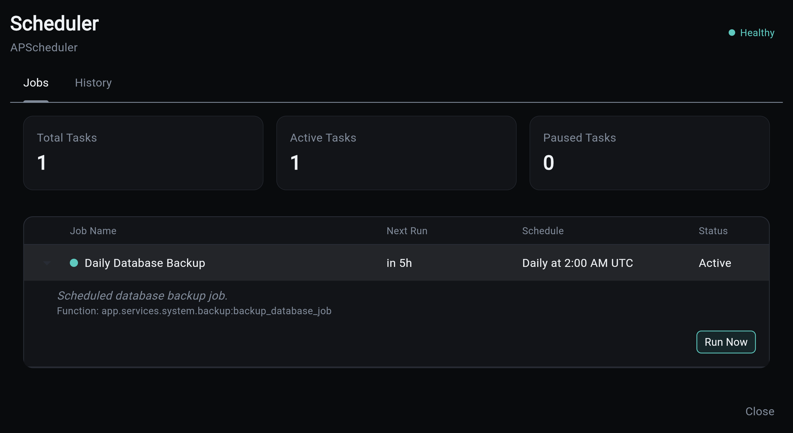
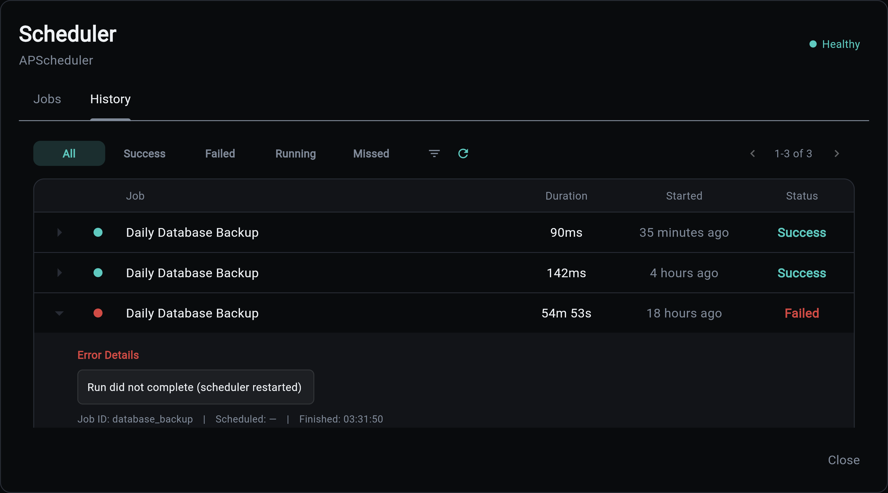

# Running Jobs

Aegis Stack gives you three ways to execute a scheduled job outside its normal schedule: the Overseer dashboard, the CLI, and the REST API directly. All three record the run to the same execution history.

## Overseer Dashboard

The Scheduler modal in the Overseer dashboard has two tabs.

### Jobs Tab



Shows the live job list. Each row displays the job name, next run time, schedule expression, and a status dot. Expanding a row reveals the backing function name and a **Run Now** button. Clicking **Run Now** opens a confirmation dialog, then triggers the job immediately via the API; a snackbar confirms the outcome.

### History Tab



Shows paginated execution history with a status filter. Each row displays:

- Status dot (success, failed, running, missed)
- Job name
- Duration
- Relative start time ("2 minutes ago")

Expanding a row shows the full job ID, the scheduled run time, and the finished time. Failed rows also surface the error message.

## CLI

The generated `tasks` CLI can trigger jobs and inspect their history without the backend running. Unlike the API (which runs the job in the backend and returns immediately), the CLI runs the job in-process and waits for the result, so it composes with scripts and CI.

```bash
# Run a job now and wait for the outcome
my-app tasks trigger database_backup

# Aggregate stats for one job
my-app tasks stats database_backup

# Recent execution history
my-app tasks history --job database_backup --limit 20
```

See the [Scheduler CLI](./cli.md) for the full command reference.

## REST API

All endpoints require admin authentication.

### Trigger a Job

```
POST /api/v1/scheduler/jobs/{job_id}/run
```

Runs the job immediately in the backend process. The execution is recorded to `job_execution` the same way a scheduled run is.

**Responses:**

| Status | Meaning |
|--------|---------|
| `202 Accepted` | Job started in the background |
| `404 Not Found` | No job with that ID exists |
| `409 Conflict` | An instance of this job is already running |

```bash
curl -X POST \
  -H "Authorization: Bearer $TOKEN" \
  "http://localhost:8000/api/v1/scheduler/jobs/database_backup/run"
```

### Fetch Execution History

```
GET /api/v1/scheduler/executions
```

Returns paginated execution records across all jobs.

**Query parameters:** `status`, `job_id`, `order` (`asc`/`desc`), `offset`, `limit` (max 100).

```bash
curl -H "Authorization: Bearer $TOKEN" \
  "http://localhost:8000/api/v1/scheduler/executions?status=failed&limit=20"
```

### Job Stats

```
GET /api/v1/scheduler/jobs/{job_id}/stats
```

Returns aggregate stats for a single job.

```bash
curl -H "Authorization: Bearer $TOKEN" \
  "http://localhost:8000/api/v1/scheduler/jobs/database_backup/stats"
```

Response:

```json
{
  "job_id": "database_backup",
  "total_runs": 42,
  "success_rate": 0.976,
  "avg_duration_ms": 312.4
}
```

## See Also

- **[Database Persistence](./persistence.md)** - Schema, retention policy, and stale row cleanup
- **[Examples](./examples.md)** - Real-world scheduling patterns
- **[CLI Interface](./cli.md)** - Command-line job management
- **[Scheduler Component](../scheduler.md)** - Scheduler overview
