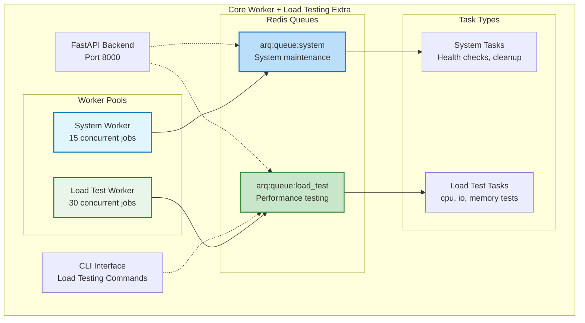
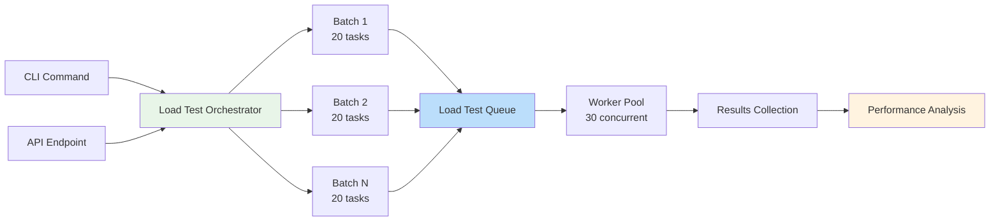

# Load Testing Extra

Built-in performance testing capabilities that add a dedicated load testing queue and comprehensive benchmarking tools.

!!! info "Extra Component"
    The load testing extra adds specialized functionality to the core worker component, including a dedicated `load_test` queue and performance testing tools.

## What This Extra Adds

### Load Test Queue

This extra adds a dedicated high-concurrency queue for performance testing:

| Queue | Purpose | Concurrency | Timeout | Use Cases |
|-------|---------|:-----------:|:-------:|-----------|
| **Load Test** 🚀 | Performance testing and analysis<br>(lightweight synthetic) | 30 jobs | 600s | • CPU testing<br>• I/O simulation<br>• Memory operations<br>• Queue benchmarking |

!!! danger "Isolation Required"
    The load_test queue should NEVER be used for production tasks. It's designed exclusively for synthetic workloads and performance testing.

### Performance Testing Capabilities

The load testing extra provides comprehensive tools for:

- Benchmark queue throughput
- Identify performance bottlenecks  
- Test scaling strategies
- Validate configuration changes
- Generate synthetic workloads

### Extended Architecture



!!! tip "Architecture Enhancement"
    The load testing extra extends the core worker architecture by adding a dedicated high-concurrency queue and specialized testing tasks, while keeping the core system queue isolated from test workloads.

## Running Load Test Workers

The load test queue uses standard arq patterns:

```bash
# Run load test worker directly with arq
arq app.components.worker.queues.load_test.WorkerSettings

# With auto-reload for development
arq app.components.worker.queues.load_test.WorkerSettings --watch app/

# Check health
arq app.components.worker.queues.load_test.WorkerSettings --check

# Process all queued jobs and exit (great for testing)
arq app.components.worker.queues.load_test.WorkerSettings --burst
```

### Docker

```bash
# Via docker-compose (recommended)
docker compose up worker-load-test

# The compose file just runs standard arq under the hood
# See: app/components/worker/queues/load_test.py for configuration
```

!!! tip "Pure arq Integration"
    The load test worker is just a standard arq WorkerSettings class. All arq features work - monitoring tools, debugging, custom flags, etc.

## CLI Interface

### Quick Tests

Run optimized load tests with sensible defaults:

```bash
# CPU-intensive testing
full-stack load-test cpu --tasks 50

# I/O simulation testing  
full-stack load-test io --tasks 100

# Memory operations testing
full-stack load-test memory --tasks 200
```

### Advanced Testing

Full control over test parameters:

```bash
# Custom load test configuration
full-stack load-test run \
  --type io_simulation \
  --tasks 1000 \
  --batch 20 \
  --delay 50 \
  --queue load_test

# View detailed results
full-stack load-test results <task_id> --detailed

# Get test type information
full-stack load-test info cpu_intensive
```

## API Interface

### Starting Load Tests

```bash
# Start load test via API
curl -X POST "http://localhost:8000/api/v1/tasks/load-test" \
  -H "Content-Type: application/json" \
  -d '{
    "num_tasks": 100,
    "task_type": "io_simulation", 
    "batch_size": 10,
    "delay_ms": 0,
    "target_queue": "load_test"
  }'
```

### Getting Results

```bash
# Get results with analysis
curl "http://localhost:8000/api/v1/tasks/load-test-result/{task_id}?target_queue=load_test"
```

## Load Test Types

### CPU Load Testing

Tests computational performance with intensive calculations:

```python
# Task: cpu_intensive_task
# Work performed:
- Fibonacci calculations
- Prime number checking  
- Mathematical operations
- String manipulations

# Metrics returned:
{
    "operations_per_ms": 145.3,
    "fibonacci_result": 832040,
    "cpu_operations": 50000,
    "execution_time_ms": 344.2
}
```

### I/O Load Testing

Tests async I/O handling and concurrency:

```python
# Task: io_simulation_task
# Work performed:
- Simulated network delays
- Concurrent async operations
- Database-like queries
- API call simulations

# Metrics returned:
{
    "io_efficiency_percent": 87.5,
    "concurrency_benefit": 4.2,
    "total_io_time_ms": 1523,
    "parallel_speedup": 3.8
}
```

### Memory Load Testing

Tests memory allocation and garbage collection:

```python
# Task: memory_operations_task  
# Work performed:
- Large data structure creation
- Memory allocation patterns
- Object lifecycle testing
- GC pressure simulation

# Metrics returned:
{
    "estimated_peak_memory_mb": 125.4,
    "memory_throughput_mb_per_sec": 450.2,
    "allocations_count": 10000,
    "gc_collections": 3
}
```

## Performance Analysis

### Understanding Results

Load test results include comprehensive analysis:

```json
{
  "test_id": "abc123",
  "configuration": {
    "task_type": "io_simulation",
    "num_tasks": 1000,
    "batch_size": 20,
    "delay_ms": 50
  },
  "metrics": {
    "tasks_sent": 1000,
    "tasks_completed": 998,
    "tasks_failed": 2,
    "total_duration_seconds": 45.3,
    "overall_throughput": 22.03,
    "failure_rate_percent": 0.2
  },
  "analysis": {
    "performance_analysis": {
      "throughput_rating": "good",
      "efficiency_rating": "excellent",
      "queue_pressure": "moderate",
      "recommendations": [
        "Consider increasing batch size for better throughput",
        "Queue handled load well, can increase concurrency"
      ]
    },
    "task_metrics": {
      "avg_execution_time_ms": 234.5,
      "p50_execution_time_ms": 210.0,
      "p95_execution_time_ms": 456.2,
      "p99_execution_time_ms": 892.1
    }
  }
}
```

### Performance Ratings

The system automatically rates performance based on **baseline establishment** and **task complexity**:

!!! warning "Context-Dependent Metrics"
    Performance thresholds are **highly dependent** on:
    
    - **Task complexity**: CPU-intensive tasks naturally have lower throughput
    - **System resources**: CPU cores, RAM, disk I/O capabilities  
    - **Test type**: I/O simulation vs memory operations vs CPU calculations
    - **Infrastructure**: Docker limits, network latency, Redis performance

| Rating | Throughput (baseline relative) | Meaning |
|--------|-------------------------------|---------|
| **Excellent** | >3x baseline | Queue performing optimally |
| **Good** | 1.5-3x baseline | Healthy performance |
| **Moderate** | 0.5-1.5x baseline | Acceptable for most workloads |
| **Poor** | <0.5x baseline | May need optimization |

**Example baselines** (for reference, not absolute standards):

- **Simple I/O simulation**: ~50-200 tasks/sec (varies by system)
- **CPU-intensive calculations**: ~10-50 tasks/sec (varies by complexity)
- **Memory operations**: ~100-500 tasks/sec (varies by allocation patterns)

!!! tip "Establish Your Baselines"
    Run initial load tests on your specific infrastructure to establish baseline performance for your task types and system configuration.

## Load Test Orchestration

### How It Works



### Batch Processing

Tasks are sent in configurable batches to:

- Prevent queue overwhelming
- Simulate realistic load patterns
- Allow for throttling and delays
- Enable progress monitoring

## Usage Examples

### Baseline Performance Test

Establish baseline metrics for your system:

```bash
# Test each queue type
for queue in system media load_test; do
  echo "Testing $queue queue..."
  full-stack load-test run \
    --type io_simulation \
    --tasks 100 \
    --queue $queue
done
```

### Stress Testing

Push queues to their limits:

```bash
# High-volume stress test
full-stack load-test run \
  --type cpu_intensive \
  --tasks 10000 \
  --batch 100 \
  --delay 0 \
  --no-wait

# Monitor in real-time
watch -n 1 'docker compose exec redis redis-cli DBSIZE'
```

### Scaling Validation

Test horizontal scaling effectiveness:

```bash
# Test with 1 worker
docker compose up --scale worker=1 -d
full-stack load-test run --type io_simulation --tasks 1000
SINGLE_WORKER_RESULT=$?

# Test with 3 workers
docker compose up --scale worker=3 -d
full-stack load-test run --type io_simulation --tasks 1000
MULTI_WORKER_RESULT=$?

# Compare results
echo "Compare task IDs: $SINGLE_WORKER_RESULT vs $MULTI_WORKER_RESULT"
```

## Integration with CI/CD

### GitHub Actions Example

```yaml
name: Performance Testing

on:
  pull_request:
    paths:
      - 'app/components/worker/**'

jobs:
  load-test:
    runs-on: ubuntu-latest
    steps:
      - uses: actions/checkout@v3
      
      - name: Start services
        run: docker compose up -d
        
      - name: Wait for services
        run: sleep 10
        
      - name: Run load tests
        run: |
          docker compose exec -T app \
            full-stack load-test run \
            --type io_simulation \
            --tasks 500 \
            --json > results.json
            
      - name: Check performance
        run: |
          THROUGHPUT=$(jq '.metrics.overall_throughput' results.json)
          if (( $(echo "$THROUGHPUT < 20" | bc -l) )); then
            echo "Performance regression detected!"
            exit 1
          fi
```

## Best Practices

!!! tip "Load Testing Best Practices"
    1. **Isolate test workloads** - Always use the dedicated load_test queue
    2. **Start small** - Begin with 100 tasks and scale up
    3. **Monitor resources** - Watch CPU, memory, and Redis during tests
    4. **Test regularly** - Include in CI/CD pipeline
    5. **Document baselines** - Keep records of expected performance

### Avoiding Common Pitfalls

**Don't mix production and test workloads:**
```python
# Bad - using production queue for testing
await enqueue_to_system_queue("load_test_task")

# Good - using dedicated test queue
await enqueue_to_load_test_queue("load_test_task")
```

**Don't ignore failed tasks:**
```bash
# Always check failure rates
full-stack load-test results <task_id> --detailed | grep failure_rate
```

**Don't test without monitoring:**
```bash
# Monitor during tests
docker stats worker
docker compose logs -f worker
```

## Customizing Load Tests

### Adding Custom Test Types

```python
# app/components/worker/tasks/load_tasks.py
async def custom_load_test(ctx) -> dict:
    """Custom load test implementation."""
    start_time = time.time()
    
    # Your custom test logic
    result = await perform_custom_operation()
    
    return {
        "task": "custom_load_test",
        "execution_time_ms": (time.time() - start_time) * 1000,
        "custom_metric": result
    }

# Register in task map
task_queue_map["custom_load_test"] = "load_test"
```

### Custom Analysis

```python
# app/services/load_test.py
def analyze_custom_results(results: list[dict]) -> dict:
    """Analyze custom load test results."""
    custom_metrics = [r.get("custom_metric") for r in results]
    
    return {
        "avg_custom_metric": statistics.mean(custom_metrics),
        "custom_analysis": perform_custom_analysis(custom_metrics)
    }
```

## Next Steps

- **[Configuration](../configuration.md)** - Optimize settings based on results
- **[Examples](../examples.md)** - See load testing in practice
- **[Back to Overview](../index.md)** - Return to worker component overview