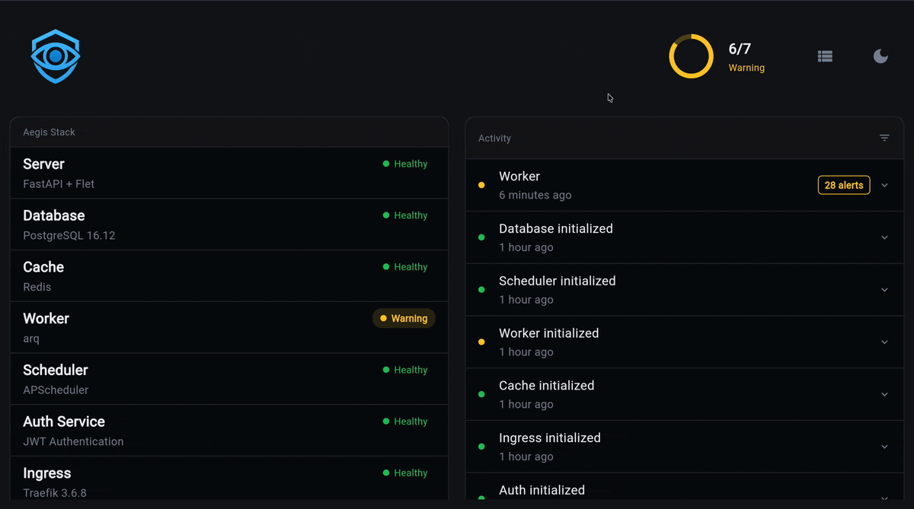

# Worker Component

Background task processing with your choice of worker backend: [arq](https://arq-docs.helpmanual.io/) (default), [Dramatiq](https://dramatiq.io/), or [TaskIQ](https://taskiq-python.github.io/).

!!! info "Adding Worker to Your Project"
    **Interactive** — the CLI prompts you to pick a backend when you select the worker component:
    ```bash
    aegis init my-project           # interactive mode prompts for backend
    aegis add worker --interactive  # same for existing projects
    ```

    **Non-interactive** — specify the backend with bracket syntax:
    ```bash
    # arq (default)
    aegis init my-project --components worker --no-interactive -y

    # Dramatiq
    aegis init my-project --components "worker[dramatiq]" --no-interactive -y

    # TaskIQ
    aegis init my-project --components "worker[taskiq]" --no-interactive -y
    ```

    Worker automatically includes Redis as a dependency. The command will:

    - Create worker component files (`app/components/worker/`)
    - Add worker queues (system, load-test)
    - Add worker health checks and Overseer dashboard card
    - Configure Docker services (Redis + workers)
    - Install backend-specific dependencies

## What You Get

- **Background task processing** - Runs any code without blocking your API
- **System queue** - For maintenance and background operations
- **Load test queue** - For performance benchmarking (isolated from production)
- **Auto-reload** - Built-in development mode with file watching
- **Dashboard monitoring** - Real-time queue depth and health status
- **Health checks** - Redis heartbeat keys and queue depth metrics

## Choosing a Backend

Select your backend at init time. The choice is permanent per project (switching requires recreating the worker component).

| Feature | arq | Dramatiq | TaskIQ |
|---------|-----|----------|--------|
| Concurrency model | Async (single process) | Process-based (multi-process) | Async (single process) |
| Best for | I/O-bound tasks | CPU-bound tasks | I/O-bound tasks |
| Async support | Native | Via `AsyncIO` middleware | Native |
| Result backend | Redis (built-in) | Redis (`Results` middleware) | Redis (`RedisAsyncResultBackend`) |
| Dependency | `arq` | `dramatiq[redis]>=1.17.0` | `taskiq`, `taskiq-redis` |
| Worker config | `WorkerSettings` classes | Single global broker | Per-queue broker instances |
| Queue transport | Redis lists | Redis lists | Redis Streams |

**When to choose arq**: You want a simple, well-tested async worker with minimal configuration. Good default for most projects.

**When to choose Dramatiq**: You have CPU-intensive tasks that benefit from multiple OS processes, or you're already familiar with Dramatiq's actor model.

**When to choose TaskIQ**: You want explicit per-queue broker configuration, Redis Streams transport with acknowledgement support, and a framework-style API.

## Quick Start

### See It Work

```bash
# Generate project with worker (defaults to arq)
aegis init my-project --components worker
cd my-project

# Setup and start everything
cp .env.example .env
make serve  # Starts Redis + workers + webserver

# In another terminal, trigger a background task
curl -X POST http://localhost:8000/api/v1/tasks/enqueue \
  -H "Content-Type: application/json" \
  -d '{"task_name": "io_simulation_task", "queue_type": "load_test"}'

# Check the result (replace {task_id} with actual ID from response)
curl http://localhost:8000/api/v1/tasks/result/{task_id}
```

**What just happened?**

1. Worker processed `io_simulation_task` in the background
2. Task ran without blocking your API
3. Result was stored in Redis for retrieval

Try the dashboard at [http://localhost:8000/dashboard](http://localhost:8000/dashboard) to see health status including worker queues!

### Overseer Dashboard

The Overseer dashboard provides real-time worker monitoring — queue status, job counts, and worker health at a glance:



## CLI Commands

=== "arq"

    Aegis Stack uses **pure arq** - no custom wrappers or abstractions. Your existing arq knowledge transfers 100%.

    **Start worker:**

    ```bash
    arq my_project.components.worker.queues.system.WorkerSettings
    ```

    **Auto-reload (development):**

    ```bash
    arq --watch my_project.components.worker.queues.system.WorkerSettings
    ```

    **Check queue status:**

    ```bash
    arq --check my_project.components.worker.queues.system.WorkerSettings
    ```

    **Example output:**
    ```
    16:30:45: Starting worker for 1 functions: process_data_task, send_email_task
    16:30:45: redis_version=7.0.0 mem_usage=1.00M clients_connected=5
    16:30:45:  j_complete=0 j_failed=0 j_retried=0 j_ongoing=0 queued=0
    ```

=== "Dramatiq"

    Dramatiq uses a single command that accepts multiple queue modules:

    ```bash
    dramatiq app.components.worker.broker \
      app.components.worker.queues.system \
      app.components.worker.queues.load_test \
      --queues system load_test
    ```

    **With multiple processes (CPU-bound workloads):**

    ```bash
    dramatiq app.components.worker.broker \
      app.components.worker.queues.system \
      app.components.worker.queues.load_test \
      --queues system load_test \
      --processes 4 --threads 8
    ```

    !!! info "Dramatiq --queues flag"
        The `--queues` flag tells Dramatiq which named queues to listen on. Without it, the worker listens on all queues. For load test isolation, always specify queues explicitly.

=== "TaskIQ"

    TaskIQ runs one worker per queue, pointing at the broker instance in each queue module:

    **System queue:**

    ```bash
    taskiq worker app.components.worker.queues.system:broker
    ```

    **Load test queue:**

    ```bash
    taskiq worker app.components.worker.queues.load_test:broker
    ```

    **With multiple processes:**

    ```bash
    taskiq worker app.components.worker.queues.system:broker --workers 4
    ```

## Adding Your First Task

=== "arq"

    ### 1. Create Your Task
    ```python
    # app/components/worker/tasks/my_tasks.py
    from typing import Any
    from app.core.log import logger

    async def send_welcome_email(ctx: dict[str, Any], user_id: int) -> dict:
        """Send welcome email to new user."""
        logger.info(f"Sending welcome email to user {user_id}")
        # Your email logic here
        return {"status": "sent", "user_id": user_id}
    ```

    ### 2. Register It
    ```python
    # app/components/worker/queues/system.py
    from app.components.worker.tasks.my_tasks import send_welcome_email

    class WorkerSettings:
        functions = [
            system_health_check,
            cleanup_temp_files,
            send_welcome_email,  # Add here
        ]
    ```

    ### 3. Use It
    ```python
    # In your API endpoint
    from app.components.worker.pools import get_queue_pool

    @router.post("/users")
    async def create_user(user_data: UserCreate):
        user = await save_user(user_data)

        pool, queue_name = await get_queue_pool("system")
        await pool.enqueue_job("send_welcome_email", user.id, _queue_name=queue_name)
        await pool.aclose()

        return {"message": "User created, welcome email queued"}
    ```

=== "Dramatiq"

    ### 1. Create Your Actor
    ```python
    # app/components/worker/queues/system.py
    import dramatiq
    from app.core.log import logger

    @dramatiq.actor(queue_name="system", store_results=True)
    async def send_welcome_email(user_id: int) -> dict:
        """Send welcome email to new user."""
        logger.info(f"Sending welcome email to user {user_id}")
        # Your email logic here
        return {"status": "sent", "user_id": user_id}
    ```

    Async actors work because the broker is configured with Dramatiq's built-in `AsyncIO` middleware - no external packages needed.

    ### 2. Enqueue It
    ```python
    # In your API endpoint
    import asyncio
    from app.components.worker.queues.system import send_welcome_email

    @router.post("/users")
    async def create_user(user_data: UserCreate):
        user = await save_user(user_data)

        # actor.send() is a sync Redis LPUSH - use asyncio.to_thread to avoid blocking
        message = await asyncio.to_thread(send_welcome_email.send, user.id)

        return {"message": "User created, welcome email queued", "message_id": message.message_id}
    ```

    Or use the shared `enqueue_task()` helper that handles the `asyncio.to_thread` wrapping:
    ```python
    from app.components.worker.pools import enqueue_task

    message = await enqueue_task(send_welcome_email, user.id)
    ```

=== "TaskIQ"

    ### 1. Create Your Task
    ```python
    # app/components/worker/queues/system.py
    from app.core.log import logger

    @broker.task
    async def send_welcome_email(user_id: int) -> dict:
        """Send welcome email to new user."""
        logger.info(f"Sending welcome email to user {user_id}")
        # Your email logic here
        return {"status": "sent", "user_id": user_id}
    ```

    Tasks are decorated with `@broker.task` on the queue's broker instance. All tasks must be `async def`.

    ### 2. Enqueue It
    ```python
    # In your API endpoint
    from app.components.worker.queues.system import send_welcome_email

    @router.post("/users")
    async def create_user(user_data: UserCreate):
        user = await save_user(user_data)

        # .kiq() enqueues the task and returns a handle for tracking
        handle = await send_welcome_email.kiq(user.id)

        return {"message": "User created, welcome email queued", "task_id": str(handle.task_id)}
    ```

    Or use the shared `enqueue_task()` helper:
    ```python
    from app.components.worker.pools import enqueue_task

    handle = await enqueue_task("send_welcome_email", "system", user.id)
    ```

That's it! The worker will process it automatically.

## Development Workflow

**Option 1: Standard Development (Recommended)**

```bash
# Start all services including worker
make serve
```

Worker runs automatically as part of docker-compose stack.

**Option 2: Development with Auto-Reload**

=== "arq"

    ```bash
    # Terminal 1: Start backend and Redis
    make serve

    # Terminal 2: Run worker with auto-reload (watches for code changes)
    arq --watch my_project.components.worker.queues.system.WorkerSettings
    ```

=== "Dramatiq"

    ```bash
    # Terminal 1: Start backend and Redis
    make serve

    # Terminal 2: Run worker (restart manually on changes)
    dramatiq app.components.worker.broker \
      app.components.worker.queues.system \
      --queues system
    ```

=== "TaskIQ"

    ```bash
    # Terminal 1: Start backend and Redis
    make serve

    # Terminal 2: Run worker (auto-reload via watchfiles in dev mode)
    taskiq worker app.components.worker.queues.system:broker
    ```

**Monitor your workers:**

```bash
make logs-worker     # Watch workers live
make health-detailed # See queue metrics
```

### Testing Your Tasks

```bash
# Quick test via API
curl -X POST http://localhost:8000/api/v1/tasks/enqueue \
  -H "Content-Type: application/json" \
  -d '{"task_name": "io_simulation_task", "queue_type": "load_test"}'

# Or use burst mode for one-off testing
make worker-test
```

## Configuration

Worker behavior is configured in `app/core/config.py`:

```python
# Redis connection (DSN format)
REDIS_URL: str = "redis://localhost:6379"
REDIS_DB: int = 0

# arq / TaskIQ settings
WORKER_KEEP_RESULT_SECONDS: int = 3600
WORKER_MAX_TRIES: int = 3

# Dramatiq settings
WORKER_PROCESSES: int = 1
WORKER_THREADS: int = 8
```

See **[Configuration](configuration.md)** for complete details including Docker, scaling, and monitoring.

## Next Steps

- **[Examples](examples.md)** - Real-world task patterns and API reference
- **[Configuration](configuration.md)** - Scaling and custom queues
- **[Load Testing](extras/load-testing.md)** - Stress test your workers
