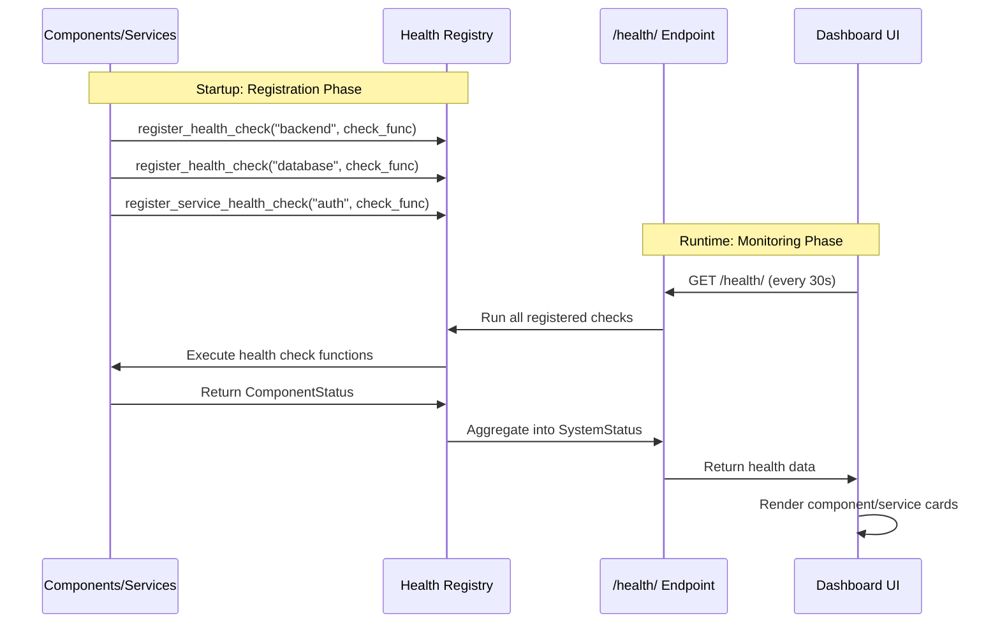

# Overseer

## Why This Exists

**Nothing is more annoying than the shrug.**

Something's broken in production. You ask what happened. You get a shrug. You ask when it started. Another shrug. You ask where the logs are. Shrug. You ask how we can fix it. The biggest fucking shrug you've ever seen.

If something is wrong, I want to know **where**, **when**, **how**, **why**, and **how can we reconcile it**. Christ! Is that too much to ask?

**It shouldn't be so fucking hard to know what happened, when, where.**

You work with Datadog until management decides to migrate to New Relic. Or you're a solo dev who just wants to see if your background jobs are running without paying enterprise prices. Overseer solves this: centralized monitoring that you own, built into every Aegis Stack project from day one.

## What It Is

**Overseer is a health monitoring dashboard** built into your Aegis Stack application. It provides real-time visibility into component and service health through a web UI.

The dashboard displays:

- **Component Cards**: Backend, Database, Worker, Scheduler health
- **Service Cards**: Auth, AI, Comms health (when included)
- **Header**: Overall health summary and theme toggle
- **Auto-refresh**: Polls health endpoint every 30 seconds

## Current Capabilities

- Component health monitoring (Backend, Database, Worker, Scheduler)
- Service health monitoring (Auth, AI, Comms)
- System metrics (CPU, memory, disk usage)
- Status hierarchy (Healthy, Warning, Unhealthy, Info)
- Web dashboard with auto-refresh (30-second polling)

## How It Works

**The Flow:**

1. **Registration**: During app startup, components and services register their health check functions with the health registry
2. **Aggregation**: The `/health/` endpoint runs all registered checks and aggregates results into a hierarchical status tree
3. **Polling**: The dashboard polls the health endpoint every 30 seconds
4. **Display**: Component and service cards render with real-time status, metrics, and details

## Health Status Indicators

Each card displays a status indicator using the Overseer status hierarchy:

| Status | Color | Visual | Meaning |
|--------|-------|--------|---------|
| **✅ Healthy** | Green | Solid green border | Component/service fully operational |
| **ℹ️ Info** | Blue | Solid blue border | Informational status, not a problem |
| **⚠️ Warning** | Yellow | Orange border | Operational but with issues |
| **❌ Unhealthy** | Red | Red border | Component/service down or failing |

**Status Propagation**: Parent components inherit the worst child status:

- Any child **Unhealthy** → Parent **Unhealthy**
- Any child **Warning** (no unhealthy) → Parent **Warning**
- Any child **Info** (no unhealthy/warning) → Parent **Info**
- All children **Healthy** → Parent **Healthy**

## The Story

Want to know how this came to be?

**[Read the full story →](story.md)** - How Overseer evolved from solving real production problems to becoming part of Aegis Stack.

## Next Steps

- **[The Overseer Story](story.md)** - Evolution from Streamlit to Aegis Stack and vision
- **[Integration Guide](integration.md)** - Add health checks to custom components/services
