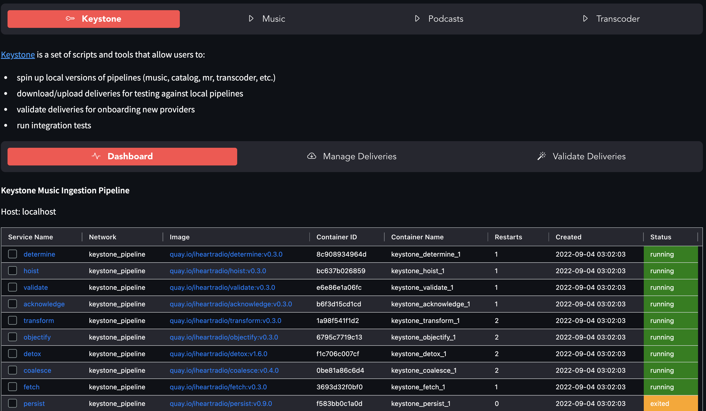

# The Overseer Story

!!! example "Musings: On Writing These Docs (November 22nd, 2025)"
    This shit is therapeutic, honestly. Getting to write down all the frustrations I've lived through - the shrugs, the vendor lock-in, the 3AM production fires where nobody knows what happened - and then showing the solution I built? That's cathartic.

    If this reads less like sterile technical documentation and more like a conversation with someone who's been there, good. That's intentional.

## From O(n) to O(1): How Overseer Evolved

### The Origin (2022-2024): Fighting the Shrug at Scale

I built the first Overseer at a media company to solve real production problems. The questions never stopped:

- "We received a new album from Ye, how come I don't see it on the front end?"
- "Are the transcoders running?"
- "Can we replay a bunch of deliveries?"
- "I have XML paths that aren't persisting. Can you grab them?"

Of course there were answers. But getting them meant SSH-ing into multiple machines, searching through exited containers, wading through AWS consoles across three environments, or navigating bureaucratic purgatory to find out nobody knew anything.

**Overseer changed that: O(n) → O(1).** Instant answers instead of archaeology.

It was a Streamlit-based control plane that did it all:

- Run Ansible deployments across staging and production
- Replay deliveries to re-trigger ingestion pipelines
- Validate DDEX files before they hit production
- Monitor Docker containers across environments
- Download deliveries from S3, batch process operations

It worked. **I** used it daily. But most other devs didn't.

**The painful truth**: I watched something I created not get used because it was hard as hell to configure. AWS 2FA, credential files in the right places, SSH access, local setup requirements. The friction killed adoption.

That lesson stuck with me.

### The Rebuild (2025): Zero Config, Maximum Value

While I was still designing Aegis Stack, I knew it was a non-negotiable whether or not to have a dashboard. But this time, I learned from my previous mistakes... 

I started with the foundation: monitoring. Health checks, status cards, real-time visibility. Get that right first, then evolve. That and ease of use. One of those, "it just works" DX's.

## Next Steps

- **[Overseer Overview](index.md)** - See what Overseer does today
- **[Integration Guide](integration.md)** - Add health checks to custom components/services
