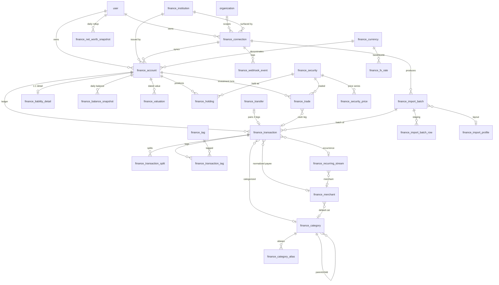

# Finance Service — Canonical Schema (v1)

> The single load-bearing artifact for the finance aggregator. 33 tables ship up front; the
> owner's #1 rule is **never add a finance table later**, so reserved-but-empty tables ship
> now and get populated when their feature lands.
>
> **TARGET = aegis-stack template service (`include_finance`).** This schema is authored TWICE
> in the template, and both must agree (there is precedent + a parity discipline for this):
> 1. **Runtime models** — `app/services/finance/models.py` in the template tree (a `.jinja` where
>    provider-conditional blocks are needed), bound to `SQLModel.metadata`, imported behind
>    `` in `alembic/env.py.jinja` so SQLite `create_all` + autogenerate see them.
> 2. **The migration** — NOT a hand-written `031_finance.py`. In aegis-stack, migrations are
>    **generated from declarative Python specs** (`aegis/core/migration_generator.py`): a
>    `FINANCE_MIGRATION = ServiceMigrationSpec(service_name="finance", tables=[TableSpec(...) × 33],
>    alter_tables=[...], schema="finance")`. **Revision IDs are auto-assigned** (sequential, in
>    service-toggle order) so the chain stays valid for any `include_*` combination — do NOT hardcode
>    a revision number. Each table below maps to a `TableSpec`; each index → `IndexSpec` (partial
>    uniques use `where=`, rendered as BOTH `sqlite_where` + `postgresql_where`); each check →
>    `CheckConstraintSpec`; each FK → `ForeignKeySpec` (`ondelete=`, and `ref_schema="auth"` for the
>    cross-schema `owner_user_id → auth.user.id` FK, mirroring `payment.payment_customer → auth.user`);
>    the one circular FK (`finance_transaction.transfer_group_id ↔ finance_transfer.id`) is an
>    `AlterTableSpec` applied after both tables exist (the `use_alter` equivalent).
>
> **Dual-engine:** the template targets **sqlite OR postgres**. Everything below is expressed to work
> on both — partial-unique indexes (both engines support `CREATE INDEX ... WHERE`), CHECK constraints,
> and `insert(...).on_conflict_do_update(...)` (dialect-dispatched: `sqlite.insert` vs `postgresql.insert`
> in the service layer). Finance tables live in a Postgres `finance` schema (ignored on SQLite).
>
> Conventions are locked by `finance-research/00-codebase-conventions.md` and obeyed verbatim:
> `int` autoincrement PKs (no UUID); money = `int` minor units + a `currency` code; naive-UTC
> timestamps via `utcnow_naive()`; enums = `String` + `CheckConstraint` for small OWNED closed sets,
> plain `TEXT` (no check) for growing provider taxonomies; JSON via `sa_column`; every user-scoped row
> carries `owner_user_id` + nullable `organization_id`; every FK indexed (currency FK is the one
> documented exception — see §0.4). `owner_user_id`/`organization_id` FKs exist only when `include_auth`
> (finance declares auth a required service).

---

## 0. Modeling decisions (the stance, and why)

Each decision follows the adversarial critique's recommendation. Deviations are stated explicitly.

### 0.1 Single-entry, not double-entry
**Chosen: single-entry.** One signed, sign-normalized row per financial event in `finance_transaction`,
plus an explicit `finance_transfer` pairing table and a `finance_transaction_split` child table.
Design 2's `finance_posting` / sum-to-zero ledger is **rejected**: 95% of rows are imported
(Plaid/OFX/CSV deliver ONE signed row + a balance, never the contra leg), a sum-to-zero invariant
cannot be a SQL `CHECK` across sibling rows anyway (so it lives in the service either way), and
every report would have to join through postings. Transfers and splits recover double-entry's two
correctness wins without shaping the whole ledger around them.

### 0.2 Money = int minor units; fractional quantities/rates/prices = scaled integers
**Chosen: `int` minor units everywhere for cash**, and **scaled integers** (never `Decimal`/`Numeric`)
for the three things cents can't hold:
- share/crypto **quantity** → `quantity_e8` (`int`, units × 1e8),
- **FX rate** → `rate_e8` (`int`, rate × 1e8),
- security **price** → `price` (`int` minor units) + a `price_scale` exponent (default = currency
  `decimals`, larger for sub-cent/crypto).

The `Numeric(38,18)`/`Numeric(28,12)` columns in Designs 2 and 4 are a real convention violation
("ZERO Decimal/Numeric money usage in the codebase — match this"), not a principled exception.
Scaled integers stay integer-deterministic and convention-clean.

### 0.3 Balances/net-worth = MATERIALIZED, never derived live
**Chosen: materialize both grains.** A per-account daily `finance_balance_snapshot` (upsert;
carry-forward on failed sync) **and** a per-user daily `finance_net_worth_snapshot` rollup
(cash/investments/other subtotals). A background job recomputes both; the headline chart is one
indexed range scan (`SELECT as_of_date, net_worth_amount ... WHERE owner_user_id=? ORDER BY as_of_date`),
never a fold over dozens of accounts (mind the worker-OOM history — keep recompute payloads bounded).
Imported accounts give only a current balance + partial history, so last March's balance is
**unreconstructable** from transactions — the snapshot is a persistence problem you cannot retrofit.
The provider-reported balance on `finance_account` is authoritative; transactions are the itemization,
never summed to a displayed balance.

### 0.4 Holdings = DATED snapshot, not current-only upsert
**Chosen: `UNIQUE(account_id, security_id, as_of_date)`.** Current value reads the latest date;
historical rows feed allocation-over-time. Design 1/2/4's current-only `UNIQUE(account_id, security_id)`
throws away allocation history you can never retrofit — the exact net-worth-history trap applied to
positions. (Currency is intentionally NOT in the holding dedup key: one position per security per
day; a position does not fork by currency.)

### 0.5 Plaid PFC — adopt as seed, own the runtime tree
**Chosen:** store raw `pfc_primary` / `pfc_detailed` as plain `TEXT` (no check — PFC keeps expanding)
on `finance_transaction`, AND map to an OWNED 2-level `finance_category` tree seeded from PFC's
16 primary / 104 detailed. `finance_category_alias` maps free-text QIF/Chase/AMEX/PFC strings onto
canonical categories; unmatched → the seeded `uncategorized` row. `category_source` precedence is a
hard contract: `provider → ml → rule → user`, and **re-sync must never clobber a user override**
(`is_user_categorized=true` freezes `category_id`).

### 0.6 Transfers, splits, pending — the three correctness traps
- **Transfer / credit-card-payment double-count** (the #1 credibility bug): `finance_transfer`
  pairs two legs (`from_transaction_id`/`to_transaction_id`, each PARTIAL-UNIQUE so a leg joins at
  most one transfer), sets `is_transfer=true` + `excluded_from_reports=true` on both legs, carries a
  `confidence` score and `match_method`. Cash-flow/income aggregates filter `is_transfer=false`; net
  worth is naturally immune. **Suggest-and-confirm below a high confidence threshold** — never
  silently zero money (Venmo-to-a-friend and one-sided legs are real spend).
- **Splits:** `finance_transaction_split` child rows; parent `is_split=true` and parent `category_id`
  NULL when split; service enforces `SUM(split.amount) == parent.amount`. Content-hash dedup stays at
  the PARENT grain so a multi-leg QIF row is one idempotent unit.
- **Pending → posted** (a DELETE+INSERT with different ids): the posted row carries
  `pending_provider_id` (Plaid `pending_transaction_id`) and a self-FK `pending_transaction_id`; on
  arrival the pending predecessor is soft-deleted (`deleted_at`, `is_removed=true`). **Mutable upsert +
  soft-delete, never append-only-immutable** — banks edit and delete the past (`modified` → in-place
  patch, `removed` → tombstone that survives re-sync). `raw_amount` + `raw_sign_convention` preserve
  the source's original so a mis-read sign is a re-derivation, not data loss.

### 0.7 Provider-polymorphic connection = ONE fat row
**Chosen:** one `finance_connection` row with credentials as INLINE encrypted columns
(`access_token_encrypted`, `api_key_encrypted`, `api_secret_encrypted`, `api_passphrase_encrypted`,
`refresh_token_encrypted`, plaintext `wallet_address`), a JSON `capabilities` matrix, and inline
`status`/health. This mirrors direct codebase precedent — the `Project` model already stores
`github_token` + `plausible_api_key` inline-encrypted on one row. Design 3's separate
credential + capability + link_session tables are over-normalized for a solo build; a JSONB
capability matrix is queryable enough for v1. Ephemeral Plaid `link_token`/`public_token`
(~4h/30m) go in **Redis**, not a durable encrypted table.

### 0.8 "Wasting money" insights — reuse `insight_event` now, ship `finance_insight` RESERVED
**Chosen:** emit v1 rule-based signals (recurring/subscription, price-hike, fee/interest, category
overspend, spending anomaly) through the EXISTING `app/services/insights/` `insight_event` machinery
(the country-spike rule pattern) — ships without AI (`include_ai: false`). Ship `finance_insight`
**reserved** for finance-specific `dedup_key` idempotency + typed `related_*` FKs when that surface
matures and is AI-ready for Illiana. Do NOT build ML tables (`category_correction`) — no ML layer
exists.

### 0.9 Currency PK shape + width
**Chosen:** `int` autoincrement `id` PK + `UNIQUE(code)`, and **`code` widened to `str(16)`** so
crypto tickers (USDC, USDT, MATIC) fit. Design 2/4's string-code PK deviates from the int-PK rule;
Design 1/3's `str(3)` cannot hold crypto tickers though crypto is in scope. `code` is stored/seeded
**lowercase** (`usd`, `btc`) to match the convention example. Every money column carries a
`currency: str(16)` FK to `finance_currency.code`.

### 0.10 Deliberate FK-index exception
Convention says "every FK indexed." The **`currency` FK is the one documented exception** — it is
low-cardinality (a handful of distinct codes) and indexing it is near-useless. `currency` FKs are
declared `ON DELETE RESTRICT` and **left unindexed** by policy, applied uniformly across all tables.
Every OTHER FK — including all self-FKs (`pending_transaction_id`, `canonical_transaction_id`,
`transfer_group_id`, `reverses_transaction_id`, `parent_id`) and the trailing FK of every join
table — carries an explicit `ix_`.

---

## 1. Table catalog

Legend: **[v1]** = populated at launch · **[reserved]** = shipped now, empty until its feature lands.
All tables are `finance_`-prefixed (avoids collision with the shared `SQLModel.metadata` namespace —
`insight_*`, `blog_*`, `payment_*`, and future services). All money columns are `int` minor units;
all `*_at` are naive-UTC (`utcnow_naive()`); all `metadata_` map to a DB column named `"metadata"`.

Standard trailing columns on every table (omitted from the per-column lists below to reduce noise):
`created_at: datetime` and, where the row is mutable, `updated_at: datetime`, both
`default_factory=utcnow_naive`.

---

## GROUP A — Connections & Sync

### `finance_institution` [v1]
Provider-agnostic institution directory (Chase, AMEX, Fidelity, Vanguard, Robinhood, Coinbase).
Shared/global reference — NOT user-scoped. Carries the capability flags the domain brief mandates.

| column | type | notes |
|---|---|---|
| id | int PK | autoincrement |
| provider | str(16) String+Check | which aggregator surfaced it (a row per provider view of an institution) |
| provider_institution_id | text | nullable; Plaid `ins_xxx` / SnapTrade brokerage id. Growing → TEXT. Dedup component |
| name | str(128) | "Chase", "American Express" |
| domain | str(255) | nullable; primary web domain (cross-provider identity hint) |
| logo_url | text | nullable |
| primary_color | str(16) | nullable hex |
| url | text | nullable |
| country | str(2) | nullable; ISO-3166 alpha-2 |
| oauth_required | bool | default false; Chase + AMEX are true (bank-hosted OAuth) |
| uses_tokenized_account_numbers | bool | default false; Chase TANs — don't treat as real routing # |
| uses_app_to_app | bool | default false; Chase mobile |
| supported_products | json | list, e.g. `["transactions","balance","liabilities","investments"]`; AMEX = assets/balance/transactions only |
| metadata_ | json | `Column("metadata", JSON)`; raw provider institution blob |

- **FKs:** none.
- **Indices:** `ix_finance_institution_provider (provider)`, `ix_finance_institution_name (name)`.
- **Unique:** `uq_finance_institution_provider_extid UNIQUE(provider, provider_institution_id) WHERE provider_institution_id IS NOT NULL` (partial).
- **Checks:** `ck_finance_institution_provider: provider IN ('plaid','snaptrade','coinbase','exchange_key','onchain','manual')`.

### `finance_connection` [v1]
Provider-polymorphic connection (Plaid Item | SnapTrade authorization | exchange api-key | on-chain
wallet | manual). ONE fat row: inline AES-GCM-encrypted credential columns + JSON capability matrix +
inline health/status + the Plaid item-level sync cursor. **Register the encrypted columns in the
key-rotation CLI** (§6.3); `__repr__` masks them.

| column | type | notes |
|---|---|---|
| id | int PK | AAD context base: `finance_connection:{id}:{column}` |
| owner_user_id | int FK user.id | indexed; CASCADE |
| organization_id | int? FK organization.id | nullable, indexed; SET NULL |
| institution_id | int? FK finance_institution.id | nullable, indexed; SET NULL |
| provider | str(16) String+Check | polymorphic discriminator |
| connection_type | str(20) String+Check | credential shape: `oauth_access_token`\|`api_key_secret`\|`onchain_address`\|`aggregator_token`\|`manual` |
| provider_item_id | text | nullable; Plaid `item_id` / SnapTrade `authorizationId`. Stable per-connection dedup key. Growing → TEXT |
| label | str(255) | nullable; user label ("Chase (personal)") |
| environment | str(16) String+Check | `sandbox`\|`production`; Items can't move between envs |
| access_token_encrypted | text | nullable CIPHERTEXT (Plaid access_token / SnapTrade userSecret). Masked in `__repr__` |
| api_key_encrypted | text | nullable CIPHERTEXT (exchange key) |
| api_secret_encrypted | text | nullable CIPHERTEXT (exchange secret) |
| api_passphrase_encrypted | text | nullable CIPHERTEXT (Coinbase-style passphrase) |
| refresh_token_encrypted | text | nullable CIPHERTEXT (OAuth refresh) |
| wallet_address | text | nullable PLAINTEXT public on-chain address (not a secret) |
| wallet_chain | text | nullable; `ethereum`/`bitcoin`/`solana`. Growing → TEXT |
| capabilities | json | `Column("capabilities", JSON)`; matrix `{read_transactions,read_balances,read_investments,read_liabilities,read_cost_basis,trade_*: bool}` |
| status | str(24) String+Check | connection health |
| status_detail | text | nullable; provider error message |
| last_error_code | text | nullable; `ITEM_LOGIN_REQUIRED` etc. Growing → TEXT |
| needs_user_action | bool | default false, indexed; drive reauth UI off THIS, not raw error strings |
| sync_cursor | text | nullable; Plaid `/transactions/sync` `next_cursor` (item-level, opaque ≤256). Idempotent re-sync |
| days_requested | int? | nullable; max history requested up front — **cannot be cheaply extended later** |
| consent_expiration_at | datetime? | nullable; Plaid consent/OAuth expiry. Do NOT hardcode 90d |
| last_successful_sync_at | datetime? | nullable; carry-forward balance source on failure |
| last_sync_attempt_at | datetime? | nullable |
| removed_at | datetime? | nullable; `/item/remove` teardown (stops per-Item monthly billing) |
| deleted_at | datetime? | nullable, indexed; soft-delete |
| metadata_ | json | `Column("metadata", JSON)` |

- **FKs:** `owner_user_id → user.id` CASCADE (idx); `organization_id → organization.id` SET NULL (idx); `institution_id → finance_institution.id` SET NULL (idx).
- **Indices:** `ix_finance_connection_owner (owner_user_id)`, `ix_finance_connection_org (organization_id)`, `ix_finance_connection_institution (institution_id)`, `ix_finance_connection_needs_action (needs_user_action)`, `ix_finance_connection_deleted (deleted_at)`, `ix_finance_connection_owner_status (owner_user_id, status)`.
- **Unique:** `uq_finance_connection_provider_item UNIQUE(provider, provider_item_id) WHERE provider_item_id IS NOT NULL AND deleted_at IS NULL` (partial); `uq_finance_connection_wallet UNIQUE(owner_user_id, provider, wallet_address) WHERE wallet_address IS NOT NULL` (partial).
- **Checks:** `ck_finance_connection_provider: provider IN ('plaid','snaptrade','coinbase','exchange_key','onchain','manual')`; `ck_finance_connection_type: connection_type IN ('oauth_access_token','api_key_secret','onchain_address','aggregator_token','manual')`; `ck_finance_connection_environment: environment IN ('sandbox','production')`; `ck_finance_connection_status: status IN ('healthy','login_required','pending_expiration','pending_disconnect','consent_expired','revoked','error','loading','manual')`.

### `finance_webhook_event` [v1]
Idempotent inbound provider-webhook log; drives per-Item sync enqueue and is the replay/debug buffer.
Dedups on `provider_event_id` so a re-delivered webhook is a no-op.

| column | type | notes |
|---|---|---|
| id | int PK | |
| connection_id | int? FK finance_connection.id | nullable, indexed; may arrive before Item mapped. CASCADE |
| provider | str(16) String+Check | |
| provider_item_id | text | nullable, indexed; Plaid `item_id` correlator |
| webhook_type | text | `TRANSACTIONS`, `ITEM`, `HOLDINGS`. Growing → TEXT |
| webhook_code | text | `SYNC_UPDATES_AVAILABLE` etc. Growing → TEXT |
| provider_event_id | text | nullable; idempotency dedup key |
| payload | json | `Column("payload", JSON)`; raw body |
| status | str(16) String+Check | `received`\|`processed`\|`ignored`\|`error` |
| error | text | nullable |
| received_at | datetime | default `utcnow_naive` |
| processed_at | datetime? | nullable |

- **FKs:** `connection_id → finance_connection.id` CASCADE (idx).
- **Indices:** `ix_finance_webhook_connection (connection_id)`, `ix_finance_webhook_item (provider_item_id)`, `ix_finance_webhook_status_received (status, received_at)`.
- **Unique:** `uq_finance_webhook_event UNIQUE(provider, provider_event_id) WHERE provider_event_id IS NOT NULL` (partial).
- **Checks:** `ck_finance_webhook_provider: provider IN ('plaid','snaptrade','coinbase')`; `ck_finance_webhook_status: status IN ('received','processed','ignored','error')`.

---

## GROUP B — Accounts & Balances

### `finance_account` [v1]
One row per provider account AND per manual asset (`is_manual=true` covers real estate/vehicle/
crypto/private). Provider-reported balance is authoritative. Normalized `account_type` +
`classification` are STORED for fast net-worth signing; Plaid `type`/`subtype` are plain TEXT.
`connection_id` NULL ⇒ manual.

| column | type | notes |
|---|---|---|
| id | int PK | |
| owner_user_id | int FK user.id | indexed; CASCADE |
| organization_id | int? FK organization.id | nullable, indexed; SET NULL |
| connection_id | int? FK finance_connection.id | nullable, indexed; NULL=manual. CASCADE |
| institution_id | int? FK finance_institution.id | nullable, indexed; SET NULL |
| provider | str(16) String+Check | denormalized source |
| provider_account_id | text | nullable; Plaid/SnapTrade account id (stable within Item). Growing → TEXT. Dedup key |
| persistent_account_id | text | nullable, indexed; **stable across relinks** — a re-linked Item mints a new `provider_account_id`; this prevents duplicate accounts + a broken net-worth line |
| name | str(255) | display name |
| official_name | str(255) | nullable |
| mask | str(8) | nullable; last-4 |
| type | text | Plaid top-level `depository`/`credit`/`loan`/`investment`/`other`. Growing → TEXT |
| subtype | text | nullable; Plaid subtype (checking/savings/hsa/401k/roth/brokerage/crypto/mortgage/...). Growing → TEXT |
| account_type | str(24) String+Check | normalized internal type for signing/UI |
| classification | str(12) String+Check | `asset`\|`liability`; STORED for net-worth sign |
| currency | str(16) FK finance_currency.code | native currency; RESTRICT (unindexed) |
| current_balance | int? | nullable; provider-reported, authoritative |
| available_balance | int? | nullable |
| credit_limit | int? | nullable; NULL for AMEX charge cards |
| balance_as_of | datetime? | nullable; freshness of current balance |
| is_manual | bool | default false |
| is_hidden | bool | default false; exclude from net worth |
| is_closed | bool | default false |
| is_on_budget | bool | default true |
| linked_at | datetime? | nullable; "history starts here" |
| last_synced_at | datetime? | nullable |
| deleted_at | datetime? | nullable, indexed; soft-delete |
| metadata_ | json | `Column("metadata", JSON)`; real-estate address / VIN for manual assets |

- **FKs:** `owner_user_id → user.id` CASCADE (idx); `organization_id → organization.id` SET NULL (idx); `connection_id → finance_connection.id` CASCADE (idx); `institution_id → finance_institution.id` SET NULL (idx); `currency → finance_currency.code` RESTRICT (unindexed).
- **Indices:** `ix_finance_account_owner (owner_user_id)`, `ix_finance_account_org (organization_id)`, `ix_finance_account_connection (connection_id)`, `ix_finance_account_institution (institution_id)`, `ix_finance_account_persistent (persistent_account_id)`, `ix_finance_account_deleted (deleted_at)`, `ix_finance_account_owner_type (owner_user_id, account_type)`, `ix_finance_account_owner_classification (owner_user_id, classification)`.
- **Unique:** `uq_finance_account_provider UNIQUE(connection_id, provider_account_id) WHERE provider_account_id IS NOT NULL AND deleted_at IS NULL` (partial).
- **Checks:** `ck_finance_account_type: account_type IN ('checking','savings','credit_card','loan','investment','brokerage','crypto','property','vehicle','cash','other_asset','other_liability')`; `ck_finance_account_classification: classification IN ('asset','liability')`; `ck_finance_account_provider: provider IN ('plaid','snaptrade','coinbase','exchange_key','onchain','manual')`.

### `finance_liability_detail` [v1]
1:1 per credit/loan account — statement balance, minimum payment, due dates, APR array. Chase
Liabilities is in launch scope; **AMEX fields are NULL** (gated on `supported_products`). APR array
is a JSON column (not a child table — APR-by-type is not a relational query). Upserted per pull.

| column | type | notes |
|---|---|---|
| id | int PK | |
| owner_user_id | int FK user.id | indexed; CASCADE |
| account_id | int FK finance_account.id | indexed, UNIQUE (1:1); CASCADE |
| liability_type | text | `credit`\|`mortgage`\|`student`. Growing → TEXT |
| last_statement_balance | int? | nullable |
| last_statement_issue_date | date? | nullable |
| last_payment_amount | int? | nullable |
| last_payment_date | date? | nullable |
| minimum_payment_amount | int? | nullable |
| next_payment_due_date | date? | nullable |
| origination_date | date? | nullable (loans) |
| origination_principal | int? | nullable (loans) |
| outstanding_balance | int? | nullable |
| interest_rate_bps | int? | nullable; basis points (avoids Decimal) |
| ytd_interest_paid | int? | nullable |
| ytd_principal_paid | int? | nullable |
| loan_term_months | int? | nullable |
| is_overdue | bool? | nullable |
| aprs | json | `Column("aprs", JSON)`; list of `{apr_type, apr_percentage_bps, balance_subject_to_apr, interest_charge_amount}` — Plaid APR array folded into JSON |
| currency | str(16) FK finance_currency.code | RESTRICT (unindexed) |
| raw | json | `Column("raw", JSON)`; full Plaid liabilities payload |

- **FKs:** `owner_user_id → user.id` CASCADE (idx); `account_id → finance_account.id` CASCADE (idx); `currency → finance_currency.code` RESTRICT (unindexed).
- **Indices:** `ix_finance_liability_owner (owner_user_id)`, `ix_finance_liability_account (account_id)`.
- **Unique:** `uq_finance_liability_account UNIQUE(account_id)`.
- **Checks:** none (all growing/typed).

### `finance_balance_snapshot` [v1]
THE net-worth-over-time primitive: materialized daily balance per account, recomputed/upserted by a
background job (carried-forward on days with no provider update). `owner_user_id` denormalized for
per-user timeline scans.

| column | type | notes |
|---|---|---|
| id | int PK | |
| account_id | int FK finance_account.id | indexed; CASCADE. Dedup key with `balance_date` |
| owner_user_id | int FK user.id | indexed; CASCADE. Denormalized |
| organization_id | int? FK organization.id | nullable, indexed; SET NULL |
| balance_date | date | the day this balance represents |
| balance | int | net balance that day (asset +, liability magnitude by convention) |
| available_balance | int? | nullable |
| cash_balance | int? | nullable; investment cash portion |
| holdings_value | int? | nullable; market value of positions |
| currency | str(16) FK finance_currency.code | RESTRICT (unindexed) |
| base_currency_value | int? | nullable; converted to user base currency via `finance_fx_rate` (filled when multi-currency active) |
| source | str(16) String+Check | how obtained |
| is_estimated | bool | default false; true for carried-forward/interpolated gap fill |

- **FKs:** `account_id → finance_account.id` CASCADE (idx); `owner_user_id → user.id` CASCADE (idx); `organization_id → organization.id` SET NULL (idx); `currency → finance_currency.code` RESTRICT (unindexed).
- **Indices:** `ix_finance_balsnap_account_date (account_id, balance_date)`, `ix_finance_balsnap_owner_date (owner_user_id, balance_date)`.
- **Unique:** `uq_finance_balsnap UNIQUE(account_id, balance_date)`.
- **Checks:** `ck_finance_balsnap_source: source IN ('sync','provider','computed','carried_forward','manual')`.

### `finance_net_worth_snapshot` [v1]
Per-user daily net-worth rollup so the headline chart is O(1). Recomputed by the same job that fills
`finance_balance_snapshot`, aggregating accounts + holdings + manual-asset valuations.

| column | type | notes |
|---|---|---|
| id | int PK | |
| owner_user_id | int FK user.id | indexed; CASCADE |
| organization_id | int? FK organization.id | nullable, indexed; SET NULL |
| as_of_date | date | rollup day |
| total_assets_amount | int | sum of asset accounts |
| total_liabilities_amount | int | sum of liability accounts (stored positive magnitude) |
| net_worth_amount | int | assets − liabilities |
| cash_amount | int? | nullable; depository subtotal |
| investments_amount | int? | nullable; investment subtotal |
| other_assets_amount | int? | nullable; manual assets subtotal |
| currency | str(16) FK finance_currency.code | reporting currency; RESTRICT (unindexed) |
| breakdown | json | `Column("breakdown", JSON)`; per-account-type subtotals |
| is_estimated | bool | default false; true if any input was estimated/stale |

- **FKs:** `owner_user_id → user.id` CASCADE (idx); `organization_id → organization.id` SET NULL (idx); `currency → finance_currency.code` RESTRICT (unindexed).
- **Indices:** `ix_finance_networth_owner_date (owner_user_id, as_of_date)`, `ix_finance_networth_org_date (organization_id, as_of_date)`.
- **Unique:** `uq_finance_networth UNIQUE(owner_user_id, as_of_date, currency)`.
- **Checks:** none.

### `finance_valuation` [v1]
Source-tagged dated-value time series unifying manual/off-aggregator assets (real estate, vehicles,
crypto marks, private holdings) as "a dated value" with staleness tracking. Feeds the balance-snapshot
recompute for non-transactional assets. One value per account/day/source.

| column | type | notes |
|---|---|---|
| id | int PK | |
| owner_user_id | int FK user.id | indexed; CASCADE. Denormalized |
| organization_id | int? FK organization.id | nullable, indexed; SET NULL |
| account_id | int FK finance_account.id | indexed; CASCADE. The manual-asset account being valued |
| as_of_date | date | date the value is asserted for |
| value | int | asset value that day |
| currency | str(16) FK finance_currency.code | RESTRICT (unindexed) |
| source | str(16) String+Check | valuation source |
| source_ref | text | nullable; Zillow URL/zpid, wallet address, VIN |
| is_estimate | bool | default false; AVM/estimate vs confirmed |
| fetched_at | datetime? | nullable; when the source produced it (staleness clock) |
| is_stale | bool | default false; set by staleness job |
| stale_after_days | int? | nullable; per-asset freshness budget |
| note | text | nullable |
| metadata_ | json | `Column("metadata", JSON)` |

- **FKs:** `owner_user_id → user.id` CASCADE (idx); `organization_id → organization.id` SET NULL (idx); `account_id → finance_account.id` CASCADE (idx); `currency → finance_currency.code` RESTRICT (unindexed).
- **Indices:** `ix_finance_valuation_owner_date (owner_user_id, as_of_date)`, `ix_finance_valuation_account_date (account_id, as_of_date)`, `ix_finance_valuation_source (source)`.
- **Unique:** `uq_finance_valuation UNIQUE(account_id, as_of_date, source)`.
- **Checks:** `ck_finance_valuation_source: source IN ('manual','zillow','kbb','exchange_api','onchain','plaid','snaptrade','coingecko','reconciliation')`.

---

## GROUP C — Transactions & Categorization

### `finance_transaction` [v1]
The core single-entry cash ledger (depository + credit + charge). Mutable upsert + soft-delete.
Dual-lane deterministic dedup (provider-id OR content-hash), lossless cross-source collapse, pending
linkage, transfer pairing, refunds, splits. `raw_payload` always persisted (re-derive without re-billing).

| column | type | notes |
|---|---|---|
| id | int PK | |
| owner_user_id | int FK user.id | indexed; CASCADE |
| organization_id | int? FK organization.id | nullable, indexed; SET NULL |
| account_id | int FK finance_account.id | indexed; CASCADE. Dedup-scope root |
| connection_id | int? FK finance_connection.id | nullable, indexed; SET NULL. Provenance |
| import_batch_id | int? FK finance_import_batch.id | nullable, indexed; SET NULL. Reversible batch |
| source | str(16) String+Check | dedup discriminator + LANE-1 key part |
| external_id | text | nullable; Plaid `transaction_id` / OFX `FITID` / SnapTrade id. **LANE-1 dedup, account-scoped (FITID never global)**. Growing → TEXT |
| external_id_source | text | nullable; which id namespace (`plaid`\|`fitid`\|`snaptrade`) |
| import_hash | str(64) | nullable; sha256 content hash for id-less rows (QIF/CSV/manual). **LANE-2 dedup** |
| within_day_ordinal | int | default 0; disambiguates identical same-day/amount/payee rows — **assigned within a deterministic sort (date, amount, normalized_payee, memo), NEVER file order** (so an overlapping re-export doesn't shift every hash) |
| dedup_status | str(16) String+Check | cross-source collapse marker; default `unique` |
| canonical_transaction_id | int? FK finance_transaction.id (self) | nullable, indexed; SET NULL. Duplicate → its primary |
| source_precedence | int | default 0; higher wins on collapse (plaid/snaptrade=100 > ofx=70 > qif=50 > csv=40 > manual=30) |
| amount | int | **SIGN-NORMALIZED**: negative=outflow/spend, positive=inflow (house rule) |
| raw_amount | int? | nullable; exactly as the source delivered (audit / re-derivation) |
| raw_sign_convention | text | nullable; how `raw_amount` was signed: `plaid`\|`ofx`\|`amex`\|`natural` |
| currency | str(16) FK finance_currency.code | RESTRICT (unindexed) |
| unofficial_currency_code | text | nullable; crypto/non-standard (Plaid) |
| date | date | posted/settled date (OFX `DTPOSTED` / Plaid `date`) |
| authorized_date | date? | nullable; when swiped — prefer for spending analytics |
| datetime_ | datetime? | `Column("datetime")`; nullable precise timestamp |
| name | text | cleaned display name/description |
| original_description | text | nullable; raw bank memo (OFX `NAME`/`MEMO`, CSV description) — kept so re-normalization is always possible |
| merchant_id | int? FK finance_merchant.id | nullable, indexed; SET NULL |
| merchant_name | text | nullable; Plaid-enriched merchant string |
| merchant_entity_id | text | nullable, indexed; Plaid stable merchant entity id |
| memo | text | nullable; part of content hash |
| check_number | str(32) | nullable; OFX `CHECKNUM`; part of content hash |
| payment_channel | text | nullable; `online`/`in store`/`other`. Growing → TEXT |
| pfc_primary | text | nullable; raw Plaid PFC primary (16). Growing → TEXT |
| pfc_detailed | text | nullable; raw Plaid PFC detailed (104). Growing → TEXT |
| pfc_confidence_level | text | nullable |
| category_id | int? FK finance_category.id | nullable, indexed; SET NULL. Effective category (NULL when `is_split`) |
| category_source | str(12) String+Check | precedence guard; user override never clobbered |
| is_user_categorized | bool | default false; freezes `category_id` against re-sync |
| is_reviewed | bool | default false |
| pending | bool | default false, indexed |
| pending_provider_id | text | nullable; Plaid `pending_transaction_id` (posted row → its pending) |
| pending_transaction_id | int? FK finance_transaction.id (self) | nullable, indexed; SET NULL. Internal pending predecessor |
| status | str(12) String+Check | `pending`\|`posted`\|`removed` |
| is_transfer | bool | default false, indexed; excluded from cash-flow |
| transfer_group_id | int? FK finance_transfer.id | nullable, indexed; SET NULL, `use_alter=True` (breaks circular dep) |
| transfer_pair_transaction_id | int? FK finance_transaction.id (self) | nullable, indexed; SET NULL. Direct other leg |
| is_split | bool | default false |
| excluded_from_reports | bool | default false |
| is_reversal | bool | default false; refund/reversal |
| reverses_transaction_id | int? FK finance_transaction.id (self) | nullable, indexed; SET NULL. Original charge this reverses (link, don't auto-net) |
| recurring_stream_id | int? FK finance_recurring_stream.id | nullable, indexed; SET NULL. Back-ref (a txn belongs to ≤1 stream — no join table) |
| reconciled_status | str(12) String+Check | 3-state: `uncleared`\|`cleared`\|`reconciled` (reconciled = locked) |
| location | json | `Column("location", JSON, nullable=True)`; Plaid location — don't explode |
| counterparties | json | `Column("counterparties", JSON, nullable=True)` |
| raw_payload | json | `Column("raw_payload", JSON, nullable=True)`; full provider blob |
| is_removed | bool | default false; Plaid `removed[]` / bank deletion |
| removed_at | datetime? | nullable |
| deleted_at | datetime? | nullable, indexed; soft-delete tombstone survives re-sync |
| metadata_ | json | `Column("metadata", JSON)` |

- **FKs:** `owner_user_id → user.id` CASCADE (idx); `organization_id → organization.id` SET NULL (idx); `account_id → finance_account.id` CASCADE (idx); `connection_id → finance_connection.id` SET NULL (idx); `import_batch_id → finance_import_batch.id` SET NULL (idx); `merchant_id → finance_merchant.id` SET NULL (idx); `category_id → finance_category.id` SET NULL (idx); `canonical_transaction_id → finance_transaction.id` SET NULL (idx, self); `pending_transaction_id → finance_transaction.id` SET NULL (idx, self); `transfer_group_id → finance_transfer.id` SET NULL, `use_alter=True` (idx); `transfer_pair_transaction_id → finance_transaction.id` SET NULL (idx, self); `reverses_transaction_id → finance_transaction.id` SET NULL (idx, self); `recurring_stream_id → finance_recurring_stream.id` SET NULL (idx); `currency → finance_currency.code` RESTRICT (unindexed).
- **Indices:** `ix_finance_txn_owner_date (owner_user_id, date)`, `ix_finance_txn_account_date (account_id, date)`, `ix_finance_txn_owner_cat_date (owner_user_id, category_id, date)`, `ix_finance_txn_merchant (merchant_id)`, `ix_finance_txn_merchant_entity (merchant_entity_id)`, `ix_finance_txn_category (category_id)`, `ix_finance_txn_connection (connection_id)`, `ix_finance_txn_batch (import_batch_id)`, `ix_finance_txn_recurring (recurring_stream_id)`, `ix_finance_txn_transfer_group (transfer_group_id)`, `ix_finance_txn_canonical (canonical_transaction_id)`, `ix_finance_txn_pending_link (pending_transaction_id)`, `ix_finance_txn_pair (transfer_pair_transaction_id)`, `ix_finance_txn_reverses (reverses_transaction_id)`, `ix_finance_txn_pending (pending)`, `ix_finance_txn_is_transfer (is_transfer)`, `ix_finance_txn_deleted (deleted_at)`.
- **Unique:** `uq_finance_txn_external UNIQUE(account_id, source, external_id) WHERE external_id IS NOT NULL AND deleted_at IS NULL` (partial, LANE 1); `uq_finance_txn_hash UNIQUE(account_id, import_hash) WHERE external_id IS NULL AND import_hash IS NOT NULL AND deleted_at IS NULL` (partial, LANE 2).
- **Checks:** `ck_finance_txn_source: source IN ('plaid','snaptrade','ofx','qfx','qif','csv','manual','coinbase','onchain','simplefin','teller')`; `ck_finance_txn_status: status IN ('pending','posted','removed')`; `ck_finance_txn_dedup_status: dedup_status IN ('unique','primary','duplicate','linked')`; `ck_finance_txn_category_source: category_source IN ('provider','ml','rule','user','unset')`; `ck_finance_txn_reconciled: reconciled_status IN ('uncleared','cleared','reconciled')`; **`ck_finance_txn_dedup_lane: NOT (external_id IS NOT NULL AND import_hash IS NOT NULL)`** (a row occupies exactly one dedup lane — stops it evading both partial-uniques).

### `finance_transaction_split` [v1]
Child category legs of a split transaction. Service enforces `SUM(amount)==parent.amount`; parent
`category_id` NULL + `is_split=true` when split so reporting never double-counts. Content-hash dedup
stays at the parent grain.

| column | type | notes |
|---|---|---|
| id | int PK | |
| owner_user_id | int FK user.id | indexed; CASCADE |
| parent_transaction_id | int FK finance_transaction.id | indexed; CASCADE |
| category_id | int? FK finance_category.id | nullable, indexed; SET NULL |
| merchant_id | int? FK finance_merchant.id | nullable, indexed; SET NULL |
| amount | int | signed portion (same convention); sums to parent |
| currency | str(16) FK finance_currency.code | RESTRICT (unindexed) |
| memo | text | nullable |
| sort_order | int | default 0; deterministic ordering |
| note | text | nullable |

- **FKs:** `owner_user_id → user.id` CASCADE (idx); `parent_transaction_id → finance_transaction.id` CASCADE (idx); `category_id → finance_category.id` SET NULL (idx); `merchant_id → finance_merchant.id` SET NULL (idx); `currency → finance_currency.code` RESTRICT (unindexed).
- **Indices:** `ix_finance_split_parent (parent_transaction_id)`, `ix_finance_split_owner (owner_user_id)`, `ix_finance_split_category (category_id)`, `ix_finance_split_merchant (merchant_id)`.
- **Unique:** `uq_finance_split_parent_sort UNIQUE(parent_transaction_id, sort_order)`.
- **Checks:** none.

### `finance_transfer` [v1]
Pairs the two legs of a transfer (the credit-card-payment double-count fix). Each leg PARTIAL-UNIQUE so
it joins at most one transfer. Suggest-and-confirm below a high confidence threshold.

| column | type | notes |
|---|---|---|
| id | int PK | |
| owner_user_id | int FK user.id | indexed; CASCADE |
| organization_id | int? FK organization.id | nullable, indexed; SET NULL |
| from_account_id | int? FK finance_account.id | nullable, indexed; SET NULL |
| to_account_id | int? FK finance_account.id | nullable, indexed; SET NULL |
| from_transaction_id | int? FK finance_transaction.id | nullable, indexed; CASCADE. Outflow leg. Partial-UNIQUE |
| to_transaction_id | int? FK finance_transaction.id | nullable, indexed; CASCADE. Inflow leg. Partial-UNIQUE |
| amount | int? | nullable; abs transfer amount (legs may differ on fee/FX) |
| currency | str(16) FK finance_currency.code | RESTRICT (unindexed) |
| transfer_date | date? | nullable |
| transfer_group_key | text | nullable, indexed; shared key across legs |
| is_credit_card_payment | bool | default false; net card payments out of spend |
| match_method | str(20) String+Check | `auto_amount_date`\|`plaid_transfer`\|`user_manual`\|`rule` |
| confidence | int? | nullable 0-100 |
| status | str(12) String+Check | `suggested`\|`confirmed`\|`rejected` |

- **FKs:** `owner_user_id → user.id` CASCADE (idx); `organization_id → organization.id` SET NULL (idx); `from_account_id → finance_account.id` SET NULL (idx); `to_account_id → finance_account.id` SET NULL (idx); `from_transaction_id → finance_transaction.id` CASCADE (idx); `to_transaction_id → finance_transaction.id` CASCADE (idx); `currency → finance_currency.code` RESTRICT (unindexed).
- **Indices:** `ix_finance_transfer_owner (owner_user_id)`, `ix_finance_transfer_from_account (from_account_id)`, `ix_finance_transfer_to_account (to_account_id)`, `ix_finance_transfer_from_txn (from_transaction_id)`, `ix_finance_transfer_to_txn (to_transaction_id)`, `ix_finance_transfer_group_key (transfer_group_key)`.
- **Unique:** `uq_finance_transfer_from UNIQUE(from_transaction_id) WHERE from_transaction_id IS NOT NULL` (partial); `uq_finance_transfer_to UNIQUE(to_transaction_id) WHERE to_transaction_id IS NOT NULL` (partial).
- **Checks:** `ck_finance_transfer_method: match_method IN ('auto_amount_date','plaid_transfer','user_manual','rule')`; `ck_finance_transfer_status: status IN ('suggested','confirmed','rejected')`; `ck_finance_transfer_distinct: from_transaction_id IS NULL OR to_transaction_id IS NULL OR from_transaction_id <> to_transaction_id`.

### `finance_category` [v1]
Owned 2-level category tree seeded from Plaid PFC (16 primary / 104 detailed), user-editable.
`owner_user_id` NULL = system/global seed. Self-referencing hierarchy.

| column | type | notes |
|---|---|---|
| id | int PK | |
| owner_user_id | int? FK user.id | nullable, indexed; NULL = system seed. CASCADE |
| organization_id | int? FK organization.id | nullable, indexed; SET NULL |
| parent_id | int? FK finance_category.id (self) | nullable, indexed; SET NULL |
| name | str(128) | display |
| slug | str(96) | stable key; dedup with owner |
| classification | str(12) String+Check | `income`\|`expense`\|`transfer` |
| plaid_pfc_primary | text | nullable; for PFC auto-map. Growing → TEXT |
| plaid_pfc_detailed | text | nullable. Growing → TEXT |
| icon | str(64) | nullable |
| color | str(16) | nullable hex |
| is_system | bool | default false; seed row, not user-deletable |
| is_archived | bool | default false |
| sort_order | int | default 0 |
| tax_line | text | nullable; reserved (Quicken tax lines arrive blank) |
| metadata_ | json | `Column("metadata", JSON)` |

- **FKs:** `owner_user_id → user.id` CASCADE (idx); `organization_id → organization.id` SET NULL (idx); `parent_id → finance_category.id` SET NULL (idx, self).
- **Indices:** `ix_finance_category_owner (owner_user_id)`, `ix_finance_category_parent (parent_id)`, `ix_finance_category_pfc (plaid_pfc_detailed)`.
- **Unique:** `uq_finance_category_system_slug UNIQUE(slug) WHERE owner_user_id IS NULL` (partial); `uq_finance_category_user_slug UNIQUE(owner_user_id, slug) WHERE owner_user_id IS NOT NULL` (partial).
- **Checks:** `ck_finance_category_classification: classification IN ('income','expense','transfer')`.

### `finance_category_alias` [v1]
Free-text category string (QIF/Chase/AMEX/Plaid PFC) → canonical category. N:1 lookup keyed on
normalized text; unmatched → seeded `uncategorized`.

| column | type | notes |
|---|---|---|
| id | int PK | |
| owner_user_id | int? FK user.id | nullable, indexed; NULL = global seed. CASCADE |
| category_id | int FK finance_category.id | indexed; CASCADE |
| alias_text | text | raw free-text string |
| normalized_alias | text | indexed; lookup key |
| source | text | `plaid_pfc`\|`quicken`\|`chase`\|`amex`\|`user`. Growing → TEXT |

- **FKs:** `owner_user_id → user.id` CASCADE (idx); `category_id → finance_category.id` CASCADE (idx).
- **Indices:** `ix_finance_catalias_owner (owner_user_id)`, `ix_finance_catalias_category (category_id)`, `ix_finance_catalias_normalized (normalized_alias)`.
- **Unique:** `uq_finance_catalias_owner_norm UNIQUE(owner_user_id, normalized_alias)`.
- **Checks:** none.

### `finance_merchant` [v1]
Normalized payee directory — THE prerequisite for recurring/subscription detection. `owner_user_id`
NULL = global/provider-seeded. Raw description stays on the transaction. `service_type` enables
duplicate-service insights.

| column | type | notes |
|---|---|---|
| id | int PK | |
| owner_user_id | int? FK user.id | nullable, indexed; NULL = global. CASCADE |
| organization_id | int? FK organization.id | nullable, indexed; SET NULL |
| name | str(255) | clean display |
| normalized_name | str(255) | indexed; dedup key |
| source | str(12) String+Check | `plaid`\|`user`\|`system`\|`rule`\|`snaptrade` |
| provider_merchant_id | text | nullable; Plaid `merchant_entity_id`. Growing → TEXT |
| logo_url | text | nullable |
| website_url | text | nullable |
| default_category_id | int? FK finance_category.id | nullable, indexed; SET NULL |
| service_type | text | nullable; `music_streaming`\|`video_streaming`\|`gym`... (duplicate-service insight). Growing → TEXT |
| deleted_at | datetime? | nullable, indexed; soft-delete |

- **FKs:** `owner_user_id → user.id` CASCADE (idx); `organization_id → organization.id` SET NULL (idx); `default_category_id → finance_category.id` SET NULL (idx).
- **Indices:** `ix_finance_merchant_owner (owner_user_id)`, `ix_finance_merchant_org (organization_id)`, `ix_finance_merchant_normalized (normalized_name)`, `ix_finance_merchant_default_cat (default_category_id)`, `ix_finance_merchant_deleted (deleted_at)`.
- **Unique:** `uq_finance_merchant_global UNIQUE(normalized_name) WHERE owner_user_id IS NULL AND deleted_at IS NULL` (partial); `uq_finance_merchant_user UNIQUE(owner_user_id, normalized_name) WHERE owner_user_id IS NOT NULL AND deleted_at IS NULL` (partial); `uq_finance_merchant_provider UNIQUE(source, provider_merchant_id) WHERE provider_merchant_id IS NOT NULL` (partial).
- **Checks:** `ck_finance_merchant_source: source IN ('plaid','user','system','rule','snaptrade')`.

### `finance_tag` [v1]
First-class tags (Quicken `/Class` axis + user tags), orthogonal to categories.

| column | type | notes |
|---|---|---|
| id | int PK | |
| owner_user_id | int FK user.id | indexed; CASCADE |
| organization_id | int? FK organization.id | nullable, indexed; SET NULL |
| name | str(64) | display |
| normalized_name | str(64) | dedup key |
| color | str(16) | nullable hex |
| deleted_at | datetime? | nullable, indexed |

- **FKs:** `owner_user_id → user.id` CASCADE (idx); `organization_id → organization.id` SET NULL (idx).
- **Indices:** `ix_finance_tag_owner (owner_user_id)`, `ix_finance_tag_org (organization_id)`, `ix_finance_tag_deleted (deleted_at)`.
- **Unique:** `uq_finance_tag_owner_name UNIQUE(owner_user_id, normalized_name) WHERE deleted_at IS NULL` (partial).
- **Checks:** none.

### `finance_transaction_tag` [v1]
M2M join transaction ↔ tag, at split-line grain when `split_id` set. Composite PK (pure join table).

| column | type | notes |
|---|---|---|
| transaction_id | int FK finance_transaction.id | PK part; CASCADE |
| tag_id | int FK finance_tag.id | PK part; CASCADE |
| split_id | int? FK finance_transaction_split.id | nullable, indexed; CASCADE. Tag at line level |
| created_at | datetime | default |

- **PK:** `(transaction_id, tag_id)`.
- **FKs:** `transaction_id → finance_transaction.id` CASCADE (idx via PK lead); `tag_id → finance_tag.id` CASCADE (idx — trailing FK needs its own); `split_id → finance_transaction_split.id` CASCADE (idx).
- **Indices:** `ix_finance_txntag_tag (tag_id)`, `ix_finance_txntag_split (split_id)`.
- **Unique:** PK covers it.
- **Checks:** none.

### `finance_rule` [reserved]
User automation rules (auto-categorize, mark-transfer, rename payee, ignore/flag), priority-ordered,
conditions/actions as JSON. Precedence `provider → ml → rule → user`; setting up a recurring item
auto-spawns a rule. Reserved until the rules UI ships.

| column | type | notes |
|---|---|---|
| id | int PK | |
| owner_user_id | int FK user.id | indexed; CASCADE |
| organization_id | int? FK organization.id | nullable, indexed; SET NULL |
| name | str(128) | |
| priority | int | default 100, indexed; lower runs first |
| is_enabled | bool | default true |
| conditions | json | `Column("conditions", JSON)`; payee contains/starts/exact, amount range, day-of-month, account |
| actions | json | `Column("actions", JSON)`; set category/payee/tags, link recurring, split, mark reviewed, delete (one-off) |
| stop_processing | bool | default false |
| match_count | int | default 0 |
| last_matched_at | datetime? | nullable |
| deleted_at | datetime? | nullable, indexed |
| metadata_ | json | `Column("metadata", JSON)` |

- **FKs:** `owner_user_id → user.id` CASCADE (idx); `organization_id → organization.id` SET NULL (idx).
- **Indices:** `ix_finance_rule_owner (owner_user_id)`, `ix_finance_rule_org (organization_id)`, `ix_finance_rule_owner_priority (owner_user_id, priority)`, `ix_finance_rule_deleted (deleted_at)`.
- **Unique:** none.
- **Checks:** none (conditions/actions are JSON-validated in the service).

---

## GROUP D — Investments

### `finance_security` [v1]
Global (un-owned) securities catalog: equities, ETFs, funds, bonds, options, crypto. Per-provider ids
reconciled to shared FIGI/CUSIP/ISIN so one instrument merges across users/providers. `security_type`
is plain TEXT.

| column | type | notes |
|---|---|---|
| id | int PK | |
| provider | text | nullable; `plaid`\|`snaptrade`\|`coinbase`\|`manual`\|`market_data` |
| provider_security_id | text | nullable; Plaid `security_id`. Dedup key (partial unique) |
| figi | text | nullable; OpenFIGI. Cross-provider dedup key |
| cusip | str(16) | nullable; dedup key |
| isin | str(16) | nullable; dedup key |
| sedol | str(16) | nullable |
| ticker | str(32) | nullable, indexed; NOT unique (multi-exchange) |
| name | text | nullable |
| security_type | text | `equity`\|`etf`\|`mutual_fund`\|`bond`\|`option`\|`cryptocurrency`\|`cash`\|`fixed_income`\|`derivative`\|`other`. Growing → TEXT |
| exchange_mic | str(10) | nullable |
| exchange_operating_mic | str(10) | nullable; dedup component |
| country_code | str(2) | nullable |
| currency | str(16)? FK finance_currency.code | nullable; quote currency; RESTRICT (unindexed) |
| is_cash_equivalent | bool | default false; sweep/MMF |
| is_crypto | bool | default false |
| coingecko_id | text | nullable; crypto price-source id |
| onchain_contract | text | nullable; token contract address |
| onchain_chain | text | nullable |
| close_price | int? | nullable; cached latest institution price (minor units × `price_scale`) |
| price_scale | int | default 2; scale exponent for `close_price` |
| close_price_as_of | date? | nullable |
| metadata_ | json | `Column("metadata", JSON)`; option contract, fixed_income sub-objects |

- **FKs:** `currency → finance_currency.code` RESTRICT (unindexed).
- **Indices:** `ix_finance_security_ticker (ticker)`, `ix_finance_security_cusip (cusip)`, `ix_finance_security_isin (isin)`, `ix_finance_security_provider_secid (provider_security_id)`, `ix_finance_security_type (security_type)`.
- **Unique:** `uq_finance_security_provider UNIQUE(provider, provider_security_id) WHERE provider_security_id IS NOT NULL` (partial); `uq_finance_security_figi UNIQUE(figi) WHERE figi IS NOT NULL` (partial); `uq_finance_security_cusip UNIQUE(cusip) WHERE cusip IS NOT NULL` (partial); `uq_finance_security_isin UNIQUE(isin) WHERE isin IS NOT NULL` (partial).
- **Checks:** none (all growing taxonomy).

### `finance_security_price` [v1]
Price time series feeding holding valuation and charts. One price per security/day/source. Sub-cent/
crypto precision via `price_scale`.

| column | type | notes |
|---|---|---|
| id | int PK | |
| security_id | int FK finance_security.id | indexed; CASCADE |
| price_date | date | close date |
| close_price | int | close price (minor units × `price_scale`) |
| price_scale | int | default 2; divisor exponent (larger for crypto/sub-cent) |
| currency | str(16) FK finance_currency.code | RESTRICT (unindexed) |
| source | str(16) String+Check | price source |

- **FKs:** `security_id → finance_security.id` CASCADE (idx); `currency → finance_currency.code` RESTRICT (unindexed).
- **Indices:** `ix_finance_secprice_security_date (security_id, price_date)`.
- **Unique:** `uq_finance_secprice UNIQUE(security_id, price_date, source)`.
- **Checks:** `ck_finance_secprice_source: source IN ('plaid','snaptrade','exchange_api','onchain','coingecko','manual','market_data')`.

### `finance_holding` [v1]
**DATED position snapshot** per `(account, security, as_of_date)` — upsert, not append. Current =
latest date; historical rows feed allocation-over-time. Quantity as scaled integer `quantity_e8`.

| column | type | notes |
|---|---|---|
| id | int PK | |
| owner_user_id | int FK user.id | indexed; CASCADE |
| organization_id | int? FK organization.id | nullable, indexed; SET NULL |
| account_id | int FK finance_account.id | indexed; CASCADE |
| security_id | int FK finance_security.id | indexed; RESTRICT |
| as_of_date | date | snapshot date; dedup key |
| quantity_e8 | int | units × 1e8 (fractional shares + crypto) |
| cost_basis | int? | nullable; total cost basis |
| average_cost | int? | nullable; per-unit average cost |
| price | int? | nullable; institution price/unit (minor units × `price_scale`) |
| price_scale | int | default 2; scale for `price` |
| institution_value | int? | nullable; provider-reported market value |
| vested_quantity_e8 | int? | nullable |
| currency | str(16) FK finance_currency.code | RESTRICT (unindexed) |
| source | text | `plaid`\|`snaptrade`\|`manual`. Growing → TEXT |
| deleted_at | datetime? | nullable, indexed; position closed |
| metadata_ | json | `Column("metadata", JSON)`; vested/unvested, lot detail |

- **FKs:** `owner_user_id → user.id` CASCADE (idx); `organization_id → organization.id` SET NULL (idx); `account_id → finance_account.id` CASCADE (idx); `security_id → finance_security.id` RESTRICT (idx); `currency → finance_currency.code` RESTRICT (unindexed).
- **Indices:** `ix_finance_holding_owner (owner_user_id)`, `ix_finance_holding_account (account_id)`, `ix_finance_holding_security (security_id)`, `ix_finance_holding_account_date (account_id, as_of_date)`, `ix_finance_holding_deleted (deleted_at)`.
- **Unique:** `uq_finance_holding UNIQUE(account_id, security_id, as_of_date)`.
- **Checks:** none.

### `finance_trade` [v1]
Investment/security-movement events (buy/sell/dividend/reinvest/fee/transfer) — Plaid
`/investments/transactions` / SnapTrade activities. Same dual-lane dedup + soft-delete as cash
transactions; optional link to the cash-leg `finance_transaction`. `type` normalized (owned enum),
`subtype` provider TEXT.

| column | type | notes |
|---|---|---|
| id | int PK | |
| owner_user_id | int FK user.id | indexed; CASCADE |
| organization_id | int? FK organization.id | nullable, indexed; SET NULL |
| account_id | int FK finance_account.id | indexed; CASCADE |
| security_id | int? FK finance_security.id | nullable, indexed; SET NULL (cash-only fee/interest) |
| transaction_id | int? FK finance_transaction.id | nullable, indexed; SET NULL. Paired cash leg |
| connection_id | int? FK finance_connection.id | nullable, indexed; SET NULL |
| import_batch_id | int? FK finance_import_batch.id | nullable, indexed; SET NULL |
| source | str(16) String+Check | LANE-1 key part |
| external_id | text | nullable; provider investment txn id / OFX INVTRAN FITID. LANE-1 dedup (account-scoped) |
| external_id_source | text | nullable |
| import_hash | str(64) | nullable; id-less content hash. LANE-2 dedup |
| type | str(16) String+Check | normalized coarse type |
| subtype | text | nullable; provider detailed subtype. Growing → TEXT |
| quantity_e8 | int? | nullable; units × 1e8 (signed: negative on sell) |
| price | int? | nullable; per-unit price (minor units × `price_scale`) |
| price_scale | int | default 2 |
| amount | int | signed total cash impact (normalized: negative=cash out/buy, positive=cash in) |
| raw_amount | int? | nullable; as source delivered |
| fees | int? | nullable |
| currency | str(16) FK finance_currency.code | RESTRICT (unindexed) |
| trade_date | date | |
| settle_date | date? | nullable |
| datetime_ | datetime? | `Column("datetime")`; nullable |
| name | text | nullable; provider description |
| pending | bool | default false |
| raw_payload | json | `Column("raw_payload", JSON, nullable=True)` |
| is_removed | bool | default false |
| deleted_at | datetime? | nullable, indexed; soft-delete |
| metadata_ | json | `Column("metadata", JSON)`; on-chain tx hash, gas |

- **FKs:** `owner_user_id → user.id` CASCADE (idx); `organization_id → organization.id` SET NULL (idx); `account_id → finance_account.id` CASCADE (idx); `security_id → finance_security.id` SET NULL (idx); `transaction_id → finance_transaction.id` SET NULL (idx); `connection_id → finance_connection.id` SET NULL (idx); `import_batch_id → finance_import_batch.id` SET NULL (idx); `currency → finance_currency.code` RESTRICT (unindexed).
- **Indices:** `ix_finance_trade_owner_date (owner_user_id, trade_date)`, `ix_finance_trade_account_date (account_id, trade_date)`, `ix_finance_trade_security (security_id)`, `ix_finance_trade_transaction (transaction_id)`, `ix_finance_trade_connection (connection_id)`, `ix_finance_trade_batch (import_batch_id)`, `ix_finance_trade_deleted (deleted_at)`.
- **Unique:** `uq_finance_trade_external UNIQUE(account_id, source, external_id) WHERE external_id IS NOT NULL AND deleted_at IS NULL` (partial); `uq_finance_trade_hash UNIQUE(account_id, import_hash) WHERE external_id IS NULL AND import_hash IS NOT NULL AND deleted_at IS NULL` (partial).
- **Checks:** `ck_finance_trade_source: source IN ('plaid','snaptrade','ofx','qfx','csv','manual','coinbase','onchain')`; `ck_finance_trade_type: type IN ('buy','sell','dividend','interest','fee','tax','transfer_in','transfer_out','deposit','withdrawal','reinvest','split','cancel','other')`; `ck_finance_trade_dedup_lane: NOT (external_id IS NOT NULL AND import_hash IS NOT NULL)`.

---

## GROUP E — Budgets / Recurring / Insights

### `finance_recurring_stream` [v1]
Detected recurring streams (subscriptions, bills, paychecks) — the "wasting money" engine. Plaid
Recurring add-on + local heuristic detection. Confidence/maturity, not a boolean (annuals invisible
for a year). Transactions back-link via `finance_transaction.recurring_stream_id` (no join table).

| column | type | notes |
|---|---|---|
| id | int PK | |
| owner_user_id | int FK user.id | indexed; CASCADE |
| organization_id | int? FK organization.id | nullable, indexed; SET NULL |
| account_id | int? FK finance_account.id | nullable, indexed; CASCADE |
| merchant_id | int? FK finance_merchant.id | nullable, indexed; SET NULL |
| category_id | int? FK finance_category.id | nullable, indexed; SET NULL |
| connection_id | int? FK finance_connection.id | nullable, indexed; SET NULL. Dedup with `provider_stream_id` |
| provider_stream_id | text | nullable; Plaid recurring `stream_id`. Growing → TEXT. Dedup key |
| name | str(255) | stream label ("Netflix", "Payroll") |
| normalized_payee | text | nullable; dedup key for locally-detected streams |
| direction | str(8) String+Check | `inflow`\|`outflow` |
| frequency | str(16) String+Check | cadence |
| average_amount | int? | nullable |
| last_amount | int? | nullable; price-hike compare |
| expected_amount | int? | nullable |
| amount_is_variable | bool | default false; utilities — suppress false price alarms |
| amount_tolerance_bps | int? | nullable |
| currency | str(16) FK finance_currency.code | RESTRICT (unindexed) |
| first_date | date? | nullable |
| last_date | date? | nullable |
| next_expected_date | date? | nullable, indexed; powers cash-flow forecast |
| occurrence_count | int | default 0; ≥3 = mature |
| status | str(16) String+Check | maturity/lifecycle |
| confidence | int? | nullable 0-100 |
| is_subscription | bool | default false; wasting-money surface flag |
| is_active | bool | default true |
| is_user_confirmed | bool | default false |
| is_muted | bool | default false |
| service_type | text | nullable; duplicate-service detection. Growing → TEXT |
| source | str(12) String+Check | `plaid`\|`derived`\|`user` |
| deleted_at | datetime? | nullable, indexed |
| metadata_ | json | `Column("metadata", JSON)` |

- **FKs:** `owner_user_id → user.id` CASCADE (idx); `organization_id → organization.id` SET NULL (idx); `account_id → finance_account.id` CASCADE (idx); `merchant_id → finance_merchant.id` SET NULL (idx); `category_id → finance_category.id` SET NULL (idx); `connection_id → finance_connection.id` SET NULL (idx); `currency → finance_currency.code` RESTRICT (unindexed).
- **Indices:** `ix_finance_recurring_owner (owner_user_id)`, `ix_finance_recurring_account (account_id)`, `ix_finance_recurring_merchant (merchant_id)`, `ix_finance_recurring_category (category_id)`, `ix_finance_recurring_connection (connection_id)`, `ix_finance_recurring_next (owner_user_id, next_expected_date)`, `ix_finance_recurring_status (status)`, `ix_finance_recurring_deleted (deleted_at)`.
- **Unique:** `uq_finance_recurring_provider UNIQUE(connection_id, provider_stream_id) WHERE provider_stream_id IS NOT NULL` (partial); `uq_finance_recurring_detected UNIQUE(owner_user_id, account_id, direction, normalized_payee) WHERE provider_stream_id IS NULL` (partial).
- **Checks:** `ck_finance_recurring_direction: direction IN ('inflow','outflow')`; `ck_finance_recurring_frequency: frequency IN ('weekly','biweekly','semi_monthly','monthly','bimonthly','quarterly','semi_annually','annually','irregular','unknown')`; `ck_finance_recurring_status: status IN ('early_detection','mature','inactive','cancelled')`; `ck_finance_recurring_source: source IN ('plaid','derived','user')`.

### `finance_budget` [reserved]
Budget definition scoped to a period. Reserved until the budgeting UI ships.

| column | type | notes |
|---|---|---|
| id | int PK | |
| owner_user_id | int FK user.id | indexed; CASCADE |
| organization_id | int? FK organization.id | nullable, indexed; SET NULL |
| name | str(128) | |
| period | str(16) String+Check | `monthly`\|`weekly`\|`quarterly`\|`yearly`\|`custom` |
| start_date | date | period anchor |
| end_date | date? | nullable (custom) |
| currency | str(16) FK finance_currency.code | RESTRICT (unindexed) |
| philosophy | text | nullable; `envelope`\|`flex`\|`top_down`. Growing → TEXT |
| rollover | bool | default false |
| is_active | bool | default true |
| deleted_at | datetime? | nullable, indexed |

- **FKs:** `owner_user_id → user.id` CASCADE (idx); `organization_id → organization.id` SET NULL (idx); `currency → finance_currency.code` RESTRICT (unindexed).
- **Indices:** `ix_finance_budget_owner (owner_user_id)`, `ix_finance_budget_org (organization_id)`, `ix_finance_budget_deleted (deleted_at)`.
- **Unique:** `uq_finance_budget_owner_name_start UNIQUE(owner_user_id, name, start_date)`.
- **Checks:** `ck_finance_budget_period: period IN ('monthly','weekly','quarterly','yearly','custom')`.

### `finance_budget_category` [reserved]
Per-category budgeted amount per `period_month` (YYYYMM), with carryover/goal so envelope AND flex
never need a new table. Actuals derived live from transactions/splits.

| column | type | notes |
|---|---|---|
| id | int PK | |
| owner_user_id | int FK user.id | indexed; CASCADE |
| budget_id | int FK finance_budget.id | indexed; CASCADE |
| category_id | int? FK finance_category.id | nullable, indexed; CASCADE (NULL = overall budget line) |
| period_month | int? | nullable, indexed; YYYYMM |
| allocated_amount | int | budgeted for the category/period |
| goal_amount | int? | nullable |
| carryover_amount | int | default 0; envelope rollover |
| rollover_enabled | bool | default false |
| currency | str(16) FK finance_currency.code | RESTRICT (unindexed) |

- **FKs:** `owner_user_id → user.id` CASCADE (idx); `budget_id → finance_budget.id` CASCADE (idx); `category_id → finance_category.id` CASCADE (idx); `currency → finance_currency.code` RESTRICT (unindexed).
- **Indices:** `ix_finance_budgetcat_owner (owner_user_id)`, `ix_finance_budgetcat_budget (budget_id)`, `ix_finance_budgetcat_category (category_id)`, `ix_finance_budgetcat_month (period_month)`.
- **Unique:** `uq_finance_budgetcat UNIQUE(budget_id, category_id, period_month)`.
- **Checks:** none.

### `finance_spending_baseline` [reserved]
Materialized trailing 3/6/12-mo averages per category (+optional merchant) — powers
anomaly-vs-your-own-baseline "you're wasting money" insights. Computed by a job once history matures.

| column | type | notes |
|---|---|---|
| id | int PK | |
| owner_user_id | int FK user.id | indexed; CASCADE |
| category_id | int? FK finance_category.id | nullable, indexed; CASCADE |
| merchant_id | int? FK finance_merchant.id | nullable, indexed; CASCADE |
| window_months | int | 3\|6\|12 |
| period_month | int | YYYYMM the baseline is anchored to |
| trailing_avg_amount | int | rolled average |
| currency | str(16) FK finance_currency.code | RESTRICT (unindexed) |
| computed_at | datetime | |

- **FKs:** `owner_user_id → user.id` CASCADE (idx); `category_id → finance_category.id` CASCADE (idx); `merchant_id → finance_merchant.id` CASCADE (idx); `currency → finance_currency.code` RESTRICT (unindexed).
- **Indices:** `ix_finance_baseline_owner (owner_user_id)`, `ix_finance_baseline_category (category_id)`, `ix_finance_baseline_merchant (merchant_id)`.
- **Unique:** `uq_finance_baseline UNIQUE(owner_user_id, category_id, merchant_id, window_months, period_month)`.
- **Checks:** `ck_finance_baseline_window: window_months IN (3,6,12)`.

### `finance_insight` [reserved]
Finance-specific insight/alert rows (price_hike, duplicate_service, inactive_subscription,
fee_charged, overspend, spending_anomaly, low_yield_cash). `dedup_key` prevents regenerating the same
insight daily. **Reserved** — v1 rule-based signals emit through the existing `insight_event` system
(§6.1); this table exists for finance `dedup_key` idempotency + typed `related_*` FKs + AI-readiness
(Illiana) when that surface matures.

| column | type | notes |
|---|---|---|
| id | int PK | |
| owner_user_id | int FK user.id | indexed; CASCADE |
| organization_id | int? FK organization.id | nullable, indexed; SET NULL |
| insight_type | text | `price_hike`\|`duplicate_service`\|`inactive_subscription`\|`fee_charged`\|`overspend_category`\|`spending_anomaly`\|`low_yield_cash`\|... Growing → TEXT |
| severity | str(16) String+Check | `info`\|`warning`\|`critical` |
| title | text | |
| body | text | nullable |
| related_account_id | int? FK finance_account.id | nullable, indexed; CASCADE |
| related_transaction_id | int? FK finance_transaction.id | nullable, indexed; CASCADE |
| related_category_id | int? FK finance_category.id | nullable, indexed; SET NULL |
| related_stream_id | int? FK finance_recurring_stream.id | nullable, indexed; SET NULL |
| detected_amount | int? | nullable |
| currency | str(16)? FK finance_currency.code | nullable; RESTRICT (unindexed) |
| dedup_key | text | stable key (kind+period+subject); idempotent regeneration |
| period_start | date? | nullable |
| period_end | date? | nullable |
| data | json | `Column("data", JSON)`; structured payload |
| status | str(12) String+Check | `new`\|`seen`\|`dismissed`\|`actioned` |
| is_read | bool | default false |
| dismissed_at | datetime? | nullable |
| metadata_ | json | `Column("metadata", JSON)` |

- **FKs:** `owner_user_id → user.id` CASCADE (idx); `organization_id → organization.id` SET NULL (idx); `related_account_id → finance_account.id` CASCADE (idx); `related_transaction_id → finance_transaction.id` CASCADE (idx); `related_category_id → finance_category.id` SET NULL (idx); `related_stream_id → finance_recurring_stream.id` SET NULL (idx); `currency → finance_currency.code` RESTRICT (unindexed).
- **Indices:** `ix_finance_insight_owner (owner_user_id)`, `ix_finance_insight_org (organization_id)`, `ix_finance_insight_type (insight_type)`, `ix_finance_insight_status (status)`, `ix_finance_insight_account (related_account_id)`, `ix_finance_insight_transaction (related_transaction_id)`, `ix_finance_insight_category (related_category_id)`, `ix_finance_insight_stream (related_stream_id)`, `ix_finance_insight_owner_read (owner_user_id, is_read)`.
- **Unique:** `uq_finance_insight_dedup UNIQUE(owner_user_id, dedup_key)`.
- **Checks:** `ck_finance_insight_severity: severity IN ('info','warning','critical')`; `ck_finance_insight_status: status IN ('new','seen','dismissed','actioned')`.

---

## GROUP F — Import & Reference

### `finance_currency` [v1]
Units-of-account reference (fiat + crypto). `id` int PK + `UNIQUE(code)`; `code` widened to str(16)
for crypto tickers; stored lowercase. Every money column FKs `code` and reads `decimals` to render.

| column | type | notes |
|---|---|---|
| id | int PK | autoincrement |
| code | str(16) | UNIQUE, indexed; lowercase ISO-4217 or crypto ticker (`usd`,`eur`,`jpy`,`btc`,`usdc`) |
| name | str(64) | display |
| symbol | str(8) | nullable |
| decimals | int | minor-unit exponent: usd=2, jpy=0, btc=8 |
| kind | str(8) String+Check | `fiat`\|`crypto` |
| is_active | bool | default true |

- **FKs:** none.
- **Indices:** `ix_finance_currency_code (code)` (unique), `ix_finance_currency_kind (kind)`.
- **Unique:** `uq_finance_currency_code UNIQUE(code)`.
- **Checks:** `ck_finance_currency_kind: kind IN ('fiat','crypto')`; `ck_finance_currency_decimals: decimals BETWEEN 0 AND 18`.

### `finance_fx_rate` [v1]
Historical FX time series for base-currency net-worth rollups. `rate_e8` scaled integer (no Decimal).
Convert at DISPLAY time against dated rates. One rate per pair/day/source.

| column | type | notes |
|---|---|---|
| id | int PK | |
| base_currency | str(16) FK finance_currency.code | RESTRICT (unindexed) |
| quote_currency | str(16) FK finance_currency.code | RESTRICT (unindexed) |
| rate_date | date | observation date |
| rate_e8 | int | 1 base = `rate_e8`/1e8 quote |
| source | str(16) String+Check | rate source |

- **FKs:** `base_currency → finance_currency.code` RESTRICT (unindexed); `quote_currency → finance_currency.code` RESTRICT (unindexed).
- **Indices:** `ix_finance_fxrate_pair_date (base_currency, quote_currency, rate_date)`.
- **Unique:** `uq_finance_fxrate UNIQUE(base_currency, quote_currency, rate_date, source)`.
- **Checks:** `ck_finance_fxrate_source: source IN ('manual','ecb','exchange_api','coingecko','provider','derived')`; `ck_finance_fxrate_distinct: base_currency <> quote_currency`.

### `finance_import_batch` [v1]
One row per ingestion run (a Plaid/SnapTrade sync pass OR an uploaded QIF/QFX/OFX/CSV file OR manual
bulk). Reversible unit + counts + `file_sha256` whole-file dedup (blocks identical re-upload before
row parsing). Every imported transaction/trade FKs back here.

| column | type | notes |
|---|---|---|
| id | int PK | |
| owner_user_id | int FK user.id | indexed; CASCADE |
| organization_id | int? FK organization.id | nullable, indexed; SET NULL |
| connection_id | int? FK finance_connection.id | nullable, indexed; SET NULL |
| account_id | int? FK finance_account.id | nullable, indexed; SET NULL (single-account file imports) |
| import_profile_id | int? FK finance_import_profile.id | nullable, indexed; SET NULL |
| source_type | str(16) String+Check | `plaid_sync`\|`snaptrade_sync`\|`ofx`\|`qfx`\|`qif`\|`csv`\|`manual` |
| file_name | str(255) | nullable |
| file_sha256 | text | nullable; whole-file dedup key |
| sync_cursor_before | text | nullable; cursor at run start (audit) |
| sync_cursor_after | text | nullable; `next_cursor` at run end |
| rows_total | int | default 0 |
| rows_inserted | int | default 0 |
| rows_updated | int | default 0 |
| rows_duplicate | int | default 0 |
| rows_error | int | default 0 |
| status | str(16) String+Check | `pending`\|`processing`\|`committed`\|`failed`\|`rolled_back` |
| error | text | nullable |
| started_at | datetime? | nullable |
| finished_at | datetime? | nullable |

- **FKs:** `owner_user_id → user.id` CASCADE (idx); `organization_id → organization.id` SET NULL (idx); `connection_id → finance_connection.id` SET NULL (idx); `account_id → finance_account.id` SET NULL (idx); `import_profile_id → finance_import_profile.id` SET NULL (idx).
- **Indices:** `ix_finance_importbatch_owner (owner_user_id)`, `ix_finance_importbatch_org (organization_id)`, `ix_finance_importbatch_connection (connection_id)`, `ix_finance_importbatch_account (account_id)`, `ix_finance_importbatch_profile (import_profile_id)`, `ix_finance_importbatch_status (status)`, `ix_finance_importbatch_owner_started (owner_user_id, started_at)`.
- **Unique:** `uq_finance_importbatch_file UNIQUE(owner_user_id, file_sha256) WHERE file_sha256 IS NOT NULL` (partial).
- **Checks:** `ck_finance_importbatch_source: source_type IN ('plaid_sync','snaptrade_sync','ofx','qfx','qif','csv','manual')`; `ck_finance_importbatch_status: status IN ('pending','processing','committed','failed','rolled_back')`.

### `finance_import_batch_row` [v1]
Staging: one raw parsed record per file row + parse status + match link + content hash. Powers
review-before-commit, reversible batches, and precise dup/error reporting.

| column | type | notes |
|---|---|---|
| id | int PK | |
| import_batch_id | int FK finance_import_batch.id | indexed; CASCADE |
| owner_user_id | int FK user.id | indexed; CASCADE |
| account_id | int? FK finance_account.id | nullable, indexed; SET NULL |
| row_number | int | position in file |
| raw_line | text | nullable; original line |
| parsed | json | `Column("parsed", JSON)`; parsed canonical fields |
| content_hash | str(64) | nullable; the computed `import_hash` |
| fitid | text | nullable; OFX FITID if present |
| parsed_status | str(12) String+Check | outcome |
| matched_transaction_id | int? FK finance_transaction.id | nullable, indexed; SET NULL |
| matched_trade_id | int? FK finance_trade.id | nullable, indexed; SET NULL |
| reason | text | nullable; why dup/error |

- **FKs:** `import_batch_id → finance_import_batch.id` CASCADE (idx); `owner_user_id → user.id` CASCADE (idx); `account_id → finance_account.id` SET NULL (idx); `matched_transaction_id → finance_transaction.id` SET NULL (idx); `matched_trade_id → finance_trade.id` SET NULL (idx).
- **Indices:** `ix_finance_importrow_batch (import_batch_id)`, `ix_finance_importrow_owner (owner_user_id)`, `ix_finance_importrow_account (account_id)`, `ix_finance_importrow_matched_txn (matched_transaction_id)`, `ix_finance_importrow_matched_trade (matched_trade_id)`, `ix_finance_importrow_hash (content_hash)`.
- **Unique:** `uq_finance_importrow_batch_num UNIQUE(import_batch_id, row_number)`.
- **Checks:** `ck_finance_importrow_status: parsed_status IN ('parsed','inserted','updated','duplicate','error','matched','skipped')`.

### `finance_import_profile` [v1]
Data-driven CSV/OFX column mapping + header signature (auto-detect Chase-CC vs Chase-checking vs AMEX
variants) + sign convention. `owner_user_id` NULL = system seed. **Not hardcoded parsers** — the
difference between "add a data row" and "add a parser + migrate" when AMEX ships yet another layout.

| column | type | notes |
|---|---|---|
| id | int PK | |
| owner_user_id | int? FK user.id | nullable, indexed; NULL = system seed. CASCADE |
| organization_id | int? FK organization.id | nullable, indexed; SET NULL |
| institution_id | int? FK finance_institution.id | nullable, indexed; SET NULL |
| name | str(128) | "Chase CC", "AMEX v2" |
| source_format | str(8) String+Check | `csv`\|`ofx`\|`qfx`\|`qif` |
| header_signature | json | `Column("header_signature", JSON)`; ordered column list to auto-match uploaded header |
| column_mapping | json | `Column("column_mapping", JSON)`; provider column → canonical field |
| date_format | text | nullable; strptime pattern |
| amount_sign_convention | str(20) String+Check | `outflow_negative`\|`outflow_positive`\|`split_debit_credit` (AMEX inverts Chase) |
| decimal_separator | str(1) | nullable |
| thousands_separator | str(1) | nullable |
| currency | str(16) FK finance_currency.code | RESTRICT (unindexed) |
| is_system | bool | default false |
| deleted_at | datetime? | nullable, indexed |

- **FKs:** `owner_user_id → user.id` CASCADE (idx); `organization_id → organization.id` SET NULL (idx); `institution_id → finance_institution.id` SET NULL (idx); `currency → finance_currency.code` RESTRICT (unindexed).
- **Indices:** `ix_finance_importprofile_owner (owner_user_id)`, `ix_finance_importprofile_org (organization_id)`, `ix_finance_importprofile_institution (institution_id)`, `ix_finance_importprofile_deleted (deleted_at)`.
- **Unique:** `uq_finance_importprofile_owner_name UNIQUE(owner_user_id, name)`.
- **Checks:** `ck_finance_importprofile_format: source_format IN ('csv','ofx','qfx','qif')`; `ck_finance_importprofile_sign: amount_sign_convention IN ('outflow_negative','outflow_positive','split_debit_credit')`.

### `finance_attachment` [reserved]
Receipts/documents per transaction or account (object-store key). Reserved to avoid a later add.

| column | type | notes |
|---|---|---|
| id | int PK | |
| owner_user_id | int FK user.id | indexed; CASCADE |
| organization_id | int? FK organization.id | nullable, indexed; SET NULL |
| transaction_id | int? FK finance_transaction.id | nullable, indexed; CASCADE |
| account_id | int? FK finance_account.id | nullable, indexed; CASCADE |
| file_name | text | |
| content_type | text | nullable |
| byte_size | int? | nullable |
| storage_key | text | object-store key |
| sha256 | text | nullable; content dedup |
| deleted_at | datetime? | nullable, indexed |

- **FKs:** `owner_user_id → user.id` CASCADE (idx); `organization_id → organization.id` SET NULL (idx); `transaction_id → finance_transaction.id` CASCADE (idx); `account_id → finance_account.id` CASCADE (idx).
- **Indices:** `ix_finance_attachment_owner (owner_user_id)`, `ix_finance_attachment_org (organization_id)`, `ix_finance_attachment_transaction (transaction_id)`, `ix_finance_attachment_account (account_id)`, `ix_finance_attachment_deleted (deleted_at)`.
- **Unique:** `uq_finance_attachment_owner_sha UNIQUE(owner_user_id, sha256) WHERE sha256 IS NOT NULL` (partial).
- **Checks:** none.

### `finance_transaction_changelog` [reserved]
Append-only field-level audit of Plaid `modified[]` and user edits, kept separate from the mutable
transaction row (the queryable row stays an upsert; audit is immutable). Reserved until an audit/undo
surface is built.

| column | type | notes |
|---|---|---|
| id | int PK | |
| transaction_id | int FK finance_transaction.id | indexed; CASCADE |
| owner_user_id | int FK user.id | indexed; CASCADE |
| field | text | changed field name |
| old_value | text | nullable |
| new_value | text | nullable |
| change_source | text | `plaid_modified`\|`user`\|`rule`\|`reconciliation`. Growing → TEXT |
| sync_cursor | text | nullable; cursor at time of change |
| changed_at | datetime | indexed, default |

- **FKs:** `transaction_id → finance_transaction.id` CASCADE (idx); `owner_user_id → user.id` CASCADE (idx).
- **Indices:** `ix_finance_changelog_transaction (transaction_id)`, `ix_finance_changelog_owner (owner_user_id)`, `ix_finance_changelog_changed (changed_at)`.
- **Unique:** none (append-only).
- **Checks:** none.

---

## 2. Dedup & idempotency

Every ingestion path resolves to a real UNIQUE constraint so a re-run is an idempotent Postgres
`insert(...).on_conflict_do_update(...)` / `on_conflict_do_nothing`, never a blind insert.

### 2.1 Per-source unique key + on_conflict target

| Source | Table | Natural key / on_conflict target |
|---|---|---|
| **Plaid `/transactions/sync`** | `finance_transaction` | `external_id = transaction_id`, `source='plaid'` → `uq_finance_txn_external (account_id, source, external_id)`. Cursor on `finance_connection.sync_cursor`. |
| **Plaid `/investments/transactions`** | `finance_trade` | `external_id = investment_transaction_id`, `source='plaid'` → `uq_finance_trade_external (account_id, source, external_id)`. |
| **Plaid holdings** | `finance_holding` | current-day upsert → `uq_finance_holding (account_id, security_id, as_of_date)` (today's date). |
| **SnapTrade** | `finance_transaction` / `finance_trade` | activity `id` → same `(account_id, source='snaptrade', external_id)` target. |
| **OFX / QFX** (Chase/AMEX/Fidelity/Quicken export) | `finance_transaction` | `external_id = <FITID>`, `source='ofx'`/`'qfx'` → `uq_finance_txn_external (account_id, source, external_id)`. **FITID is unique only WITHIN an account — the `(account_id, ...)` tuple, never FITID alone.** `account_id` resolved from OFX `<ACCTID>`/`<BANKID>` via `finance_account.provider_account_id`. |
| **QIF / CSV / manual** (no stable id) | `finance_transaction` | `import_hash` → `uq_finance_txn_hash (account_id, import_hash) WHERE external_id IS NULL`. `import_hash = sha256(account_id | date.isoformat() | signed_amount | normalized_payee | memo | check_number | within_day_ordinal)` — normalize (uppercase, collapse whitespace, strip punctuation) before hashing. `within_day_ordinal` is assigned within a **deterministic sort (date, amount, normalized_payee, memo)**, never file order, so an overlapping-range re-export doesn't shift every subsequent hash. |
| **Whole-file re-upload** | `finance_import_batch` | `uq_finance_importbatch_file (owner_user_id, file_sha256)` short-circuits an identical file before row parsing. |
| institution / account / security / price / balance / valuation / fx / recurring | see each table | `uq_finance_institution_provider_extid`, `uq_finance_account_provider`, `uq_finance_security_{provider,figi,cusip,isin}`, `uq_finance_secprice`, `uq_finance_balsnap`, `uq_finance_valuation`, `uq_finance_fxrate`, `uq_finance_recurring_{provider,detected}`. |

The `ck_finance_txn_dedup_lane` / `ck_finance_trade_dedup_lane` check (`NOT (external_id AND import_hash)`)
forbids a row from occupying both lanes and evading both partial-uniques.

### 2.2 Plaid sync churn (added / modified / removed)
Wrap the whole `has_more` loop **plus** the `sync_cursor` advance in ONE DB transaction — never
persist a cursor for a batch not fully applied.
- `added[]` → `on_conflict_do_update` on the LANE-1 target (idempotent if the page is re-seen).
- `modified[]` → same target, UPDATE-in-place (bank rewrote the row; re-derive from `raw_payload`).
- `removed[]` → set `is_removed=true, removed_at, deleted_at, status='removed'` — **soft-delete, never
  hard delete** (tombstone survives re-sync; honors bank deletions/fraud reversals).

### 2.3 Pending → posted
The posted row arrives with a NEW `external_id` and Plaid's `pending_transaction_id` (stored in
`pending_provider_id`). On ingest, look up the internal pending row by `(account_id, pending_provider_id)`,
set the posted row's self-FK `pending_transaction_id` → the pending row, and soft-delete the pending row.
Aggregates and durable snapshots read POSTED, non-deleted rows only, so pending never double-counts and
phantom pre-auths (that arrive in `removed[]` and never post) never manufacture spend.

### 2.4 Cross-source collision (Plaid + a Chase QFX of the same account)
The two rows have different natural keys (different lanes) so both insert. A service-layer
reconciliation pass fuzzy-matches on `(account_id, date ±3d, exact signed amount, fuzzy normalized_payee)`.
On a confident match: the higher `source_precedence` row (plaid/snaptrade 100 > ofx 70 > qif 50 >
csv 40 > manual 30; tie → newest) is marked `dedup_status='primary'`; the loser gets
`dedup_status='duplicate'` + `canonical_transaction_id → primary`. **Never destructively merged** —
all money aggregates filter `dedup_status IN ('unique','primary') AND deleted_at IS NULL`. Below the
high-confidence threshold, surface as a user-confirmable duplicate rather than silently collapsing
(two genuine same-day/same-amount coffees must not merge).

---

## 3. v1 vs reserved summary

| Group | Table | v1/reserved | Populated at launch by |
|---|---|---|---|
| A | finance_institution | **v1** | Plaid/SnapTrade institution metadata + seed |
| A | finance_connection | **v1** | Link/connect flow (encrypted creds) |
| A | finance_webhook_event | **v1** | Plaid/SnapTrade webhooks |
| B | finance_account | **v1** | Plaid/SnapTrade accounts + manual |
| B | finance_liability_detail | **v1** | Plaid Liabilities (Chase; AMEX null) |
| B | finance_balance_snapshot | **v1** | Snapshot background job |
| B | finance_net_worth_snapshot | **v1** | Snapshot background job |
| B | finance_valuation | **v1** | Manual asset valuations |
| C | finance_transaction | **v1** | Plaid/SnapTrade/OFX/QIF/CSV/manual |
| C | finance_transaction_split | **v1** (feature-gated) | Split UI (schema live day 1) |
| C | finance_transfer | **v1** | Transfer detection pass |
| C | finance_category | **v1** | PFC seed + user |
| C | finance_category_alias | **v1** | PFC/QIF/Chase/AMEX seed + user |
| C | finance_merchant | **v1** | Plaid enrichment + normalization |
| C | finance_tag | **v1** | QIF `/Class` import + user |
| C | finance_transaction_tag | **v1** | Tagging |
| C | finance_rule | **reserved** | Rules UI |
| D | finance_security | **v1** | Plaid/SnapTrade securities catalog |
| D | finance_security_price | **v1** | Price feed / provider |
| D | finance_holding | **v1** | Plaid/SnapTrade holdings (dated) |
| D | finance_trade | **v1** | Plaid/SnapTrade investment txns |
| E | finance_recurring_stream | **v1** | Plaid Recurring + local detection |
| E | finance_budget | **reserved** | Budgeting UI |
| E | finance_budget_category | **reserved** | Budgeting UI |
| E | finance_spending_baseline | **reserved** | Anomaly-baseline job |
| E | finance_insight | **reserved** | Finance insight engine (v1 uses `insight_event`) |
| F | finance_currency | **v1** | Seed (`usd` + crypto as needed) |
| F | finance_fx_rate | **v1** | FX feed (reserved-populated; USD-only at launch) |
| F | finance_import_batch | **v1** | Every sync/file import |
| F | finance_import_batch_row | **v1** | File-import staging |
| F | finance_import_profile | **v1** | Chase/AMEX layout seeds + user |
| F | finance_attachment | **reserved** | Receipt upload feature |
| C | finance_transaction_changelog | **reserved** | Audit/undo surface |

**33 tables, one migration.** Reserved tables cost one `op.create_table` line each and zero runtime
until populated — honoring "never add a finance table later."

---

## 4. ER diagram (core relationships)



---

## 5. Seeds (populate in the migration / a seed routine)

- **`finance_currency`**: `usd` (decimals 2, fiat) at minimum; add `btc`/`eth`/`usdc` when crypto lands.
- **`finance_category`** + **`finance_category_alias`**: the Plaid PFC 16-primary / 104-detailed tree
  as `is_system=true, owner_user_id=NULL`, plus an `uncategorized` catch-all; alias rows mapping each
  PFC `primary/detailed` string and common QIF/Chase/AMEX category strings onto canonical ids.
- **`finance_institution`**: Chase, American Express, Fidelity, Vanguard rows with `supported_products`
  + `oauth_required` + `uses_tokenized_account_numbers` flags from the domain brief.
- **`finance_import_profile`**: seed system profiles for Chase-CC, Chase-checking, and the known AMEX
  CSV layouts (with `amount_sign_convention`), matched by `header_signature`.

---

## 6. Where finance touches existing schema

### 6.1 Insights service reuse (`insight_event` vs `finance_insight`)
The existing `app/services/insights/` service ships `insight_source`, `insight_record`, `insight_event`,
`goal` and a rule-based anomaly-event system (country-spike pattern). **v1 "wasting money" signals emit
`insight_event`-style rows** (rule-based, no AI) — recurring/subscription, price-hike, fee/interest,
category overspend, low-yield cash, spending anomaly. `finance_insight` ships **reserved** and stays
empty until the finance-specific surface (typed `related_*` FKs + `dedup_key` idempotency + Illiana
AI-readiness) is built. Do NOT duplicate the country-spike machinery; register a finance event
producer against the existing tables. A future `app/services/finance/finance_context.py` provider feeds
the Illiana AI layer (`include_ai: false` today — design AI-ready, don't depend on it).

### 6.2 Org / user tables
Every user-scoped finance row carries `owner_user_id: int = Field(foreign_key="user.id", index=True)`
(ON DELETE CASCADE) and `organization_id: int | None = Field(default=None, foreign_key="organization.id",
index=True)` (ON DELETE SET NULL). FK targets are the existing `user` and `organization` tables.
Org-tenancy is **not active** — reads are owner-based; the column ships now, nothing depends on it
(matches the insights `Project` pattern). Import `User` at the top of `models.py`
(`from app.models.user import User  # noqa: F401`) so FK-string resolution succeeds in non-webserver
processes (scheduler/worker), exactly as `insights/models.py` does.

### 6.3 Encryption + key-rotation CLI
`finance_connection`'s five `*_encrypted` columns hold AES-256-GCM ciphertext produced/consumed in
`FinanceService` (not the model) via `app.core.encryption.encrypt_secret/decrypt_secret`, with AAD
`context=f"finance_connection:{id}:{column}"` (mirrors `insights.project_service._ctx`). `wallet_address`
is public plaintext, NOT encrypted. Register the encrypted columns in the key-rotation CLI
`app/cli/security.py::_run`: add a scan block streaming every `finance_connection` row with a non-null
`*_encrypted` column and rotating each via the existing `rotate_column(owner, column, context, row_label)`
helper — mirroring the `Project`/`UserOAuthIdentity` blocks. Define a
`_ENCRYPTED_COLUMNS = ("access_token_encrypted","api_key_encrypted","api_secret_encrypted",
"api_passphrase_encrypted","refresh_token_encrypted")` tuple in the finance service, and mask these in
`finance_connection.__repr__`. **Missing this step silently strands finance credentials on the next key
rotation** — the one operational footgun to document loudly.

### 6.4 Alembic registration
`031_finance.py` (`revision="031"`, `down_revision="030"`), hand-written `op.create_table` +
`op.create_index(op.f("ix_..."))` + partial uniques via `postgresql_where=` (verified on live Postgres
only — the pytest SQLite session runs FK/CHECK OFF, so FK-violation and partial-unique paths must be
checked against the live endpoint, not asserted in unit tests), with a full reverse `downgrade()`
dropping tables in FK-dependency order. **Add the finance import block to `alembic/env.py`** after the
insights import (all 33 models, `# noqa: E402,F401`) or autogenerate/`create_all` won't see them.
`finance_transaction.transfer_group_id → finance_transfer.id` uses `use_alter=True` to break the
`finance_transaction ↔ finance_transfer` circular FK at DDL time.

### 6.5 Service / deps / worker
`class FinanceService: def __init__(self, db: AsyncSession)`; queries via `sqlmodel.select` +
`await self.db.exec(...)`; writes `self.db.add(...)` + `await self.db.flush()` (no commit — the
request-scoped `get_async_db` commits). `app/services/finance/deps.py`:
`async def get_finance_service(db: AsyncSession = Depends(get_async_db)) -> FinanceService`. The
snapshot recompute + recurring detection + reconciliation run in the taskiq worker / APScheduler with
**bounded per-request payloads** (worker-OOM history: never load 365 days × N accounts at once).
```
