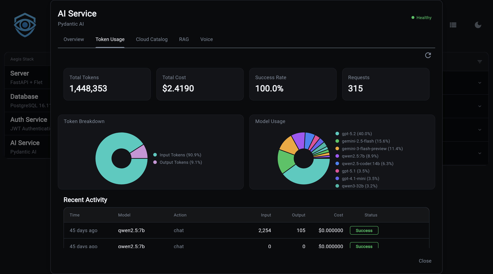

# Cost Tracking & Usage Analytics



Every AI request is automatically tracked — tokens consumed, cost calculated, and success or failure recorded. No instrumentation required. The data is available immediately via API and visualized in the frontend analytics dashboard.

!!! info "Requires Database Backend"
    Cost tracking is only active when the AI service is configured with a database backend:

    ```bash
    aegis init my-app --services "ai[sqlite]"
    aegis init my-app --services "ai[postgres]"
    ```

    With the default in-memory backend, the `/ai/usage/stats` endpoint is not available and usage is not persisted.

## What You Get

- **Automatic tracking** - every `chat` and `stream_chat` call records tokens and cost
- **Catalog-based pricing** - costs calculated from the LLM Catalog's versioned price entries
- **Per-user breakdown** - filter usage by `user_id` to see individual consumption
- **Model breakdown** - compare spend and volume across models and providers
- **Real-time dashboard** - frontend analytics tab with hero stats, pie chart, and activity table
- **Illiana context** - usage stats injected into Illiana's system prompt so she can answer cost questions

---

## How It Works

Every call to `chat()` or `stream_chat()` follows this flow:

```
Request
  │
  ├─ AI provider call (OpenAI, Groq, Anthropic, etc.)
  │
  ├─ Extract token counts from response
  │     PydanticAI: result.usage.request_tokens / response_tokens
  │     LangChain:  response_metadata['token_usage']
  │
  ├─ Look up model price from LLM Catalog
  │     SELECT ... ORDER BY effective_date DESC LIMIT 1
  │
  ├─ Calculate cost
  │     (input_tokens × input_cost) + (output_tokens × output_cost)
  │
  └─ Write LLMUsage record to database
        Non-blocking: a failure here never fails the request
```

### Key Behaviors

- **Vendor prefix stripping** - `openai/gpt-4o` is recorded as `gpt-4o` for consistency
- **Unknown models** - If a model isn't in the catalog, usage is still recorded with `total_cost = 0.0`
- **Non-blocking** - If the database write fails, the error is logged but the AI response returns normally

---

## API Endpoint

### GET `/ai/usage/stats`

Returns aggregated usage statistics.

**Query Parameters:**

| Parameter | Type | Required | Default | Description |
|-----------|------|----------|---------|-------------|
| `user_id` | string | No | all users | Filter to a specific user |
| `start_time` | datetime | No | all time | ISO 8601 lower bound |
| `end_time` | datetime | No | now | ISO 8601 upper bound |
| `recent_limit` | integer | No | 10 | Number of recent activity records |

All aggregations are performed at the SQL level (`GROUP BY`, `SUM`, `COUNT`, `AVG`).

**Response:**

```json
{
  "total_tokens": 45230,
  "input_tokens": 32100,
  "output_tokens": 13130,
  "total_cost": 0.47,
  "total_requests": 23,
  "success_rate": 95.6,
  "models": [
    {
      "model_id": "gpt-4o",
      "vendor": "OpenAI",
      "requests": 15,
      "tokens": 30000,
      "cost": 0.35,
      "percentage": 65.2
    }
  ],
  "recent_activity": [
    {
      "timestamp": "2024-01-15T10:30:00Z",
      "model": "gpt-4o",
      "input_tokens": 1500,
      "output_tokens": 800,
      "cost": 0.02,
      "success": true,
      "action": "chat"
    }
  ]
}
```

**Examples:**

=== "cURL"

    ```bash
    # All-time totals
    curl http://localhost:8000/ai/usage/stats | jq

    # Filter by user
    curl "http://localhost:8000/ai/usage/stats?user_id=alice" | jq

    # Last 7 days
    curl "http://localhost:8000/ai/usage/stats?start_time=2024-01-08T00:00:00Z" | jq

    # Show last 25 requests
    curl "http://localhost:8000/ai/usage/stats?recent_limit=25" | jq
    ```

=== "Python"

    ```python
    import httpx
    from datetime import datetime, timedelta, timezone

    # All-time stats
    response = httpx.get("http://localhost:8000/ai/usage/stats")
    stats = response.json()
    print(f"Total cost: ${stats['total_cost']:.4f}")
    print(f"Total requests: {stats['total_requests']}")
    print(f"Success rate: {stats['success_rate']:.1f}%")

    # Per-model breakdown
    for model in stats["models"]:
        print(f"  {model['model_id']}: {model['requests']} reqs, "
              f"${model['cost']:.4f} ({model['percentage']:.1f}%)")

    # Filter to last 24 hours for a specific user
    now = datetime.now(timezone.utc)
    yesterday = now - timedelta(days=1)

    response = httpx.get(
        "http://localhost:8000/ai/usage/stats",
        params={
            "user_id": "alice",
            "start_time": yesterday.isoformat(),
        },
    )
    ```

---

## Analytics Dashboard

The frontend includes an analytics tab (`ai_analytics_tab.py`) with real-time usage visualization.

**Hero stats cards:**

| Card | Description |
|------|-------------|
| Total Tokens | Sum of all input + output tokens |
| Total Cost | Cumulative spend across all models |
| Success Rate | Percentage of requests completed without error |
| Total Requests | Count of all tracked AI calls |

**Model usage pie chart** - visual breakdown of request volume per model.

**Recent activity table** - last N requests with timestamp, model, token counts, cost, success flag, and action type.

---

## Cost Calculation

**Location:** `app/services/ai/service.py`

```python
# Simplified - actual implementation in service.py
async def calculate_cost(input_tokens: int, output_tokens: int) -> float:
    # Look up current model in catalog
    price = get_latest_price(model_id)  # ORDER BY effective_date DESC LIMIT 1
    if not price:
        return 0.0
    return (input_tokens * price.input_cost_per_token) + \
           (output_tokens * price.output_cost_per_token)
```

### Price Versioning

`LLMPrice` rows include an `effective_date`. When a provider updates pricing, a new row is added rather than overwriting the old one. Historical records retain the cost that was accurate when written; only new requests pick up the new price.

```
LLMPrice rows for gpt-4o:
  effective_date=2024-01-01  input=$2.50/1M  output=$10.00/1M
  effective_date=2024-05-01  input=$2.50/1M  output=$10.00/1M  ← current
```

`LLMPrice` also supports a `cache_input_cost_per_token` field for providers that offer prompt caching.

---

## Database Model

**Table:** `llm_usage`

**Location:** `app/services/ai/models/llm/llm_usage.py`

| Column | Type | Notes |
|--------|------|-------|
| `model_id` | string, indexed | Without vendor prefix (`gpt-4o`, not `openai/gpt-4o`) |
| `user_id` | string, indexed, nullable | Null for unauthenticated requests |
| `timestamp` | datetime, indexed | Auto-set to UTC |
| `input_tokens` | integer | >= 0 |
| `output_tokens` | integer | >= 0 |
| `total_cost` | float | Calculated at record time from catalog prices |
| `success` | boolean | Default `True`; `False` on provider errors |
| `error_message` | string, nullable | Populated on failure |
| `action` | string, indexed | `"chat"` or `"stream_chat"` |

A compound index on `(timestamp, model_id)` keeps time-range + model aggregation queries fast.

!!! info "Decoupled from Foreign Key"
    `model_id` is a plain string, not a foreign key to the LLM Catalog. Usage records survive catalog resets, model renames, and schema migrations without orphaned rows.

---

## Illiana Context

Usage statistics are automatically included in Illiana's system prompt via `UsageContext` (`app/services/ai/usage_context.py`).

This means Illiana can answer questions like:

- "How much have I spent this month?"
- "Which model am I using most?"
- "What's my success rate?"

`format_for_prompt(compact=True)` produces a condensed version for smaller models (Ollama), keeping the system prompt short.

!!! note "Ollama Zero-Cost"
    Illiana knows that Ollama models report `$0.00` cost by design — local inference has no per-token billing. She won't flag zero cost as an anomaly.

---

**Next Steps:**

- **[LLM Catalog](llm-catalog.md)** - Model registry with pricing data
- **[AI Service Overview](index.md)** - Getting started
- **[API Reference](api.md)** - All REST endpoints
- **[CLI Commands](cli.md)** - Command-line interface
