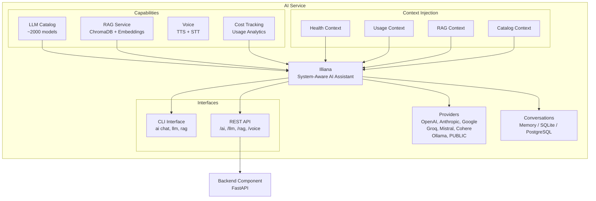

# Illiana


**Illiana** is the conversational AI interface that ships with every AI-enabled Aegis Stack project. She is not a generic chatbot. She has live awareness of your running system through context injection, and she can search your codebase when RAG is enabled.

She is not required to use Aegis Stack, and nothing in the system depends on her being present. When enabled, she becomes another way to understand what your application is doing and why, alongside the CLI and Overseer.

## What Makes Her Different

Illiana receives live data injected into her system prompt before every response. This means she answers based on what your system is actually doing right now, not what it could theoretically do.

| Context | What She Knows | Example Questions |
|---------|---------------|-------------------|
| **Health** | Component status, uptime, resource usage | "Is my database healthy?" "What's the scheduler doing?" |
| **Usage** | Her own token consumption, costs, success rate | "How much have I spent today?" "What's my most-used model?" |
| **RAG** | Your codebase (when indexed) | "How does auth work in this project?" "Where is the scheduler configured?" |
| **Catalog** | Available models, pricing, capabilities | "What's the cheapest model with vision?" "Compare Claude vs GPT-4o pricing" |



## Getting Started

```bash
# Generate a project with AI
aegis init my-app --services "ai[sqlite,rag]"
cd my-app && uv sync && source .venv/bin/activate

# Start chatting
my-app ai chat
```

```
Illiana v0.6.4
Provider: public | Model: auto

You: What can you tell me about my system?
Illiana: I can see your system is running with...
```

### With Codebase Context

Index your code so Illiana can reference specific files and line numbers:

```bash
# Index your codebase
my-app rag index ./app --collection code --extensions .py

# Chat with RAG enabled
my-app ai chat --rag --collection code --top-k 20 --sources
```

Now she answers from your actual code instead of generic knowledge:

```
You: How does the auth service validate tokens?
Illiana: Based on your codebase, token validation happens in
app/services/auth/service.py [1]. The validate_token() method...

Sources:
[1] app/services/auth/service.py:42
[2] app/components/backend/api/auth/router.py:15
```

## Slash Commands

During interactive chat, use slash commands for quick actions:

| Command | Description |
|---------|-------------|
| `/help` | Show available commands |
| `/model [name]` | Show current model or switch to a new one |
| `/status` | Show current configuration |
| `/new` | Start a new conversation |
| `/rag [off\|collection]` | Toggle RAG mode or select collection |
| `/sources [enable\|disable]` | Toggle source references in output |
| `/clear` | Clear the screen |
| `/exit` | Exit the chat session |

### Switching Models Mid-Conversation

```
You: /model gpt-4o
✓ Switched to OpenAI/gpt-4o

You: /model claude-sonnet-4-20250514
✓ Switched to Anthropic/claude-sonnet-4-20250514
```

Tab completion is available for model names (populated from Ollama and configured cloud providers).

### RAG Controls

```
You: /rag code
✓ RAG enabled with collection: code

You: /sources enable
✓ Source references enabled

You: /rag off
RAG disabled
```

## Context Injection

Illiana's system prompt is assembled dynamically before every response. Four context formatters inject live data:

### Health Context

**Source:** `app/services/ai/health_context.py`

Injects component health status. Illiana reports what **is** running, not what **could** run.

### Usage Context

**Source:** `app/services/ai/usage_context.py`

Gives Illiana awareness of her own activity: tokens consumed, costs, success rates. Supports a compact mode for smaller models (Ollama) where context window is limited.

### RAG Context

**Source:** `app/services/ai/rag_context.py`

When RAG is enabled, search results are formatted as markdown with file names, line numbers, and syntax highlighting. Illiana is instructed to answer from this code, not generic knowledge.

### LLM Catalog Context

**Source:** `app/services/ai/llm_catalog_context.py`

Top models per featured vendor (OpenAI, Anthropic, Google, xAI, Mistral, Groq, DeepSeek) with pricing and capabilities. This lets Illiana recommend models when asked.

### Prompt Assembly

**Source:** `app/services/ai/prompts.py`

All contexts are combined via `build_system_prompt()`. Health context is injected last so the LLM weights it more heavily for status questions.

## Chat Modes

### Single Message

```bash
my-app ai chat "Explain the architecture of this project"
```

### Interactive Session

```bash
my-app ai chat
```

Features:

- Conversation memory (context maintained during session)
- Markdown rendering in terminal
- Streaming responses
- Slash commands
- Tab completion for models and collections

### With RAG

```bash
my-app ai chat --rag --collection code --top-k 20 --sources \
  "How does the scheduler component work?"
```

| Flag | Description |
|------|-------------|
| `--rag` | Enable RAG context |
| `--collection` | Collection to search |
| `--top-k` | Number of search results to include |
| `--sources` | Show source file references after response |

## API Access

Illiana is also accessible via the REST API:

```bash
# Chat
curl -X POST http://localhost:8000/ai/chat \
  -H "Content-Type: application/json" \
  -d '{"message": "What is the health of my system?"}'

# Stream
curl -X POST http://localhost:8000/ai/chat/stream \
  -H "Content-Type: application/json" \
  -d '{"message": "Explain the auth service"}' \
  --no-buffer
```

See [API Reference](api.md) for full endpoint documentation.

## Configuration

Illiana uses the same configuration as the AI service:

```bash
# .env
AI_ENABLED=true
AI_PROVIDER=public      # or openai, anthropic, groq, ollama, etc.
AI_MODEL=auto
AI_TEMPERATURE=0.7
AI_MAX_TOKENS=1000
```

Switch models at any time:

```bash
my-app llm use gpt-4o
my-app llm use claude-sonnet-4-20250514
```

---

**Next Steps:**

- **[RAG](rag.md)** - Index your codebase for Illiana to search
- **[LLM Catalog](llm-catalog.md)** - Browse and switch models
- **[Provider Setup](providers.md)** - Configure AI providers
- **[CLI Commands](cli.md)** - Complete CLI reference
