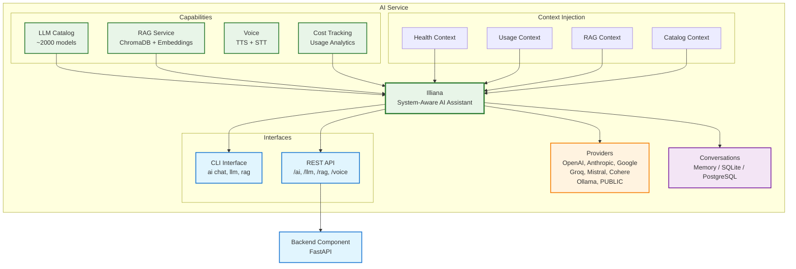

# AI Service

The **AI Service** brings a complete AI platform to your Aegis Stack project: multi-provider chat with **Illiana** (your system-aware AI assistant), an **LLM Catalog** with ~2000 models, **RAG** for codebase-aware conversations, **cost tracking** with usage analytics, and optional **voice** (TTS/STT).


!!! info "Start Chatting in 30 Seconds"
    Generate a project with AI service and start chatting with Illiana immediately:

    ```bash
    uvx aegis-stack init my-app --services ai
    cd my-app
    uv sync && source .venv/bin/activate
    my-app ai chat "Hello! What can you tell me about my system?"
    ```

    No API key required with the PUBLIC provider - perfect for testing!

    *Requires [uv](https://docs.astral.sh/uv/getting-started/installation/) installed. See [Installation](../../installation.md) for other options.*

## What You Get

<div class="grid cards" markdown>

-   :material-robot: **Illiana - System-Aware AI**

    ---

    Conversational assistant with live awareness of your system health, usage stats, and codebase context

-   :material-database-search: **LLM Catalog**

    ---

    ~2000 models from OpenRouter, LiteLLM, and Ollama with pricing, capabilities, and one-command switching

    [:octicons-arrow-right-24: LLM Catalog](llm-catalog.md)

-   :material-file-search: **RAG**

    ---

    Index your codebase into ChromaDB and let Illiana answer questions with file-level precision

    [:octicons-arrow-right-24: RAG](rag.md)

-   :material-chart-line: **Cost Tracking**

    ---

    Automatic per-request usage recording with cost calculation, analytics dashboard, and usage API

    [:octicons-arrow-right-24: Cost Tracking](cost-tracking.md)

-   :material-microphone: **Voice (TTS/STT)**

    ---

    Text-to-speech and speech-to-text with OpenAI, Groq Whisper, and local providers

    [:octicons-arrow-right-24: Voice](voice.md)

-   :material-swap-horizontal: **Multi-Provider**

    ---

    OpenAI, Anthropic, Google, Groq, Mistral, Cohere, Ollama, and free public endpoints

    [:octicons-arrow-right-24: Provider Setup](providers.md)

</div>

**Also included:**

- **Streaming Responses** - Real-time SSE streaming for interactive UX
- **Conversation Management** - In-memory or database-backed (SQLite/PostgreSQL) persistence
- **Slash Commands** - In-chat commands (`/model`, `/rag`, `/status`, `/new`)
- **Health Monitoring** - Service health checks with validation
- **Context Injection** - Live system health, usage stats, RAG results, and catalog data injected into Illiana's prompts

## Architecture


```mermaid
graph TB
    subgraph "AI Service"
        Illiana[Illiana<br/>System-Aware AI Assistant]

        subgraph "Interfaces"
            CLI[CLI Interface<br/>ai chat, llm, rag]
            API[REST API<br/>/ai, /llm, /rag, /voice]
        end

        subgraph "Capabilities"
            Catalog[LLM Catalog<br/>~2000 models]
            RAG[RAG Service<br/>ChromaDB + Embeddings]
            Voice[Voice<br/>TTS + STT]
            Usage[Cost Tracking<br/>Usage Analytics]
        end

        subgraph "Context Injection"
            Health[Health Context]
            UsageCtx[Usage Context]
            RAGCtx[RAG Context]
            CatalogCtx[Catalog Context]
        end

        Providers[Providers<br/>OpenAI, Anthropic, Google<br/>Groq, Mistral, Cohere<br/>Ollama, PUBLIC]
        Conv[Conversations<br/>Memory / SQLite / PostgreSQL]
    end

    Backend[Backend Component<br/>FastAPI]

    Illiana --> CLI
    Illiana --> API
    Illiana --> Providers
    Illiana --> Conv
    Catalog --> Illiana
    RAG --> Illiana
    Usage --> Illiana
    Health --> Illiana
    UsageCtx --> Illiana
    RAGCtx --> Illiana
    CatalogCtx --> Illiana
    API --> Backend

    style Illiana fill:#e8f5e8,stroke:#2e7d32,stroke-width:3px
    style CLI fill:#e1f5fe,stroke:#1976d2,stroke-width:2px
    style API fill:#e1f5fe,stroke:#1976d2,stroke-width:2px
    style Providers fill:#fff3e0,stroke:#f57c00,stroke-width:2px
    style Conv fill:#f3e5f5,stroke:#7b1fa2,stroke-width:2px
    style Catalog fill:#e8f5e8,stroke:#2e7d32,stroke-width:2px
    style RAG fill:#e8f5e8,stroke:#2e7d32,stroke-width:2px
    style Voice fill:#e8f5e8,stroke:#2e7d32,stroke-width:2px
    style Usage fill:#e8f5e8,stroke:#2e7d32,stroke-width:2px
    style Backend fill:#e1f5fe,stroke:#1976d2,stroke-width:2px
```

## Quick Start

### 1. Generate Project with AI Service

```bash
# Basic AI (in-memory conversations)
aegis init my-app --services ai

# AI with database persistence + RAG
aegis init my-app --services "ai[sqlite,rag]"

# AI with everything
aegis init my-app --services "ai[sqlite,rag,voice]"
```

```bash
cd my-app
uv sync && source .venv/bin/activate
```

### 2. Chat with Illiana

```bash
# Interactive chat session
my-app ai chat

# Single message
my-app ai chat "Explain the architecture of this project"

# Chat with RAG (codebase-aware)
my-app rag index ./app --collection code
my-app ai chat --rag --collection code "How does authentication work?"
```

### 3. Explore the LLM Catalog

```bash
# Sync ~2000 models from cloud APIs
my-app llm sync

# Browse models
my-app llm list claude --vendor anthropic
my-app llm info gpt-4o

# Switch models
my-app llm use claude-sonnet-4-20250514
```

### 4. API Usage

```bash
# Start server
make serve

# Chat endpoint
curl -X POST http://localhost:8000/ai/chat \
  -H "Content-Type: application/json" \
  -d '{"message": "Hello from the API!"}'

# Browse LLM catalog
curl http://localhost:8000/llm/models?pattern=gpt-4

# Check usage stats
curl http://localhost:8000/ai/usage/stats
```

## Illiana

**Illiana** is the conversational AI interface that ships with every AI-enabled Aegis project. She's not just a chat wrapper - she has live awareness of your system through context injection:

- **Health Context** - Knows which components are running, their status, and resource usage
- **Usage Context** - Tracks her own token consumption, costs, and success rates
- **RAG Context** - When enabled, searches your codebase to answer questions with file references
- **Catalog Context** - Knows available models, pricing, and can recommend alternatives

She is not required to use Aegis Stack. When enabled, she becomes another way - alongside the CLI and Overseer - to understand what your application is doing and why.

### Slash Commands

During interactive chat, use slash commands for quick actions:

| Command | Description |
|---------|-------------|
| `/help` | Show available commands |
| `/model [name]` | Show current model or switch to a new one |
| `/status` | Show current configuration |
| `/new` | Start a new conversation |
| `/rag [off\|collection]` | Toggle RAG mode or select collection |
| `/sources [enable\|disable]` | Toggle source references in output |
| `/clear` | Clear the screen |
| `/exit` | Exit the chat session |

## Configuration

### Basic Configuration

```bash
# .env - Default configuration (PUBLIC provider)
AI_ENABLED=true
AI_PROVIDER=public
AI_MODEL=auto
```

### Service Options

Configure AI features at project generation:

```bash
aegis init my-app --services "ai[framework,backend,providers,rag,voice]"
```

| Option | Values | Default | Description |
|--------|--------|---------|-------------|
| Framework | `pydantic-ai`, `langchain` | `pydantic-ai` | AI engine |
| Backend | `memory`, `sqlite`, `postgres` | `memory` | Conversation storage |
| Providers | `openai`, `anthropic`, `google`, `groq`, `mistral`, `cohere`, `public` | `public` | LLM providers |
| RAG | flag | disabled | Enable RAG support |
| Voice | flag | disabled | Enable TTS/STT |

### Switching Providers

```bash
# Via environment variables
AI_PROVIDER=groq
GROQ_API_KEY=your-key-here
AI_MODEL=llama-3.1-8b-instant
```

```bash
# Via CLI (with LLM catalog)
my-app llm use gpt-4o           # Auto-detects OpenAI
my-app llm use claude-sonnet-4-20250514  # Auto-detects Anthropic
```

**Available providers:** OpenAI, Anthropic, Google Gemini, Groq, Mistral, Cohere, Ollama, PUBLIC

**-> [Complete Provider Setup Guide](providers.md)**

---

**Next Steps:**

- **[LLM Catalog](llm-catalog.md)** - Browse and manage ~2000 AI models
- **[RAG](rag.md)** - Index your codebase for AI-powered search
- **[Cost Tracking](cost-tracking.md)** - Monitor usage and costs
- **[Voice](voice.md)** - Add speech capabilities
- **[Engines](engines.md)** - Choose between Pydantic AI and LangChain
- **[Provider Setup](providers.md)** - Configure your AI provider
- **[API Reference](api.md)** - Complete REST API documentation
- **[Service Layer](integration.md)** - Integration patterns and architecture
- **[CLI Commands](cli.md)** - Command-line interface reference
- **[Examples](examples.md)** - Real-world usage patterns
