# AI Service

The **AI Service** provides multi-provider AI chat capabilities with conversation management, streaming responses, and both CLI and API interfaces powered by [PydanticAI](https://ai.pydantic.dev/).


!!! info "Start Chatting in 30 Seconds"
    Generate a project with AI service and start chatting immediately:

    ```bash
    uvx aegis-stack init my-app --services ai
    cd my-app
    uv sync && source .venv/bin/activate
    my-app ai chat send "Hello! Can you help me understand what you can do?"
    ```

    No API key required with the PUBLIC provider - perfect for testing!

    *Requires [uv](https://docs.astral.sh/uv/getting-started/installation/) installed. See [Installation](../../installation.md) for other options.*

## What You Get

- **Multi-Provider Support** - OpenAI, Anthropic, Google, Groq, Mistral, Cohere, and free public endpoints
- **Conversation Management** - In-memory conversation tracking with message history
- **Streaming Responses** - Real-time Server-Sent Events (SSE) streaming for interactive UX
- **CLI Interface** - Interactive chat sessions with markdown rendering
- **REST API** - Complete `/ai/*` endpoints for integration
- **Health Monitoring** - Service health checks and validation

## Architecture

```mermaid
graph TB
    subgraph "AI Service"
        AIService[🤖 AI Service<br/>PydanticAI]

        CLI[💻 CLI Interface<br/>ai chat, config, providers]
        API[🌐 REST API<br/>/ai/chat, /ai/conversations]
        Providers[🔌 Providers<br/>OpenAI, Anthropic, Google<br/>Groq, Mistral, Cohere, PUBLIC]
        Conv[💬 Conversations<br/>In-memory storage]
    end

    Backend[⚡ Backend Component<br/>FastAPI]

    AIService --> CLI
    AIService --> API
    AIService --> Providers
    AIService --> Conv
    API --> Backend

    style AIService fill:#e8f5e8,stroke:#2e7d32,stroke-width:3px
    style CLI fill:#e1f5fe,stroke:#1976d2,stroke-width:2px
    style API fill:#e1f5fe,stroke:#1976d2,stroke-width:2px
    style Providers fill:#fff3e0,stroke:#f57c00,stroke-width:2px
    style Conv fill:#f3e5f5,stroke:#7b1fa2,stroke-width:2px
    style Backend fill:#e1f5fe,stroke:#1976d2,stroke-width:2px
```



## Quick Start

### 1. Generate Project with AI Service

```bash
aegis init my-app --services ai
cd my-app
uv sync && source .venv/bin/activate
```

### 2. Start Chatting (No API Key Required)

The PUBLIC provider is configured by default and requires no setup:

```bash
# Interactive chat session
my-app ai chat

# Single message
my-app ai chat send "Explain async/await in Python"

# Check service status
my-app ai config show
```

### 3. API Usage

Start the server and use the REST API:

```bash
# Terminal 1: Start server
make serve

# Terminal 2: Send chat request
curl -X POST http://localhost:8000/ai/chat \
  -H "Content-Type: application/json" \
  -d '{"message": "Hello from the API!"}'
```

## Configuration

The AI service uses environment variables for configuration. The PUBLIC provider works with zero configuration:

```bash
# .env - Default configuration (PUBLIC provider)
AI_ENABLED=true
AI_PROVIDER=public
AI_MODEL=auto
```

**That's it!** You can start chatting immediately with no API keys or setup required.

### Using Other Providers

Want faster responses, specific models, or advanced features? You can switch to other providers:

```bash
# Example: Switch to Groq for production use
AI_PROVIDER=groq
GROQ_API_KEY=your-key-here
AI_MODEL=llama-3.1-8b-instant
```

**Available providers:** OpenAI, Anthropic, Google Gemini, Groq, Mistral, Cohere

**→ [Complete Provider Setup Guide](providers.md)** - Detailed setup for all providers

## Features

### Streaming Responses
CLI automatically streams for supported providers:

```bash
# Streaming enabled by default
my-app ai chat send "Write a Python function to calculate fibonacci"

# Disable streaming
my-app ai chat send "Same question" --no-stream
```

API streaming uses Server-Sent Events:

```python
import httpx

async with httpx.AsyncClient() as client:
    async with client.stream(
        "GET",
        "http://localhost:8000/ai/chat/stream",
        params={"message": "Hello"},
    ) as response:
        async for line in response.aiter_lines():
            if line.startswith("data: "):
                data = json.loads(line[6:])
                print(data["content"])  # Stream chunks
```

### Health Monitoring

```bash
# Check service health
curl http://localhost:8000/ai/health

# Validate configuration
my-app ai config validate
```

---

**Next Steps:**

- **[API Reference](api.md)** - Complete REST API documentation
- **[Service Layer](integration.md)** - Integration patterns and architecture
- **[CLI Commands](cli.md)** - Command-line interface reference
- **[Examples](examples.md)** - Real-world usage patterns
