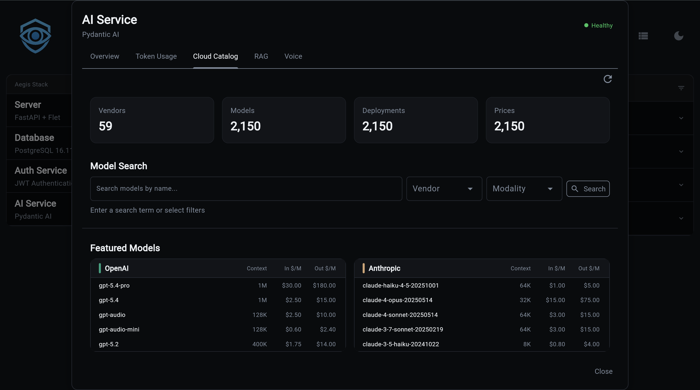

# LLM Catalog



The LLM Catalog is a local database of ~2000 language models synced from cloud APIs and local Ollama. It provides model discovery, pricing, capabilities, and one-command model switching.

!!! info "Requires Database Backend"
    The LLM Catalog requires a database backend (`ai[sqlite]` or `ai[postgres]`). With the in-memory backend, catalog features are not available.

## What You Get

- **~2000 models** synced from OpenRouter, LiteLLM, and local Ollama
- **32+ vendors** including OpenAI, Anthropic, Google, Groq, Mistral, DeepSeek, and more
- **Pricing data** with per-token input/output costs and price versioning
- **Capability tracking** - modalities (text, image, audio, video), function calling, streaming, structured output
- **One-command switching** - `llm use gpt-4o` auto-detects vendor and updates your config
- **Context injection** - top models per vendor are injected into Illiana's prompts for model recommendations

## Quick Start

```bash
# 1. Generate project with database backend
aegis init my-app --services "ai[sqlite]"
cd my-app && uv sync && source .venv/bin/activate

# 2. Sync the catalog (~2000 models, takes ~12 seconds)
my-app llm sync

# 3. Browse models
my-app llm list claude
my-app llm vendors

# 4. Switch models
my-app llm use gpt-4o
```

---

## CLI Commands

### llm sync

Sync model data from cloud APIs or local Ollama into the local database.

```bash
# Default: sync chat models from cloud (OpenRouter + LiteLLM)
my-app llm sync

# Sync only Ollama models
my-app llm sync --source ollama

# Sync everything
my-app llm sync --source all --mode all

# Preview without saving
my-app llm sync --dry-run

# Full refresh (truncate + re-sync)
my-app llm sync --refresh
```

**Options:**

| Flag | Values | Default | Description |
|------|--------|---------|-------------|
| `--mode, -m` | `chat`, `embedding`, `all` | `chat` | Model type filter |
| `--source, -s` | `cloud`, `ollama`, `all` | `cloud` | Data source |
| `--dry-run, -n` | flag | off | Preview without saving |
| `--refresh, -r` | flag | off | Truncate tables first |

**Sources:**

| Source | What It Syncs | Model Count |
|--------|--------------|-------------|
| `cloud` | OpenRouter + LiteLLM public APIs | ~2000 models |
| `ollama` | Locally installed Ollama models | Varies |
| `all` | Both cloud and Ollama | ~2000+ |

### llm status

Show catalog statistics:

```bash
my-app llm status
```

```
LLM Catalog Summary
┏━━━━━━━━━━━━━┳━━━━━━━┓
┃ Metric      ┃ Count ┃
┡━━━━━━━━━━━━━╇━━━━━━━┩
│ Vendors     │ 32    │
│ Models      │ 1847  │
│ Deployments │ 2103  │
│ Prices      │ 1952  │
└─────────────┴───────┘

Top Vendors by Model Count
┏━━━━━━━━━━━━━┳━━━━━━━━┓
┃ Vendor      ┃ Models ┃
┡━━━━━━━━━━━━━╇━━━━━━━━┩
│ OpenAI      │ 156    │
│ Google      │ 89     │
│ Anthropic   │ 42     │
│ Mistral     │ 38     │
└─────────────┴────────┘
```

### llm vendors

List all vendors with model counts:

```bash
my-app llm vendors
```

### llm modalities

List modalities (text, image, audio, video) with model counts:

```bash
my-app llm modalities
```

### llm list

Search and filter models:

```bash
# Search by pattern
my-app llm list claude

# Filter by vendor
my-app llm list gpt-4 --vendor openai

# Filter by modality
my-app llm list --vendor anthropic --modality image

# Include disabled models
my-app llm list --vendor openai --all
```

**Options:**

| Flag | Description |
|------|-------------|
| `--vendor, -v` | Filter by vendor name |
| `--modality, -m` | Filter by modality (text, image, audio, video) |
| `--limit, -l` | Max results (default: 50) |
| `--all, -a` | Include disabled models |

```
LLM Models (3 results)
┏━━━━━━━━━━━━━━━━━━━━━━━━━━━━━┳━━━━━━━━━━━┳━━━━━━━━━━┳━━━━━━━━━━━┳━━━━━━━━━━━━┳━━━━━━━━━━━━┓
┃ Model ID                     ┃ Vendor    ┃ Context  ┃ Input $/1M┃ Output $/1M┃ Released   ┃
┡━━━━━━━━━━━━━━━━━━━━━━━━━━━━━╇━━━━━━━━━━━╇━━━━━━━━━━╇━━━━━━━━━━━╇━━━━━━━━━━━━╇━━━━━━━━━━━━┩
│ claude-sonnet-4-20250514     │ Anthropic │ 200,000  │ $3.00     │ $15.00     │ 2025-05-14 │
│ claude-haiku-4-5-20251001    │ Anthropic │ 200,000  │ $0.80     │ $4.00      │ 2025-10-01 │
│ claude-opus-4-6              │ Anthropic │ 200,000  │ $15.00    │ $75.00     │ 2025-06-01 │
└──────────────────────────────┴───────────┴──────────┴───────────┴────────────┴────────────┘
```

### llm current

Show current LLM configuration from `.env`, enriched with catalog data:

```bash
my-app llm current
```

```
Current LLM Configuration
├── Provider: openai
├── Model: gpt-4o
├── Temperature: 0.7
└── Max Tokens: 1,000

Model Details (from catalog)
├── Context Window: 128,000
├── Input Price: $2.50 / 1M tokens
├── Output Price: $10.00 / 1M tokens
└── Modalities: text, image
```

### llm use

Switch to a different model. Auto-detects vendor and updates `AI_PROVIDER` in `.env`:

```bash
my-app llm use gpt-4o                    # → AI_PROVIDER=openai
my-app llm use claude-sonnet-4-20250514  # → AI_PROVIDER=anthropic
my-app llm use llama3.1                  # → AI_PROVIDER=ollama

# Force any model string (skip catalog validation)
my-app llm use my-custom-model --force
```

### llm info

Show detailed model information:

```bash
my-app llm info gpt-4o
```

```
╭─────────────── gpt-4o ───────────────╮
│ GPT-4o                               │
│                                       │
│ Model ID: gpt-4o                     │
│ Vendor: OpenAI                       │
│                                       │
│ Context Window: 128,000 tokens       │
│ Streamable: Yes                      │
│ Enabled: Yes                         │
│ Released: 2024-05-13                 │
│                                       │
│ Pricing (per 1M tokens)             │
│   Input: $2.50                       │
│   Output: $10.00                     │
│                                       │
│ Modalities: text, image              │
╰───────────────────────────────────────╯
```

---

## API Endpoints

All endpoints are prefixed with `/llm`.

### GET `/llm/status`

Catalog statistics including vendor count, model count, and top vendors.

```bash
curl http://localhost:8000/llm/status | jq
```

```json
{
  "vendor_count": 32,
  "model_count": 1847,
  "deployment_count": 2103,
  "price_count": 1952,
  "top_vendors": [
    {"name": "OpenAI", "model_count": 156},
    {"name": "Google", "model_count": 89}
  ]
}
```

### GET `/llm/vendors`

List all vendors with model counts.

### GET `/llm/modalities`

List all modalities with model counts.

### GET `/llm/models`

Search and filter models.

| Parameter | Type | Default | Description |
|-----------|------|---------|-------------|
| `pattern` | string | null | Search pattern (model ID or title) |
| `vendor` | string | null | Filter by vendor |
| `modality` | string | null | Filter by modality |
| `limit` | integer | 50 | Max results (1-200) |
| `include_disabled` | boolean | false | Include disabled models |

```bash
curl "http://localhost:8000/llm/models?pattern=gpt-4&vendor=openai" | jq
```

```json
[
  {
    "model_id": "gpt-4o",
    "vendor": "OpenAI",
    "context_window": 128000,
    "input_price": 2.50,
    "output_price": 10.00,
    "released_on": "2024-05-13"
  }
]
```

### GET `/llm/current`

Current active LLM configuration enriched with catalog data.

```json
{
  "provider": "openai",
  "model": "gpt-4o",
  "temperature": 0.7,
  "max_tokens": 1000,
  "context_window": 128000,
  "input_price": 2.50,
  "output_price": 10.00,
  "modalities": ["text", "image"]
}
```

---

## Database Schema

The catalog uses five tables:

### LLMVendor

| Column | Type | Description |
|--------|------|-------------|
| `name` | string, unique | Vendor name (e.g., "OpenAI") |
| `description` | string | Vendor description |
| `color` | string | UI color code |
| `api_base` | string | API base URL |
| `auth_method` | string | Authentication method |

20+ vendors pre-configured with metadata (OpenAI, Anthropic, Google, Groq, Mistral, DeepSeek, xAI, etc.).

### LargeLanguageModel

| Column | Type | Description |
|--------|------|-------------|
| `model_id` | string, unique | Canonical model identifier |
| `title` | string | Display name |
| `context_window` | integer | Max tokens |
| `streamable` | boolean | Supports streaming |
| `enabled` | boolean | Available for use |
| `released_on` | string | Release date |
| `family` | string | Model family |
| `llm_vendor_id` | FK | Reference to vendor |

### LLMModality

Tracks input/output capabilities per model:

- **modality**: text, audio, image, video
- **direction**: input, output, bidirectional
- Unique constraint: `(llm_id, modality, direction)`

### LLMDeployment

Performance characteristics per vendor deployment:

- `speed`, `intelligence`, `reasoning` (0-100 scale)
- `function_calling`, `input_cache`, `structured_output` (boolean capabilities)
- `output_max_tokens`

### LLMPrice

Per-token pricing with versioning:

- `input_cost_per_token`, `output_cost_per_token`
- `cache_input_cost_per_token` (for prompt caching)
- `effective_date` - supports price history; latest price selected by `ORDER BY effective_date DESC`

---

## Context Injection

The `LLMCatalogContext` class (`app/services/ai/llm_catalog_context.py`) builds a compact summary of featured vendors and their top models for injection into Illiana's system prompt.

**Featured vendors** (priority-ordered): OpenAI, Anthropic, Google, xAI, Mistral, Groq, DeepSeek

For each vendor, the 3 newest models (by release date) are included with:
- Model ID, title
- Input/output cost per 1M tokens
- Context window
- Key capabilities (function calling, vision, structured output)

Alias models (ending in `-latest` or `:latest`) are filtered out.

This enables Illiana to recommend models when asked "What's the cheapest model with vision?" or "Which Anthropic model should I use?"

---

## Source Files

| File | Purpose |
|------|---------|
| `app/services/ai/llm_service.py` | Service functions (list, search, switch) |
| `app/services/ai/etl/llm_sync_service.py` | Catalog sync from APIs |
| `app/services/ai/etl/clients/openrouter_client.py` | OpenRouter API client |
| `app/services/ai/etl/clients/litellm_client.py` | LiteLLM API client |
| `app/services/ai/etl/mappers/llm_mapper.py` | Data transformation |
| `app/services/ai/llm_catalog_context.py` | Prompt context injection |
| `app/services/ai/models/llm/` | Database models |
| `app/cli/llm.py` | CLI commands |
| `app/components/backend/api/llm/router.py` | API endpoints |

---

**Next Steps:**

- **[Cost Tracking](cost-tracking.md)** - Usage analytics powered by catalog pricing
- **[Provider Setup](providers.md)** - Configure providers and switch models
- **[CLI Commands](cli.md)** - Complete CLI reference
- **[API Reference](api.md)** - All REST endpoints
