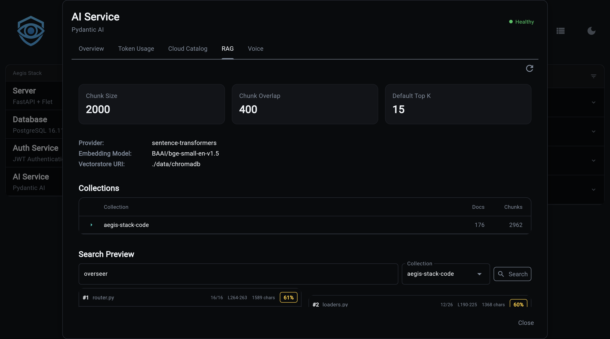
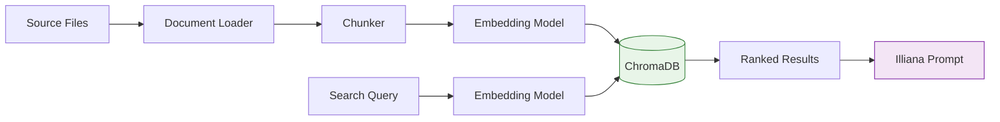
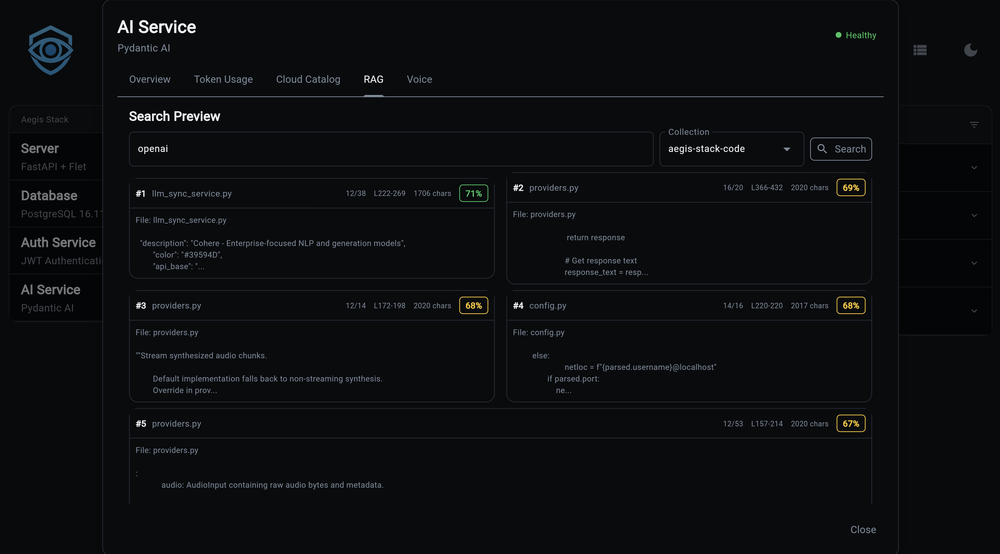

# RAG (Retrieval-Augmented Generation)



RAG enables semantic search over your codebase or documents. Index files into ChromaDB collections, then search them directly or let Illiana use them as context during conversations.

## What You Get

- **Codebase-aware AI** - Illiana answers questions using your actual code, not generic knowledge
- **Semantic search** - Find relevant code by meaning, not just keyword matching
- **ChromaDB backend** - Persistent vector store with efficient similarity search
- **Dual embedding providers** - Local sentence-transformers (~400MB, free) or OpenAI API
- **File-level management** - Add, update, or remove individual files from collections
- **CLI and API** - Full access via command line and REST endpoints

## Quick Start

```bash
# 1. Generate project with RAG enabled
aegis init my-app --services "ai[sqlite,rag]"
cd my-app && uv sync && source .venv/bin/activate

# 2. Index your codebase
my-app rag index ./app --collection code --extensions .py

# 3. Search your code
my-app rag search "how does authentication work" --collection code

# 4. Chat with codebase context
my-app ai chat --rag --collection code --top-k 20 --sources \
  "Explain how the auth service validates tokens"
```

---

## Architecture



### Pipeline

1. **Loading** - `CodebaseLoader` reads files, applies default and configured exclude patterns, and extracts metadata (path, name, extension)
2. **Chunking** - `DocumentChunker` splits documents into configurable-size chunks with overlap, preserving line numbers
3. **Embedding** - Text chunks are converted to vectors using sentence-transformers (local) or OpenAI API
4. **Indexing** - Vectors are stored in ChromaDB with metadata for retrieval
5. **Search** - Query text is embedded and compared against stored vectors using cosine similarity

---

## CLI Commands

### rag index

Index documents from a path into a collection:

```bash
# Index a directory
my-app rag index ./app --collection code

# Filter by extension
my-app rag index ./app --collection code --extensions .py,.ts
```

```
╭──────── Collection: code ─────────╮
│ Successfully indexed 1,523 chunks │
│ from 87 files                     │
│                                    │
│ Extensions: .py                   │
│ Duration: 8.3s                    │
│   Loading:  1.2s (14%)            │
│   Chunking: 0.8s (10%)           │
│   Indexing: 6.3s (76%)           │
│ Throughput: 183.5 chunks/sec     │
│ Collection size: 1,523 chunks    │
╰────────────────────────────────────╯
```

### rag add

Add or update a single file (upsert semantics):

```bash
my-app rag add app/services/auth.py --collection code
my-app rag add app/services/auth.py -c code --show-ids
```

### rag remove

Remove a file's chunks from the collection:

```bash
my-app rag remove /path/to/file.py --collection code
my-app rag remove /path/to/file.py -c code --force
```

### rag files

List indexed files with chunk counts:

```bash
my-app rag files --collection code
```

### rag search



Semantic search across indexed documents:

```bash
# Basic search
my-app rag search "how does authentication work" --collection code

# Show full content of results
my-app rag search "database connection" -c code --content

# More results
my-app rag search "error handling" -c code --top-k 10
```

Results show relevance scores and file references:

```
Found 5 results:

╭── #1 service.py ──────────────────╮
│ Score: 0.8932                     │
│                                    │
│ class AuthService:                │
│     async def validate_token(...  │
╰── app/services/auth/service.py ───╯
```

### rag list

List all collections with document counts:

```bash
my-app rag list
```

### rag delete

Delete a collection and all its documents:

```bash
my-app rag delete code
my-app rag delete code --force
```

### rag status

Show RAG service configuration:

```bash
my-app rag status
```

```
╭──────── RAG Service Status ────────╮
│ Enabled: Yes                       │
│ Persist Directory: .chromadb       │
│ Embedding Model: all-MiniLM-L6-v2 │
│ Model Status: Installed            │
│ Chunk Size: 1000                   │
│ Chunk Overlap: 200                 │
│ Default Top K: 5                   │
│ Collections: 2                     │
╰────────────────────────────────────╯
```

### rag install-model

Pre-download the embedding model for offline/air-gapped use:

```bash
# Download to default location (~400MB)
my-app rag install-model

# Custom cache directory
my-app rag install-model --cache-dir /path/to/models

# Specific model
my-app rag install-model --model sentence-transformers/all-MiniLM-L6-v2
```

!!! note
    Only needed for local sentence-transformers. OpenAI embeddings don't require a local download.

---

## API Endpoints

All endpoints are prefixed with `/rag`.

### POST `/rag/index`

Index documents from a path.

```json
// Request
{
  "path": "./app",
  "collection_name": "code",
  "extensions": [".py", ".ts"],
  "exclude_patterns": ["**/test_*"]
}

// Response
{
  "collection_name": "code",
  "documents_added": 1523,
  "total_documents": 1523,
  "duration_ms": 8300.5
}
```

### POST `/rag/search`

Semantic search across a collection.

```json
// Request
{
  "query": "how does authentication work",
  "collection_name": "code",
  "top_k": 5,
  "filter_metadata": null
}

// Response
{
  "query": "how does authentication work",
  "collection_name": "code",
  "results": [
    {
      "content": "class AuthService:\n    ...",
      "metadata": {"source": "app/services/auth/service.py"},
      "score": 0.8932,
      "rank": 1
    }
  ],
  "result_count": 5
}
```

### GET `/rag/collections`

List all collection names.

### GET `/rag/collections/{name}`

Get collection info (name, document count, metadata).

### GET `/rag/collections/{name}/files`

List indexed files with chunk counts.

### DELETE `/rag/collections/{name}`

Delete a collection.

### GET `/rag/health`

RAG service health status and configuration.

---

## Embedding Providers

| Provider | Type | Cost | Speed | Setup |
|----------|------|------|-------|-------|
| **sentence-transformers** | Local | Free | Moderate | ~400MB download, auto on first use |
| **OpenAI** | Cloud API | Per-token | Fast | Requires `OPENAI_API_KEY` |

### sentence-transformers (Default)

Runs entirely locally. The model downloads automatically on first use (~400MB). No API key needed.

```bash
# Pre-download for offline use
my-app rag install-model
```

### OpenAI Embeddings

Cloud-based, faster for large datasets. Requires an API key.

```bash
# .env
RAG_EMBEDDING_PROVIDER=openai
OPENAI_API_KEY=sk-...
```

---

## Configuration

Environment variables for RAG:

| Variable | Default | Description |
|----------|---------|-------------|
| `RAG_EMBEDDING_PROVIDER` | `sentence-transformers` | `sentence-transformers` or `openai` |
| `RAG_EMBEDDING_MODEL` | `all-MiniLM-L6-v2` | Embedding model name |
| `RAG_MODEL_CACHE_DIR` | system default | Local model cache path |
| `RAG_CHUNK_SIZE` | `1000` | Characters per chunk |
| `RAG_CHUNK_OVERLAP` | `200` | Overlap between chunks |
| `RAG_DEFAULT_TOP_K` | `5` | Default search results count |

---

## Chat Integration

### CLI Flags

```bash
my-app ai chat --rag --collection code --top-k 20 --sources \
  "How does the scheduler component work?"
```

| Flag | Description |
|------|-------------|
| `--rag` | Enable RAG context for this chat |
| `--collection` | Collection to search |
| `--top-k` | Number of results to include (default: 5) |
| `--sources` | Show source file references after response |

### Slash Commands (Interactive)

```
/rag              Show RAG status
/rag code         Enable RAG with collection "code"
/rag off          Disable RAG
/sources          Toggle source references
/sources enable   Enable source references
```

### Context Injection

When RAG is enabled, search results are injected into Illiana's system prompt via two context objects:

**RAGContext** (`app/services/ai/rag_context.py`):
- `format_for_prompt()` - Markdown with file names, line numbers, syntax highlighting
- `format_sources_footer()` - Citation-style source references (`[1] app/services/auth.py:42`)
- `to_metadata()` - Storage-friendly format for conversation metadata

**RAGStatsContext** (`app/services/ai/rag_stats_context.py`):
- Collection-level awareness (count, names, document counts)
- Embedding model and chunking configuration
- Formatted for compact prompt injection

---

## Source Files

| File | Purpose |
|------|---------|
| `app/services/rag/service.py` | Core RAG service |
| `app/services/rag/config.py` | Configuration |
| `app/services/rag/loaders.py` | Document loading |
| `app/services/rag/chunking.py` | Text chunking |
| `app/services/rag/vectorstore.py` | ChromaDB wrapper |
| `app/services/ai/rag_context.py` | Prompt context formatting |
| `app/services/ai/rag_stats_context.py` | Stats context |
| `app/cli/rag.py` | CLI commands |
| `app/components/backend/api/rag/router.py` | API endpoints |

---

**Next Steps:**

- **[Cost Tracking](cost-tracking.md)** - Usage analytics
- **[LLM Catalog](llm-catalog.md)** - Model registry
- **[CLI Commands](cli.md)** - Complete CLI reference
- **[API Reference](api.md)** - All REST endpoints
