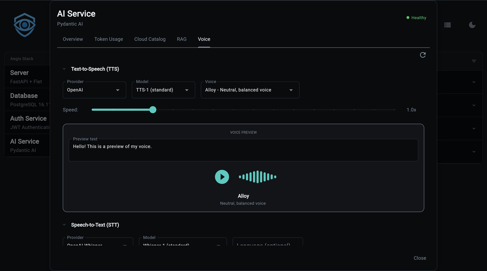

# Voice (TTS/STT)



Voice capabilities add Text-to-Speech (TTS) and Speech-to-Text (STT) to the AI service. Multiple providers are supported, from cloud APIs to fully local inference.

!!! warning "Experimental Feature"
    Voice is currently experimental. Some features may not work out of the box and will require configuration on your part. For example, TTS and STT providers that need API keys (like OpenAI) may return errors or hang in the frontend if the key is not set. Make sure your provider credentials are configured before using voice features.

!!! info "Enable at Project Generation"
    Voice is an optional feature enabled at project generation:

    ```bash
    aegis init my-app --services "ai[voice]"

    # With database and RAG
    aegis init my-app --services "ai[sqlite,rag,voice]"
    ```

## What You Get

- **Text-to-Speech** - Convert text to audio with multiple voices and speed control
- **Speech-to-Text** - Transcribe audio with timestamps and segment detection
- **Multiple providers** - Cloud (OpenAI, Groq) and local (Whisper, faster-whisper)
- **Voice catalog** - Browse providers, models, and voices via API
- **Voice previews** - Generate audio samples to compare voices
- **Usage tracking** - TTS and STT operations tracked alongside LLM usage

---

## TTS Providers

| Provider | Type | Models | Voices | Streaming | API Key |
|----------|------|--------|--------|-----------|---------|
| **OpenAI** | Cloud | tts-1, tts-1-hd | alloy, echo, fable, onyx, nova, shimmer | Yes | `OPENAI_API_KEY` |

### OpenAI TTS

Two models available:

- **tts-1** - Optimized for speed, lower latency
- **tts-1-hd** - Higher quality audio, slightly slower

Six voices: alloy, echo, fable, onyx, nova, shimmer

```bash
# .env configuration
TTS_PROVIDER=openai
TTS_MODEL=tts-1
TTS_VOICE=alloy
TTS_SPEED=1.0   # 0.25 to 4.0
```

---

## STT Providers

| Provider | Type | Model | Speed | Quality | Requires |
|----------|------|-------|-------|---------|----------|
| **OpenAI Whisper** | Cloud | whisper-1 | Good | High | `OPENAI_API_KEY` |
| **Groq Whisper** | Cloud | whisper-large-v3-turbo | Very fast | High | `GROQ_API_KEY` |
| **Local Whisper** | Local | whisper-tiny to large-v3 | Varies | Varies | `transformers`, `torch` |
| **faster-whisper** | Local | tiny to large-v3 | 4x faster | High | `faster-whisper` |

### OpenAI Whisper

Cloud-based transcription with segment timestamps:

```bash
STT_PROVIDER=openai_whisper
STT_MODEL=whisper-1
```

### Groq Whisper

Ultra-fast cloud transcription:

```bash
STT_PROVIDER=groq_whisper
STT_MODEL=whisper-large-v3-turbo
```

### Local Whisper

Runs on your machine via HuggingFace transformers. Auto-detects GPU (CUDA, MPS) or falls back to CPU:

```bash
STT_PROVIDER=whisper_local
STT_MODEL=openai/whisper-base   # tiny, base, small, medium, large-v3
```

Requires: `uv add transformers torch`

### faster-whisper

SYSTRAN's optimized implementation - 4x faster than standard Whisper with similar accuracy:

```bash
STT_PROVIDER=faster_whisper
STT_MODEL=base   # tiny, base, small, medium, large-v3
```

Requires: `uv add faster-whisper`

Supports compute types: `default`, `float16`, `int8`

---

## API Endpoints

All endpoints are prefixed with `/voice`.

### TTS Catalog

```bash
# List TTS providers
curl http://localhost:8000/voice/catalog/tts/providers | jq

# List models for a provider
curl http://localhost:8000/voice/catalog/tts/openai/models | jq

# List voices for a provider
curl http://localhost:8000/voice/catalog/tts/openai/voices | jq
```

**Provider Response:**

```json
{
  "id": "openai",
  "name": "OpenAI",
  "type": "tts",
  "requires_api_key": true,
  "api_key_env_var": "OPENAI_API_KEY",
  "is_local": false,
  "description": "OpenAI TTS API"
}
```

**Voice Response:**

```json
{
  "id": "alloy",
  "name": "Alloy",
  "provider_id": "openai",
  "model_ids": ["tts-1", "tts-1-hd"],
  "description": "A balanced, versatile voice",
  "category": "neutral",
  "gender": "neutral",
  "preview_text": "Hello, I'm Alloy..."
}
```

### STT Catalog

```bash
# List STT providers
curl http://localhost:8000/voice/catalog/stt/providers | jq

# List models for a provider
curl http://localhost:8000/voice/catalog/stt/openai_whisper/models | jq
```

### Voice Settings

```bash
# Get current settings
curl http://localhost:8000/voice/settings | jq

# Preview settings (returns merged config without persisting)
curl -X POST http://localhost:8000/voice/settings \
  -H "Content-Type: application/json" \
  -d '{"tts_voice": "nova", "tts_speed": 1.2}'
```

!!! note
    This endpoint returns what the settings would look like if applied. To actually persist changes, update the corresponding environment variables in your `.env` file.

**Settings fields:** `tts_provider`, `tts_model`, `tts_voice`, `tts_speed`, `stt_provider`, `stt_model`, `stt_language`

### Voice Preview

Generate audio samples to compare voices:

```bash
# POST with body
curl -X POST http://localhost:8000/voice/preview \
  -H "Content-Type: application/json" \
  -d '{"voice_id": "alloy", "text": "Hello world"}' \
  --output preview.mp3

# GET (browser-friendly)
curl "http://localhost:8000/voice/preview/alloy?text=Hello+world&speed=1.0" \
  --output preview.mp3
```

Returns `audio/mpeg` content.

### Catalog Summary

```bash
curl http://localhost:8000/voice/catalog/summary | jq
```

```json
{
  "tts": {
    "provider_count": 1,
    "model_count": 2,
    "voice_count": 6,
    "providers": ["openai"]
  },
  "stt": {
    "provider_count": 4,
    "model_count": 4,
    "providers": ["openai_whisper", "whisper_local", "faster_whisper", "groq_whisper"]
  },
  "current_config": {
    "tts_provider": "openai",
    "tts_model": "tts-1",
    "tts_voice": "alloy",
    "stt_provider": "openai_whisper",
    "stt_model": "whisper-1"
  }
}
```

---

## Configuration

| Variable | Default | Description |
|----------|---------|-------------|
| `TTS_PROVIDER` | `openai` | TTS provider |
| `TTS_MODEL` | `tts-1` | TTS model |
| `TTS_VOICE` | `alloy` | Default voice |
| `TTS_SPEED` | `1.0` | Speed multiplier (0.25-4.0) |
| `STT_PROVIDER` | `openai_whisper` | STT provider |
| `STT_MODEL` | `whisper-1` | STT model |
| `STT_LANGUAGE` | auto-detect | Language for transcription |

---

## Data Models

### TTS

- **SpeechRequest** - `text`, `voice`, `speed`
- **SpeechResult** - `audio` (bytes), `format` (MP3), `provider`

### STT

- **AudioInput** - `content` (bytes), `format`, `language`
- **TranscriptionResult** - `text`, `language`, `duration_seconds`, `provider`, `segments`
- **TranscriptionSegment** - `text`, `start`, `end`, `confidence`

---

## Source Files

| File | Purpose |
|------|---------|
| `app/services/ai/voice/tts/providers.py` | TTS provider implementations |
| `app/services/ai/voice/tts/service.py` | TTS service |
| `app/services/ai/voice/tts/config.py` | TTS configuration |
| `app/services/ai/voice/tts/usage.py` | TTS usage tracking |
| `app/services/ai/voice/stt/providers.py` | STT provider implementations |
| `app/services/ai/voice/stt/service.py` | STT service |
| `app/services/ai/voice/stt/config.py` | STT configuration |
| `app/services/ai/voice/stt/usage.py` | STT usage tracking |
| `app/services/ai/voice/catalog.py` | Voice catalog (providers, models, voices) |
| `app/services/ai/voice/models.py` | Data models |
| `app/components/backend/api/voice/router.py` | API endpoints |

---

**Next Steps:**

- **[AI Service Overview](index.md)** - Getting started
- **[Provider Setup](providers.md)** - Configure AI providers
- **[API Reference](api.md)** - All REST endpoints
- **[CLI Commands](cli.md)** - Command-line interface
