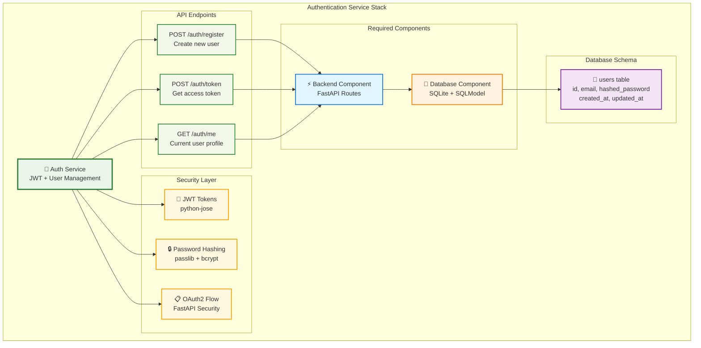
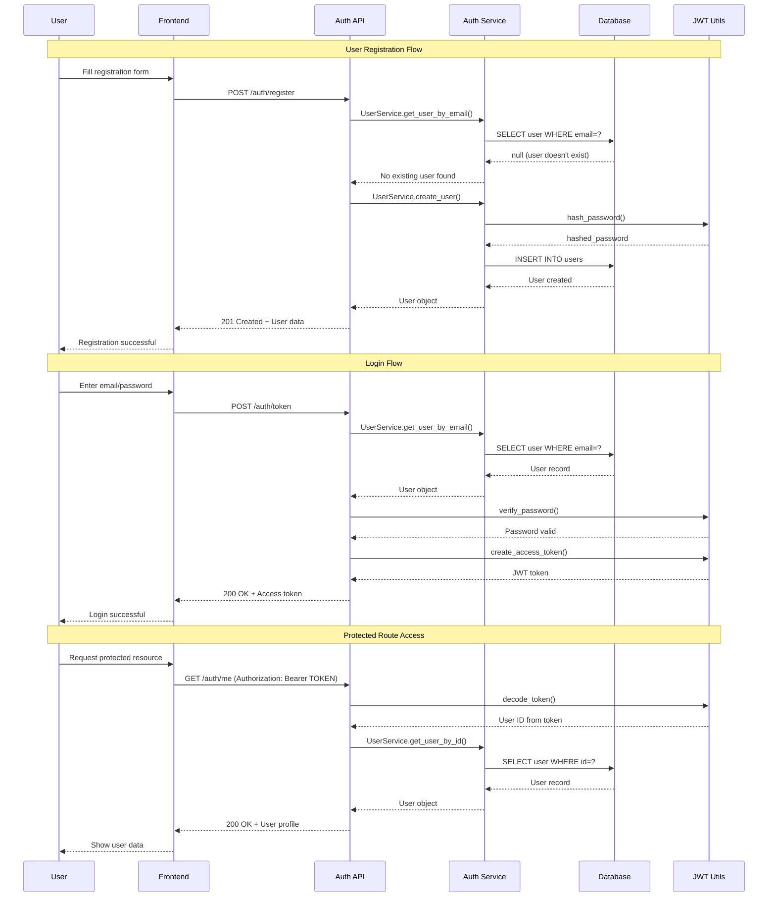

# Authentication Service

The **Authentication Service** provides complete user management and JWT-based authentication for your Aegis Stack application.

!!! info "Ready-to-Use Authentication"
    Generate a project with auth service and start building immediately:

    ```bash
    aegis init my-app --services auth --components database
    cd my-app
    uv sync && source .venv/bin/activate
    make server
    ```

    Authentication endpoints available at `/auth/*` with automatic database setup.

## What You Get

- **JWT-based authentication** - Industry-standard token authentication
- **User registration and login** - Complete user lifecycle management
- **Password hashing** - Secure bcrypt password storage
- **Protected routes** - Easy endpoint protection with decorators
- **User profile management** - Built-in user data handling
- **Database integration** - Automatic user table and model setup
- **Form data support** - OAuth2 password flow compatibility

## Architecture



## Authentication Flow



## Quick Start

### 1. Generate Project with Auth

```bash
# Create project with auth service
aegis init my-auth-app --services auth --components database

# Navigate and setup
cd my-auth-app
uv sync && source .venv/bin/activate

# Run the application
make server
```

### 2. Test Authentication

```bash
# Register a new user
curl -X POST http://localhost:8000/auth/register \
  -H "Content-Type: application/json" \
  -d '{"email":"test@example.com","password":"secure123"}'

# Login and get token
curl -X POST http://localhost:8000/auth/token \
  -H "Content-Type: application/x-www-form-urlencoded" \
  -d "username=test@example.com&password=secure123"

# Access protected endpoint
curl -X GET http://localhost:8000/auth/me \
  -H "Authorization: Bearer YOUR_TOKEN_HERE"
```

## Configuration

### JWT Settings

Configure JWT behavior in your environment:

```bash
# .env
JWT_SECRET_KEY=your-super-secret-key-here-make-it-long-and-random
JWT_ALGORITHM=HS256
JWT_ACCESS_TOKEN_EXPIRE_MINUTES=30
```

### Password Security

```python
# app/core/security.py
from passlib.context import CryptContext

pwd_context = CryptContext(schemes=["bcrypt"], deprecated="auto")

def verify_password(plain_password: str, hashed_password: str) -> bool:
    """Verify a password against its hash."""
    return pwd_context.verify(plain_password, hashed_password)

def get_password_hash(password: str) -> str:
    """Generate password hash."""
    return pwd_context.hash(password)
```

## Next Steps

| Topic | Description |
|-------|-------------|
| **[API Reference](api.md)** | Complete endpoint documentation with schemas |
| **[Integration Guide](integration.md)** | Frontend/backend integration patterns |
| **[CLI Commands](cli.md)** | User management and utility commands |
| **[Examples](examples.md)** | Real-world usage patterns and implementations |

---

**Related Documentation:**

- **[Services Overview](../index.md)** - Complete services architecture
- **[Database Component](../../components/database.md)** - Database component details
- **[CLI Reference](../../cli-reference.md)** - Auth service CLI commands