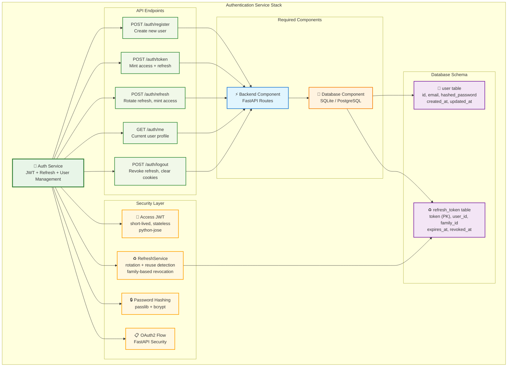
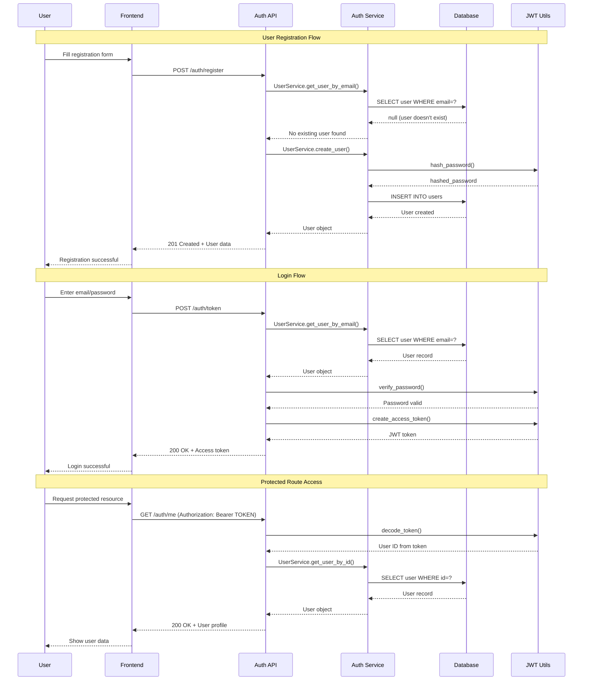
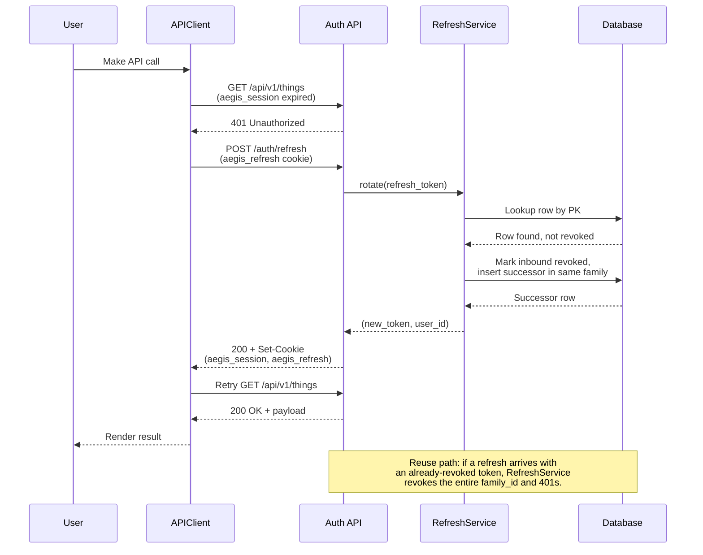

# Authentication Service

The **Authentication Service** provides complete user management and JWT-based authentication for your Aegis Stack application.

!!! info "Ready-to-Use Authentication"
    Generate a project with auth service and start building immediately:

    ```bash
    aegis init my-app --services auth --components database
    cd my-app
    uv sync && source .venv/bin/activate
    make serve
    ```

    Authentication endpoints available at `/auth/*` with automatic database setup.

!!! tip "Auth Levels: Basic, RBAC, and Organization"
    Auth supports three progressive levels. Start with basic JWT auth and upgrade to role-based access control or multi-tenant organizations as your needs grow.

    [:octicons-arrow-right-24: Auth Levels Guide](levels.md)

## What You Get

- **JWT-based authentication** - Industry-standard token authentication
- **HttpOnly session cookies** - Browser flows ride on the `aegis_session`
  cookie set by the backend; the token never has to be touched by
  frontend code
- **Persistent sessions via refresh-token rotation** - Short-lived access
  tokens (15 min default) paired with long-lived `aegis_refresh` cookies
  (14 day default), rotated on every use with family-based reuse
  detection. The frontend `APIClient` refreshes transparently on 401
- **Sign-in and registration views out of the box** - The Overseer ships
  with `/login` and `/register` pages wired to the auth API, so the
  generated app is sign-in-ready the moment it boots
- **Social login (GitHub + Google)** - One CLI flag wires up OAuth start +
  callback routes, account linking, and sign-in buttons on both `/login`
  and `/register`
- **User registration and login** - Complete user lifecycle management
- **Password hashing** - Secure bcrypt password storage
- **Protected routes** - Easy endpoint protection with decorators
- **User profile management** - Built-in user data handling
- **Database integration** - Automatic user table and model setup
- **Form data support** - OAuth2 password flow compatibility

## Architecture


```mermaid
graph TB
    subgraph "Authentication Service Stack"
        AuthService[🔐 Auth Service<br/>JWT + Refresh + User Management]

        subgraph "API Endpoints"
            Register["POST /auth/register<br/>Create new user"]
            Login["POST /auth/token<br/>Mint access + refresh"]
            Refresh["POST /auth/refresh<br/>Rotate refresh, mint access"]
            Profile["GET /auth/me<br/>Current user profile"]
            Logout["POST /auth/logout<br/>Revoke refresh, clear cookies"]
        end

        subgraph "Required Components"
            Backend[⚡ Backend Component<br/>FastAPI Routes]
            Database[💾 Database Component<br/>SQLite / PostgreSQL]
        end

        subgraph "Security Layer"
            JWT[🔑 Access JWT<br/>short-lived, stateless<br/>python-jose]
            RefreshSvc[♻️ RefreshService<br/>rotation + reuse detection<br/>family-based revocation]
            Passwords[🔒 Password Hashing<br/>passlib + bcrypt]
            OAuth2[📋 OAuth2 Flow<br/>FastAPI Security]
        end

        subgraph "Database Schema"
            Users["👥 user table<br/>id, email, hashed_password<br/>created_at, updated_at"]
            RefreshTokens["♻️ refresh_token table<br/>token (PK), user_id, family_id<br/>expires_at, revoked_at"]
        end
    end

    AuthService --> Register
    AuthService --> Login
    AuthService --> Refresh
    AuthService --> Profile
    AuthService --> Logout

    Register --> Backend
    Login --> Backend
    Refresh --> Backend
    Profile --> Backend
    Logout --> Backend

    Backend --> Database

    AuthService --> JWT
    AuthService --> RefreshSvc
    AuthService --> Passwords
    AuthService --> OAuth2

    RefreshSvc --> RefreshTokens
    Database --> Users
    Database --> RefreshTokens

    style AuthService fill:#e8f5e8,stroke:#2e7d32,stroke-width:3px
    style Register fill:#f1f8e9,stroke:#388e3c,stroke-width:2px
    style Login fill:#f1f8e9,stroke:#388e3c,stroke-width:2px
    style Refresh fill:#f1f8e9,stroke:#388e3c,stroke-width:2px
    style Profile fill:#f1f8e9,stroke:#388e3c,stroke-width:2px
    style Logout fill:#f1f8e9,stroke:#388e3c,stroke-width:2px
    style Backend fill:#e1f5fe,stroke:#1976d2,stroke-width:2px
    style Database fill:#fff3e0,stroke:#f57c00,stroke-width:2px
    style JWT fill:#fff8e1,stroke:#ffa000,stroke-width:2px
    style RefreshSvc fill:#fff8e1,stroke:#ffa000,stroke-width:2px
    style Passwords fill:#fff8e1,stroke:#ffa000,stroke-width:2px
    style OAuth2 fill:#fff8e1,stroke:#ffa000,stroke-width:2px
    style Users fill:#f3e5f5,stroke:#7b1fa2,stroke-width:2px
    style RefreshTokens fill:#f3e5f5,stroke:#7b1fa2,stroke-width:2px
```

## Authentication Flow


```mermaid
sequenceDiagram
    participant U as User
    participant F as Frontend
    participant A as Auth API
    participant S as Auth Service
    participant D as Database
    participant J as JWT Utils

    Note over U,J: User Registration Flow
    U->>F: Fill registration form
    F->>A: POST /auth/register
    A->>S: UserService.get_user_by_email()
    S->>D: SELECT user WHERE email=?
    D-->>S: null (user doesn't exist)
    S-->>A: No existing user found
    A->>S: UserService.create_user()
    S->>J: hash_password()
    J-->>S: hashed_password
    S->>D: INSERT INTO users
    D-->>S: User created
    S-->>A: User object
    A-->>F: 201 Created + User data
    F-->>U: Registration successful

    Note over U,J: Login Flow
    U->>F: Enter email/password
    F->>A: POST /auth/token
    A->>S: UserService.get_user_by_email()
    S->>D: SELECT user WHERE email=?
    D-->>S: User record
    S-->>A: User object
    A->>J: verify_password()
    J-->>A: Password valid
    A->>J: create_access_token()
    J-->>A: JWT token
    A-->>F: 200 OK + Access token
    F-->>U: Login successful

    Note over U,J: Protected Route Access
    U->>F: Request protected resource
    F->>A: GET /auth/me (Authorization: Bearer TOKEN)
    A->>J: decode_token()
    J-->>A: User ID from token
    A->>S: UserService.get_user_by_id()
    S->>D: SELECT user WHERE id=?
    D-->>S: User record
    S-->>A: User object
    A-->>F: 200 OK + User profile
    F-->>U: Show user data
```

### Refresh-Token Rotation

When the short-lived access JWT expires mid-session, the frontend `APIClient` quietly rotates the refresh token and retries — the user sees a 200, not a redirect to `/login`.


```mermaid
sequenceDiagram
    participant U as User
    participant C as APIClient
    participant A as Auth API
    participant R as RefreshService
    participant D as Database

    U->>C: Make API call
    C->>A: GET /api/v1/things<br/>(aegis_session expired)
    A-->>C: 401 Unauthorized
    C->>A: POST /auth/refresh<br/>(aegis_refresh cookie)
    A->>R: rotate(refresh_token)
    R->>D: Lookup row by PK
    D-->>R: Row found, not revoked
    R->>D: Mark inbound revoked,<br/>insert successor in same family
    D-->>R: Successor row
    R-->>A: (new_token, user_id)
    A-->>C: 200 + Set-Cookie<br/>(aegis_session, aegis_refresh)
    C->>A: Retry GET /api/v1/things
    A-->>C: 200 OK + payload
    C-->>U: Render result

    Note over A,D: Reuse path: if a refresh arrives with<br/>an already-revoked token, RefreshService<br/>revokes the entire family_id and 401s.
```

## Quick Start

### 1. Generate Project with Auth

```bash
# Create project with auth service
aegis init my-auth-app --services auth --components database

# Navigate and setup
cd my-auth-app
uv sync && source .venv/bin/activate

# Run the application
make serve
```

### 2. Test Authentication

```bash
# Register a new user
curl -X POST http://localhost:8000/auth/register \
  -H "Content-Type: application/json" \
  -d '{"email":"test@example.com","password":"secure123"}'

# Login and get token
curl -X POST http://localhost:8000/auth/token \
  -H "Content-Type: application/x-www-form-urlencoded" \
  -d "username=test@example.com&password=secure123"

# Access protected endpoint
curl -X GET http://localhost:8000/auth/me \
  -H "Authorization: Bearer YOUR_TOKEN_HERE"
```

## Configuration

### JWT + Refresh-Token Settings

Configure token behavior in your environment:

```bash
# .env
JWT_SECRET_KEY=your-super-secret-key-here-make-it-long-and-random
JWT_ALGORITHM=HS256

# Access token: short-lived JWT verified statelessly on every request.
ACCESS_TOKEN_EXPIRE_MINUTES=15

# Refresh token: long-lived opaque DB row, rotated on every use.
# Family-based reuse detection: replaying a rotated token revokes the
# whole chain. The browser-side APIClient handles refresh transparently
# on 401, so users see a 200, not a redirect to /login.
REFRESH_TOKEN_EXPIRE_DAYS=14
```

### Password Security

```python
# app/core/security.py
from passlib.context import CryptContext

pwd_context = CryptContext(schemes=["bcrypt"], deprecated="auto")

def verify_password(plain_password: str, hashed_password: str) -> bool:
    """Verify a password against its hash."""
    return pwd_context.verify(plain_password, hashed_password)

def get_password_hash(password: str) -> str:
    """Generate password hash."""
    return pwd_context.hash(password)
```

## Social Login

Sign in with **GitHub** and **Google** alongside the password flow,
end-to-end out of the box: backend routes, account linking, the
HttpOnly session cookie, *and* the sign-in buttons on `/login` and
`/register` in the generated frontend.

### Enable it

Add the `oauth` modifier to the `auth[...]` bracket syntax. The
modifier composes with the level slot, so any of these work:

```bash
# Basic auth + OAuth
aegis init my-app --services auth[oauth] --components database

# RBAC + OAuth (order doesn't matter)
aegis init my-app --services auth[rbac,oauth] --components database

# Org + OAuth, with explicit engine
aegis init my-app --services auth[org,oauth,postgres] --components database
```

### What ships

#### Frontend

The generated auth shell renders "Continue with GitHub" and "Continue
with Google" buttons under the password form on both the sign-in and
registration views. Click → `/auth/oauth/{provider}/start` → provider
consent → callback → cookie set → 303 to `/`. No view code to write.

#### Backend

- `GET /api/v1/auth/oauth/github/start` and `/google/start`:
  Authlib-driven `state` + PKCE redirects.
- `GET /api/v1/auth/oauth/{provider}/callback`, exchanges the code,
  upserts a local user (linking by email when an account already
  exists), sets the `aegis_session` HttpOnly cookie, and 303s to
  `/app` (or to the same-origin `?next=` the user came in with).
- `GET /api/v1/auth/oauth/connections` and
  `DELETE /api/v1/auth/oauth/connections/{provider}`, list and
  unlink linked identities. The disconnect route refuses to remove
  the last sign-in method to avoid lock-out.

### Configure each provider

Each provider is enabled independently, leaving its client ID/secret
blank turns just that provider off (the route returns 503), so you
can ship with GitHub configured and add Google later.

```bash
# .env
GITHUB_OAUTH_CLIENT_ID=...
GITHUB_OAUTH_CLIENT_SECRET=...
GOOGLE_OAUTH_CLIENT_ID=...
GOOGLE_OAUTH_CLIENT_SECRET=...

# Backs starlette's SessionMiddleware, Authlib stashes the OAuth
# state + PKCE verifier here between /start and /callback.
OAUTH_SESSION_SECRET=replace-me-with-a-strong-random-string
```

Callback URLs to register on each provider's developer console:

| Provider | Callback URL                                                        |
|----------|---------------------------------------------------------------------|
| GitHub   | `https://your-domain/api/v1/auth/oauth/github/callback`             |
| Google   | `https://your-domain/api/v1/auth/oauth/google/callback`             |

API clients (CLIs, server-to-server) keep using
`Authorization: Bearer ...`, the cookie path is parallel, not
exclusive.

## Next Steps

| Topic | Description |
|-------|-------------|
| **[Auth Levels](levels.md)** | RBAC, organizations, and upgrade paths |
| **[API Reference](api.md)** | Complete endpoint documentation with schemas |
| **[Integration Guide](integration.md)** | Frontend/backend integration patterns |
| **[CLI Commands](cli.md)** | User management and utility commands |
| **[Examples](examples.md)** | Real-world usage patterns and implementations |

---

**Related Documentation:**

- **[Services Overview](../index.md)** - Complete services architecture
- **[Database Component](../../components/database.md)** - Database component details
- **[CLI Reference](../../cli-reference.md)** - Auth service CLI commands