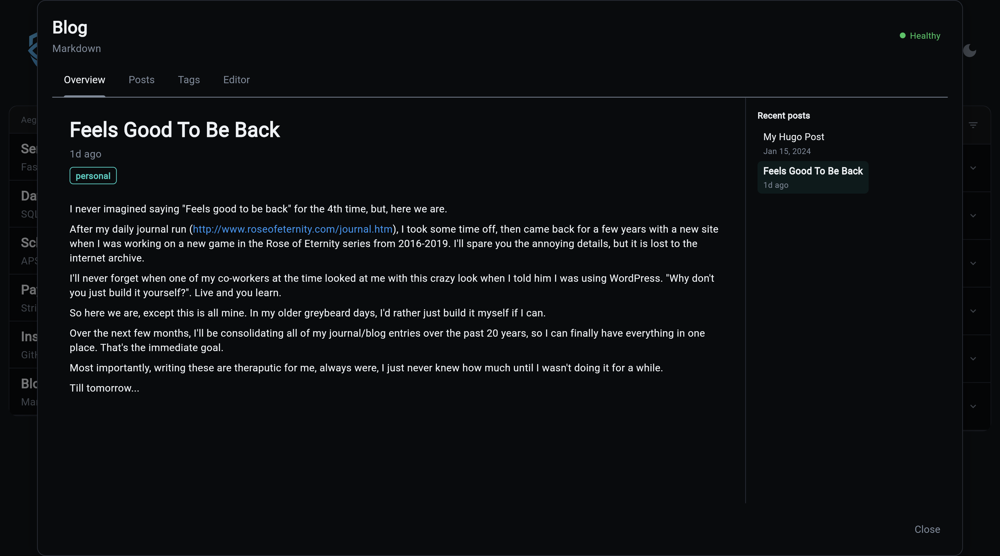
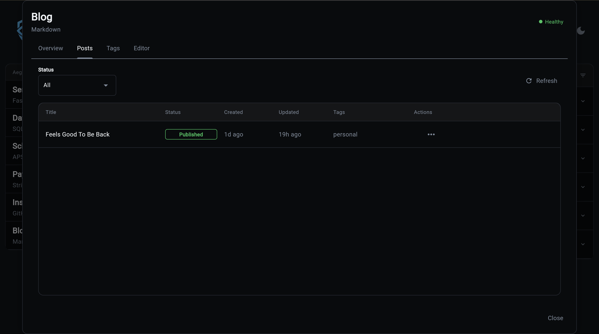
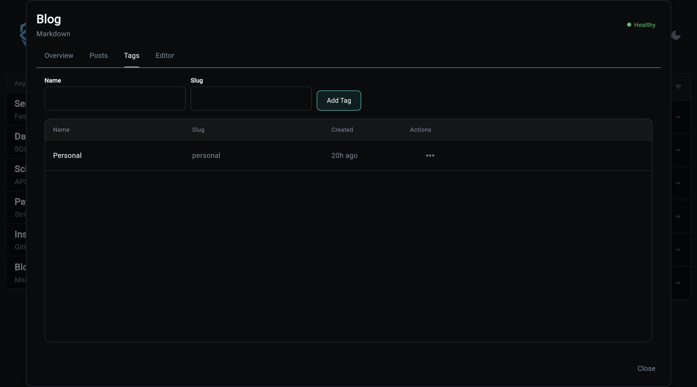
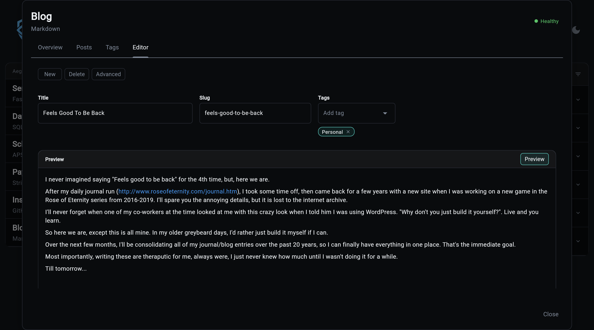

# Overseer Dashboard

Publishing breaks down when "write a post" lives in one tool, "find a post" lives in another, and "see what shipped" lives in a third. The Overseer modal collapses all of that into one place so the loop stays tight.

## Overview

Reader-style landing: the most recent published post takes the main area in full, rendered markdown body, title, date, and tags. A "Recent posts" sidebar on the right lists the last ten published entries, click one to swap the body without navigating away. Content-first by design; counts and operational status live in the Posts table and the CLI `blog status` command, not here.

## Posts

When someone says "what happened to the launch announcement" or "let's take that one down," this is where you find it in seconds. Every post lives here regardless of status, and the row's action menu walks the post through its full lifecycle: publish a draft, archive a stale one, delete an experiment, jump back into the editor. No SQL, no separate admin tool.

## Tags

The fastest way to ruin a blog's information architecture is to let writers invent tag variants on the fly: `release-notes`, `releaseNotes`, `Release Notes`. The curated set lives here and is what the editor's tag picker pulls from, so writers select instead of typing. Removing a tag here strips it from every post that referenced it, so cleanup never leaves orphans behind.

## Editor

The page where the words actually happen. Markdown body with side-by-side preview, title and tags up top, optional excerpt and SEO fields tucked behind Advanced. Save Draft is the one primary action, and the editor protects work in progress when you switch to a fresh post. Designed for writing, not configuring.

The modal loads all its data via the blog API. See the [API Reference](api.md) for the full endpoint list and request/response shapes.
