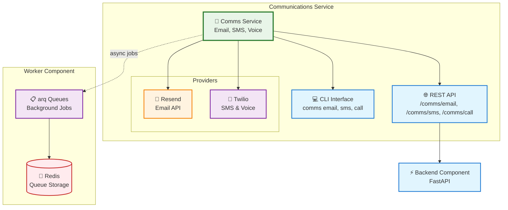

# Communications Service

The **Communications Service** provides email, SMS, and voice call capabilities for your Aegis Stack application using industry-leading providers.


!!! info "Start Sending Messages in Minutes"
    Generate a project with comms service and start communicating:

    ```bash
    aegis init my-app --services comms
    cd my-app
    uv sync && source .venv/bin/activate
    my-app comms status
    ```

    Free tiers available for both providers - no credit card required to get started!

## What You Get

- **Email via Resend** - Modern email API with excellent deliverability
- **SMS via Twilio** - Worldwide SMS messaging with delivery tracking
- **Voice Calls via Twilio** - Outbound calls with TwiML control
- **CLI Interface** - Send messages directly from command line
- **REST API** - Complete `/comms/*` endpoints for integration
- **Health Monitoring** - Service health checks and configuration validation

## Architecture



## Quick Start

### 1. Generate Project with Comms Service

```bash
aegis init my-app --services comms
cd my-app
uv sync && source .venv/bin/activate
```

### 2. Configure Providers

Set up your environment variables:

```bash
# Email (Resend) - Get key at resend.com/api-keys
export RESEND_API_KEY=re_xxxxxxxxxxxx
export RESEND_FROM_EMAIL=onboarding@resend.dev  # Use your domain in production

# SMS/Voice (Twilio) - Get credentials at console.twilio.com
export TWILIO_ACCOUNT_SID=ACxxxxxxxxxxxxxxxxxxxxxxxxxxxxxxxx
export TWILIO_AUTH_TOKEN=xxxxxxxxxxxxxxxxxxxxxxxxxxxxxxxx
export TWILIO_PHONE_NUMBER=+15551234567
```

### 3. Check Configuration

```bash
my-app comms status
```

### 4. Send Your First Message

```bash
# Send an email
my-app comms email send 'your@email.com' --subject 'Hello from Aegis Stack' --text 'Your first message!'

# Send an SMS (trial accounts: verified numbers only)
my-app comms sms send '+1YOUR_NUMBER' 'Hello from Aegis Stack!'
```

## Provider Free Tiers

| Provider | Free Tier | Limits |
|----------|-----------|--------|
| **Resend** | 100 emails/day | 3,000/month, no credit card |
| **Twilio** | $15 trial credit | ~1,900 SMS or ~1,765 call minutes |

!!! example "Musings: On SMS Registration (November 25th, 2025)"
    It's been more annoying than I thought to get a toll-free number, or any number for that matter. Voice calls work fine, but I need to jump through more hoops than I anticipated for text messaging. Which makes this less "just works" than I would like. It also looks to be a systemic issue that I'll run into with other providers...

## Configuration

### Email (Resend)

```bash
# .env
RESEND_API_KEY=re_xxxxxxxxxxxx
RESEND_FROM_EMAIL=noreply@yourdomain.com
```

### SMS/Voice (Twilio)

```bash
# .env
TWILIO_ACCOUNT_SID=ACxxxxxxxxxxxxxxxxxxxxxxxxxxxxxxxx
TWILIO_AUTH_TOKEN=xxxxxxxxxxxxxxxxxxxxxxxxxxxxxxxx
TWILIO_PHONE_NUMBER=+15551234567
```

## Usage Examples

### CLI

```bash
# Check service status
my-app comms status

# Send email
my-app comms email send 'user@example.com' --subject 'Welcome' --text 'Welcome to our service!'

# Send SMS
my-app comms sms send '+15559876543' 'Your code: 123456'

# Make voice call (uses demo TwiML by default)
my-app comms call make '+15559876543'
```

### API

```bash
# Start server
make serve

# Send email via API
curl -X POST http://localhost:8000/api/v1/comms/email/send \
  -H "Content-Type: application/json" \
  -d '{
    "to": ["user@example.com"],
    "subject": "Welcome",
    "text": "Hello from the API!"
  }'

# Send SMS via API
curl -X POST http://localhost:8000/api/v1/comms/sms/send \
  -H "Content-Type: application/json" \
  -d '{
    "to": "+15559876543",
    "body": "Your verification code is 123456"
  }'
```

### Python

```python
from app.services.comms.email import send_email_simple
from app.services.comms.sms import send_sms_simple
from app.services.comms.call import make_call_simple

# Send email
result = await send_email_simple(
    to="user@example.com",
    subject="Welcome",
    text="Hello, welcome to our service!"
)
print(f"Email sent: {result.id}")

# Send SMS
result = await send_sms_simple(
    to="+15559876543",
    body="Your verification code is 123456"
)
print(f"SMS sent: {result.sid}")

# Make call
result = await make_call_simple(
    to="+15559876543",
    twiml_url="https://example.com/twiml"
)
print(f"Call initiated: {result.sid}")
```

## Next Steps

| Topic | Description |
|-------|-------------|
| **[Provider Setup](setup.md)** | Detailed Resend and Twilio account setup |
| **[API Reference](api.md)** | Complete REST endpoint documentation |
| **[CLI Commands](cli.md)** | Command-line interface reference |
| **[Examples](examples.md)** | Real-world patterns including worker integration |

---

**Related Documentation:**

- **[Services Overview](../index.md)** - Complete services architecture
- **[Worker Component](../../components/worker/index.md)** - Background job processing
- **[CLI Reference](../../cli-reference.md)** - Comms service CLI commands
