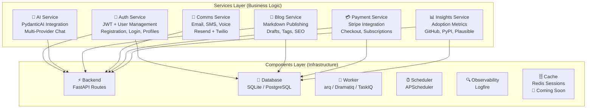
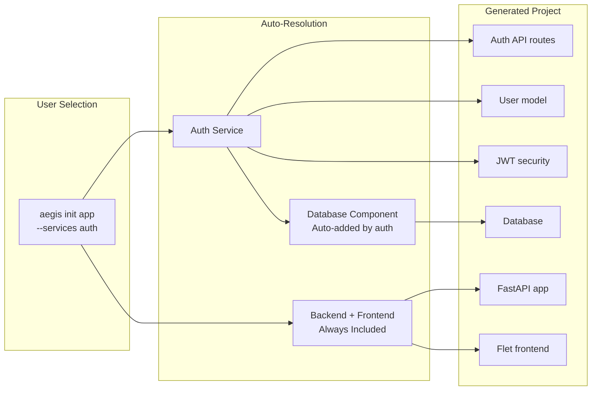
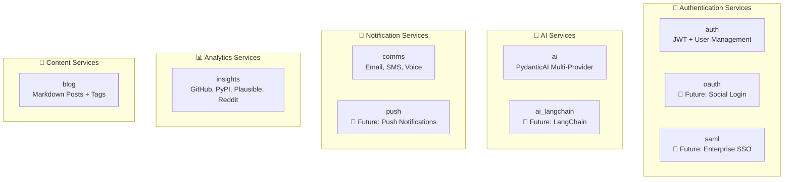
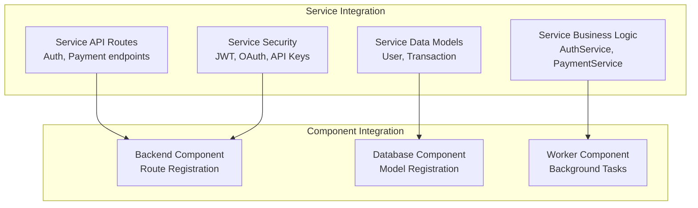

# Services Overview

Services are **business-level functionality** that your application provides to users. While Components handle infrastructure concerns (databases, workers, scheduling), Services implement specific business capabilities like authentication, payments, or AI integrations.

!!! info "Services vs Components"
    **Services** = What your app does (auth, AI, insights)
    **Components** = How your app works (database, workers, API)

## Service Architecture


```mermaid
graph TB
    subgraph "Services Layer (Business Logic)"
        Auth["🔐 Auth Service<br/>JWT + User Management<br/>Registration, Login, Profiles"]
        AI["🤖 AI Service<br/>PydanticAI Integration<br/>Multi-Provider Chat"]
        Blog["📝 Blog Service<br/>Markdown Publishing<br/>Drafts, Tags, SEO"]
        Comms["📧 Comms Service<br/>Email, SMS, Voice<br/>Resend + Twilio"]
        Payment["💳 Payment Service<br/>Stripe Integration<br/>Checkout, Subscriptions"]
        Insights["📊 Insights Service<br/>Adoption Metrics<br/>GitHub, PyPI, Plausible"]
    end

    subgraph "Components Layer (Infrastructure)"
        Backend["⚡ Backend<br/>FastAPI Routes"]
        Database["💾 Database<br/>SQLite / PostgreSQL"]
        Worker["🔄 Worker<br/>arq / Dramatiq / TaskIQ"]
        Scheduler["⏰ Scheduler<br/>APScheduler"]
        Observability["🔍 Observability<br/>Logfire"]
        Cache["🗄️ Cache<br/>Redis Sessions<br/>🚧 Coming Soon"]
    end

    Auth --> Backend
    Auth --> Database
    AI --> Backend
    Blog --> Backend
    Blog --> Database
    Comms --> Backend
    Payment --> Backend
    Payment --> Database
    Insights --> Backend
    Insights --> Database

```

!!! tip "Architectural Guidance"
    This page covers **which services are available** and how to add them to your project. For detailed patterns on **how services integrate with components** and how to structure your code, see **[Integration Patterns](../integration-patterns.md)**.

## Service Selection

Services are chosen during project creation and automatically include their required components:

```bash
# Basic API project (no services)
aegis init my-api

# Interactive mode - must explicitly specify required components
aegis init user-app --services auth --components database
# Required: must include database component that auth service needs

# Non-interactive mode - must explicitly specify all components
aegis init user-app --services auth --components database --no-interactive
# Required: must include database component that auth service needs

# Multiple services with explicit components (future)
aegis init full-app --services auth,ai --components database,worker --no-interactive
# Required: must include all components that services need
```

## Dependency Resolution

**Interactive Mode:** Services automatically include required components.

**Non-Interactive Mode:** You must explicitly specify all required components when using `--components`.


```mermaid
graph LR
    subgraph "User Selection"
        UserChoice["aegis init app<br/>--services auth"]
    end

    subgraph "Auto-Resolution"
        CoreComponents["Backend + Frontend<br/>Always Included"]
        AuthSvc[Auth Service]
        DatabaseComp["Database Component<br/>Auto-added by auth"]
    end

    subgraph "Generated Project"
        AuthAPI["Auth API routes"]
        UserModel["User model"]
        JWT["JWT security"]
        DB[Database]
        API[FastAPI app]
        UI[Flet frontend]
    end

    UserChoice --> CoreComponents
    UserChoice --> AuthSvc
    AuthSvc --> DatabaseComp

    AuthSvc --> AuthAPI
    AuthSvc --> UserModel
    AuthSvc --> JWT
    DatabaseComp --> DB
    CoreComponents --> API
    CoreComponents --> UI

```

## Service Categories


```mermaid
graph TB
    subgraph "🔐 Authentication Services"
        AuthJWT["auth<br/>JWT + User Management"]
        AuthOAuth["oauth<br/>🚧 Future: Social Login"]
        AuthSAML["saml<br/>🚧 Future: Enterprise SSO"]
    end

    subgraph "🤖 AI Services"
        AIPydantic["ai<br/>PydanticAI Multi-Provider"]
        AILangChain["ai_langchain<br/>🚧 Future: LangChain"]
    end

    subgraph "📧 Notification Services"
        CommsService["comms<br/>Email, SMS, Voice"]
        Push["push<br/>🚧 Future: Push Notifications"]
    end

    subgraph "📊 Analytics Services"
        InsightsService["insights<br/>GitHub, PyPI, Plausible, Reddit"]
    end

    subgraph "📝 Content Services"
        BlogService["blog<br/>Markdown Posts + Tags"]
    end

```

## Service Development Patterns

### Service Structure
Services follow a consistent structure in generated projects:

```
app/
├── components/backend/api/
│   └── auth/                    # Service API routes
│       ├── __init__.py
│       └── router.py           # FastAPI routes
├── models/
│   └── user.py                 # Service data models
├── services/auth/              # Service business logic
│   ├── __init__.py
│   ├── auth_service.py         # Core service logic
│   └── user_service.py         # User management
└── core/
    └── security.py             # Service utilities
```

### Service Integration Points


```mermaid
graph TB
    subgraph "Service Integration"
        ServiceAPI["Service API Routes<br/>Auth, Payment endpoints"]
        ServiceLogic["Service Business Logic<br/>AuthService, PaymentService"]
        ServiceModels["Service Data Models<br/>User, Transaction"]
        ServiceSecurity["Service Security<br/>JWT, OAuth, API Keys"]
    end

    subgraph "Component Integration"
        Backend["Backend Component<br/>Route Registration"]
        Database["Database Component<br/>Model Registration"]
        Worker["Worker Component<br/>Background Tasks"]
    end

    ServiceAPI --> Backend
    ServiceModels --> Database
    ServiceLogic --> Worker
    ServiceSecurity --> Backend

```

## CLI Commands

### List Available Services
```bash
aegis services
```

Shows all available services by category with their dependencies:

```
AVAILABLE SERVICES
========================================

Authentication Services
----------------------------------------
  auth         - User authentication and authorization with JWT tokens
               Requires components: backend, database

Payment Services
----------------------------------------
  payment      - Payment processing with Stripe (checkout, subscriptions, webhooks)
               Requires components: backend, database

AI & Machine Learning Services
----------------------------------------
  No services available yet.
```

### Create Project with Services
```bash
# With specific services - must include required components
aegis init my-app --services auth --components database

# Interactive service selection
aegis init my-app --interactive

# Multiple services (future)
aegis init full-app --services auth,ai --components database,worker
```

## Dashboard Integration

Services automatically appear in the health dashboard alongside components, providing real-time monitoring of your business capabilities. See **[Overseer](../overseer/index.md)** for dashboard documentation.

---

**Next Steps:**

- **[Integration Patterns](../integration-patterns.md)** - How services integrate with components and architectural patterns
- **[AI Service](ai/index.md)** - Multi-provider AI chat with PydanticAI
- **[Authentication Service](auth/index.md)** - Complete JWT auth implementation
- **[Blog Service](blog/index.md)** - Markdown publishing with drafts, tags, and Overseer editor *(experimental)*
- **[Communications Service](comms/index.md)** - Email, SMS, and voice via Resend/Twilio
- **[Insights Service](insights/index.md)** - Adoption metrics tracking (GitHub, PyPI, Plausible, Reddit) *(experimental)*
- **[Payment Service](payment/index.md)** - Payment processing with Stripe *(experimental)*
- **[CLI Reference](../cli-reference.md)** - Service command reference
- **[Components Overview](../components/index.md)** - Infrastructure layer
