# Services Overview

Services are **business-level functionality** that your application provides to users. While Components handle infrastructure concerns (databases, workers, scheduling), Services implement specific business capabilities like authentication, payments, or AI integrations.

!!! info "Services vs Components"
    **Services** = What your app does (auth, payments, AI)
    **Components** = How your app works (database, workers, API)

## Service Architecture

```mermaid
graph TB
    subgraph "Services Layer (Business Logic)"
        Auth[🔐 Auth Service<br/>JWT + User Management<br/>Registration, Login, Profiles]
        AI[🤖 AI Service<br/>PydanticAI Integration<br/>Multi-Provider Chat]
    end

    subgraph "Components Layer (Infrastructure)"
        Backend[⚡ Backend<br/>FastAPI Routes]
        Database[💾 Database<br/>SQLite + SQLModel]
        Worker[🔄 Worker<br/>arq + Redis]
        Scheduler[⏰ Scheduler<br/>APScheduler]
        Cache[🗄️ Cache<br/>Redis Sessions<br/>🚧 Coming Soon]
    end

    Auth --> Backend
    Auth --> Database
    AI --> Backend

    style Auth fill:#e8f5e8,stroke:#2e7d32,stroke-width:3px
    style AI fill:#e8f5e8,stroke:#2e7d32,stroke-width:3px
    style Backend fill:#e1f5fe,stroke:#1976d2,stroke-width:2px
    style Database fill:#fff3e0,stroke:#f57c00,stroke-width:2px
    style Worker fill:#f3e5f5,stroke:#7b1fa2,stroke-width:2px
    style Scheduler fill:#ffe0b2,stroke:#ef6c00,stroke-width:2px
    style Cache fill:#f0f0f0,stroke:#757575,stroke-width:2px,stroke-dasharray: 5 5
```



!!! tip "Architectural Guidance"
    This page covers **which services are available** and how to add them to your project. For detailed patterns on **how services integrate with components** and how to structure your code, see **[Integration Patterns](../integration-patterns.md)**.

## Service Selection

Services are chosen during project creation and automatically include their required components:

```bash
# Basic API project (no services)
aegis init my-api

# Interactive mode - must explicitly specify required components
aegis init user-app --services auth --components database
# Required: must include database component that auth service needs

# Non-interactive mode - must explicitly specify all components
aegis init user-app --services auth --components database --no-interactive
# Required: must include database component that auth service needs

# Multiple services with explicit components (future)
aegis init full-app --services auth,ai --components database,worker --no-interactive
# Required: must include all components that services need
```

## Dependency Resolution

**Interactive Mode:** Services automatically include required components.

**Non-Interactive Mode:** You must explicitly specify all required components when using `--components`.


## Available Services

| Service | Status | Description | Required Components |
|---------|--------|-------------|-------------------|
| **auth** | ✅ Available | User authentication and authorization with JWT tokens | backend, database |
| **ai** | 🧪 Experimental | Multi-provider AI chat with PydanticAI (OpenAI, Anthropic, Google, Groq, etc.) | backend |

## Service Categories

```mermaid
graph TB
    subgraph "🔐 Authentication Services"
        AuthJWT[auth<br/>JWT + User Management]
        AuthOAuth[oauth<br/>🚧 Future: Social Login]
        AuthSAML[saml<br/>🚧 Future: Enterprise SSO]
    end

    subgraph "🤖 AI Services"
        AIPydantic[ai<br/>PydanticAI Multi-Provider]
        AILangChain[ai_langchain<br/>🚧 Future: LangChain]
    end

    style AuthJWT fill:#e8f5e8,stroke:#2e7d32,stroke-width:3px
    style AuthOAuth fill:#f0f0f0,stroke:#757575,stroke-dasharray: 5 5
    style AuthSAML fill:#f0f0f0,stroke:#757575,stroke-dasharray: 5 5
    style AIPydantic fill:#e8f5e8,stroke:#2e7d32,stroke-width:3px
    style AILangChain fill:#f0f0f0,stroke:#757575,stroke-dasharray: 5 5
```



## Service Development Patterns

### Service Structure
Services follow a consistent structure in generated projects:

```
app/
├── components/backend/api/
│   └── auth/                    # Service API routes
│       ├── __init__.py
│       └── router.py           # FastAPI routes
├── models/
│   └── user.py                 # Service data models
├── services/auth/              # Service business logic
│   ├── __init__.py
│   ├── auth_service.py         # Core service logic
│   └── user_service.py         # User management
└── core/
    └── security.py             # Service utilities
```

### Service Integration Points


## CLI Commands

### List Available Services
```bash
aegis services
```

Shows all available services by category with their dependencies:

```
🔧 AVAILABLE SERVICES
========================================

🔐 Authentication Services
----------------------------------------
  auth         - User authentication and authorization with JWT tokens
               Requires components: backend, database

💰 Payment Services
----------------------------------------
  No services available yet.

🤖 AI & Machine Learning Services
----------------------------------------
  No services available yet.
```

### Create Project with Services
```bash
# With specific services - must include required components
aegis init my-app --services auth --components database

# Interactive service selection
aegis init my-app --interactive

# Multiple services (future)
aegis init full-app --services auth,ai --components database,worker
```

## Dashboard Integration

Services automatically appear in the health dashboard alongside components, providing real-time monitoring of your business capabilities.

!!! success "Visual Monitoring"
    When you include services in your project, they appear as dedicated dashboard cards showing service-specific metrics and health status.

    **[See Services Dashboard Documentation →](dashboard.md)**

---

**Next Steps:**

- **[Integration Patterns](../integration-patterns.md)** - How services integrate with components and architectural patterns
- **[Services Dashboard](dashboard.md)** - Services dashboard integration and monitoring
- **[Authentication Service](auth/index.md)** - Complete JWT auth implementation
- **[AI Service](ai/index.md)** - Multi-provider AI chat with PydanticAI
- **[CLI Reference](../cli-reference.md)** - Service command reference
- **[Components Overview](../components/index.md)** - Infrastructure layer