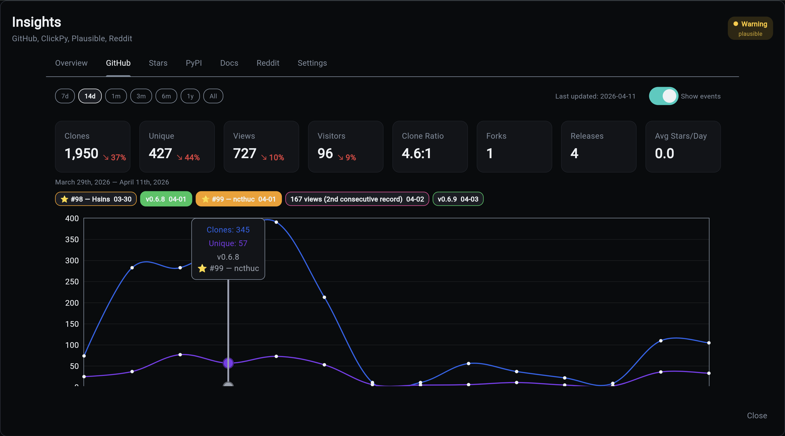
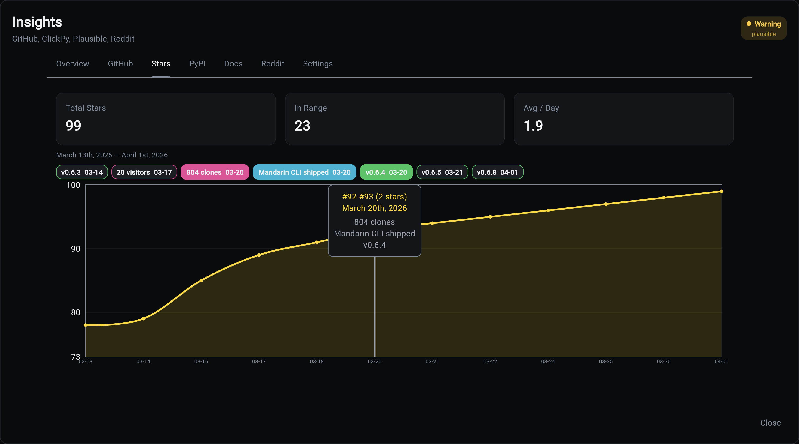
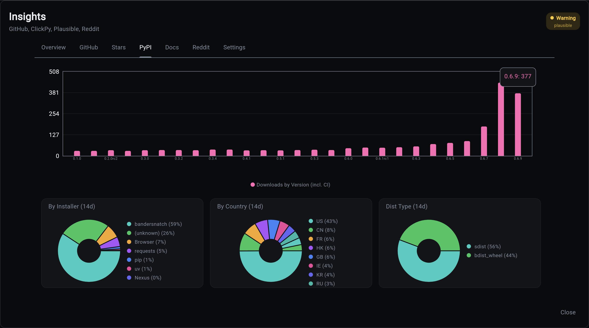
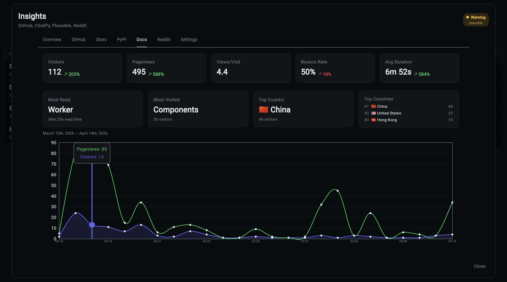

# Overseer Dashboard

Insights exists because you shouldn't need seven browser tabs (GitHub, PyPI Stats, Plausible, Reddit, a spreadsheet, a terminal, and a Google search for last month's numbers) to answer the question "how is my project actually doing?" The Overseer modal pulls every signal that matters into one place, backfills historical data that the source APIs only retain for 14 days, and keeps it current without you lifting a finger.

## Overview Tab


The single-screen daily check-in. Period-over-period arrows tell you whether the last two weeks were better or worse than the two before them, yesterday's numbers surface for daily tracking, and the milestones grid pins the all-time records worth celebrating. If a release drops, a fork happens, or a Reddit post takes off, it lands in the activity feed without you having to go look.

## GitHub Tab



GitHub only lets you see the last 14 days of traffic, which means every month you lose a fresh window of data forever unless something is recording it. This tab is that something. Years of clone and view history are preserved so you can answer "did that blog post actually drive traffic?" six months later. Event chips let you correlate a spike to a release, a Hacker News post, or a Reddit thread without squinting at raw numbers.

## Stars Tab



The curve everyone looks at first when they're deciding whether to trust your project. See the shape of your growth over time, spot which events actually moved the needle, and know when momentum is building versus stalling. Tooltips name the users who starred on each date, which is the raw material for thank-you DMs and early community-building.

## PyPI Tab



PyPI download counts are famously misleading because CI pipelines and package mirrors dominate the totals. This tab separates humans from bots so you can tell whether real developers are using your package, which installer they prefer, and which countries they're coming from. The difference between "100k downloads" (impressive) and "100k downloads, 5k of them human" (humbling but useful) lives here.

## Docs Tab (Plausible)



Which pages of your documentation are actually being read. If your quickstart gets 10x the traffic of your API reference, that tells you where to invest your writing time. The most-visited page, the top countries, and the bounce-rate trend answer "are people finding what they need, or bouncing?" without staring at a Plausible tab in another window.

## Reddit Tab

When a Reddit post about your project takes off, you want to know about it while the thread is still live, not three days later. Track specific posts by URL, watch upvotes and comments climb in near-realtime, and decide whether to jump into the thread yourself to answer questions.

Add posts to track via the CLI:

```bash
my-app insights reddit add https://reddit.com/r/FastAPI/comments/abc123/your-post
```

## Settings Tab

The "why aren't my numbers updating" debugger. Every data source is listed with its last collection timestamp and active/stale/disabled status, so you can tell in ten seconds whether a missing metric means "there's no news" or "the collector broke three days ago."

## API

The dashboard loads all data via a single API call:

```
GET /api/v1/insights/all
```

Returns a `BulkInsightsResponse` containing all daily metrics, event metrics, timeline events, sources, and latest snapshots. The response is server-side cached with automatic invalidation when collectors run.

The dashboard makes zero direct database queries. All data flows through the API.

## Shared Controls

All interactive tabs share a common base:

- **Date range chips**: 7d, 14d, 1m, 3m, 6m, 1y, All
- **Events toggle**: show/hide event annotation chips
- **Event grouping**: at wider ranges, same-type events are grouped (weekly at 3m, monthly at 6m+)
- **Date highlighting**: click an event chip to highlight all chart points in that date range
- **Last updated**: shows the most recent data point date
