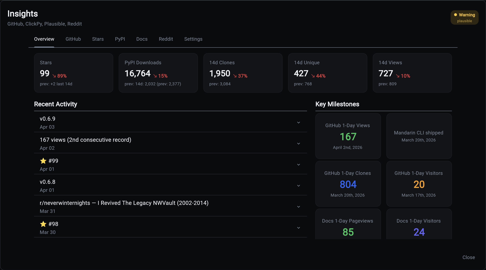
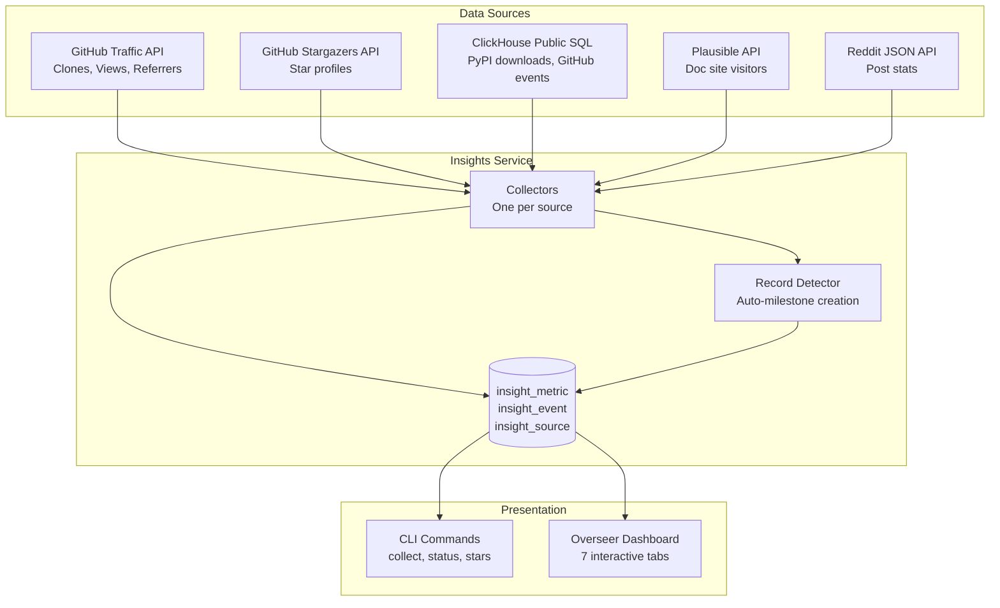
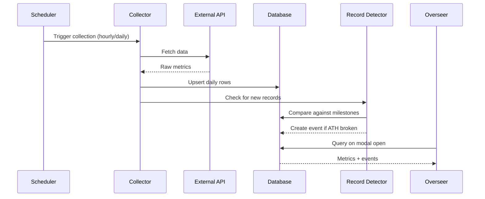

# Insights Service

The **Insights Service** automates tracking of your project's adoption metrics across GitHub, PyPI, Plausible Analytics, and Reddit. It collects, stores, and visualizes the data that matters for understanding how your project is growing.

!!! warning "Experimental Service"
    Insights is currently experimental. The data model, collectors, and dashboard are functional but the API surface may change in future releases.

!!! info "Quick Start"
    ```bash
    aegis init my-app --services "insights[github,pypi]" --components database,scheduler
    cd my-app
    uv sync && source .venv/bin/activate
    ```

    Configure your `.env` with API keys, then collect:

    ```bash
    my-app insights collect
    ```

## Why Track Adoption Metrics?

If you ship open source software, the numbers you see on GitHub and PyPI are misleading without context. GitHub Traffic expires after 14 days. PyPI download counts are 97% bots. Stars don't tell you who's actually using your tool.

Insights solves this by:

- **Preserving data** that would otherwise expire (GitHub's 14-day rolling window)
- **Separating signal from noise** (human downloads vs bot mirrors on PyPI)
- **Correlating events** across sources (did that Reddit post drive stars? did the release drive clones?)
- **Tracking records automatically** (new all-time highs are detected and logged)
- **Visualizing everything** in the Overseer dashboard with interactive charts

## What You Get

- **6 data source collectors** - GitHub Traffic, Stars, Events, PyPI Downloads, Plausible Analytics, Reddit Posts
- **Human vs bot classification** - 97% of PyPI downloads are automated mirrors. Insights separates signal from noise.
- **Event correlation** - Releases, stars, Reddit posts, and milestones annotated on every chart
- **Automatic record detection** - New all-time highs are logged as milestone events
- **Interactive Overseer dashboard** - 7 tabs with date range filtering and period-over-period comparison
- **CLI and scheduler** - Collect on-demand or automate at configurable intervals



## Architecture



## Data Flow



## Bracket Syntax

Insights uses bracket syntax to select which data sources to enable:

```bash
# GitHub + PyPI (default)
aegis init my-app --services insights

# All sources
aegis init my-app --services "insights[github,pypi,plausible,reddit]"

# Just GitHub
aegis init my-app --services "insights[github]"
```

Available sources: `github`, `pypi`, `plausible`, `reddit`

## Quick Start

1. **Create a project with Insights**
    ```bash
    aegis init my-app --services "insights[github,pypi,plausible]" --components database,scheduler
    cd my-app
    ```

2. **Configure API keys** in `.env`
    ```bash
    INSIGHT_GITHUB_TOKEN=ghp_your_token
    INSIGHT_GITHUB_OWNER=your-username
    INSIGHT_GITHUB_REPO=your-repo
    INSIGHT_PYPI_PACKAGE=your-package
    INSIGHT_PLAUSIBLE_API_KEY=your_key
    INSIGHT_PLAUSIBLE_SITES=your-site.com
    ```

3. **Run initial collection**
    ```bash
    my-app insights collect
    ```

4. **Backfill historical data** (PyPI goes back 365 days, Plausible too)
    ```bash
    my-app insights collect pypi --lookback-days 365
    my-app insights collect plausible --lookback-days 365
    ```

5. **Open the Overseer dashboard** and click the Insights card to see your data.

## Required Components

| Component | Required | Why |
|-----------|----------|-----|
| Database | Yes | Stores all metrics, events, and source configuration |
| Scheduler | Yes | Automates collection at configured intervals |
| Backend | Yes | API endpoints for dashboard data |
| Frontend | Recommended | Overseer dashboard visualization |

## Next Steps

| Topic | Description |
|-------|-------------|
| [Data Sources](data-sources.md) | What each source collects and how |
| [CLI Commands](cli.md) | Command reference for collection and management |
| [Dashboard](dashboard.md) | Overseer modal tabs and interactive features |
| [Configuration](configuration.md) | Environment variables and collection intervals |
| [Examples](examples.md) | Real-world patterns and analysis workflows |
