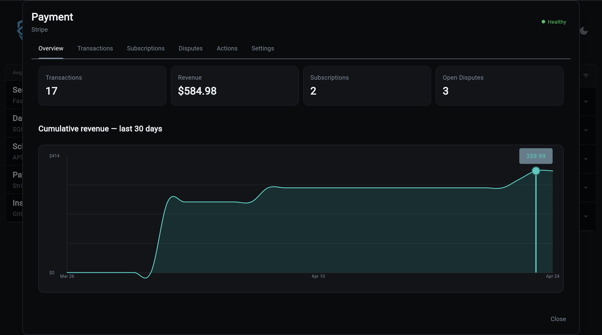
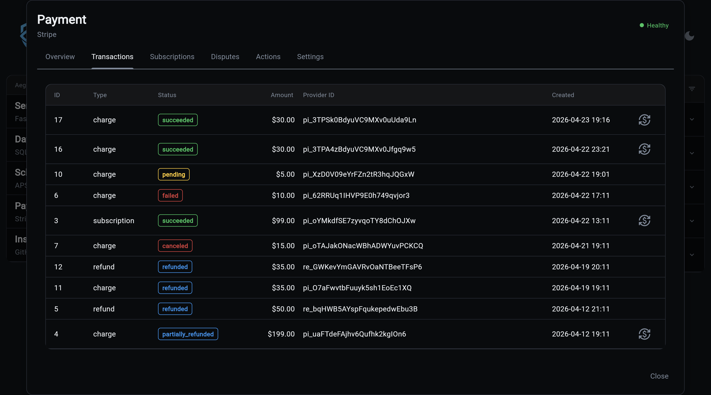
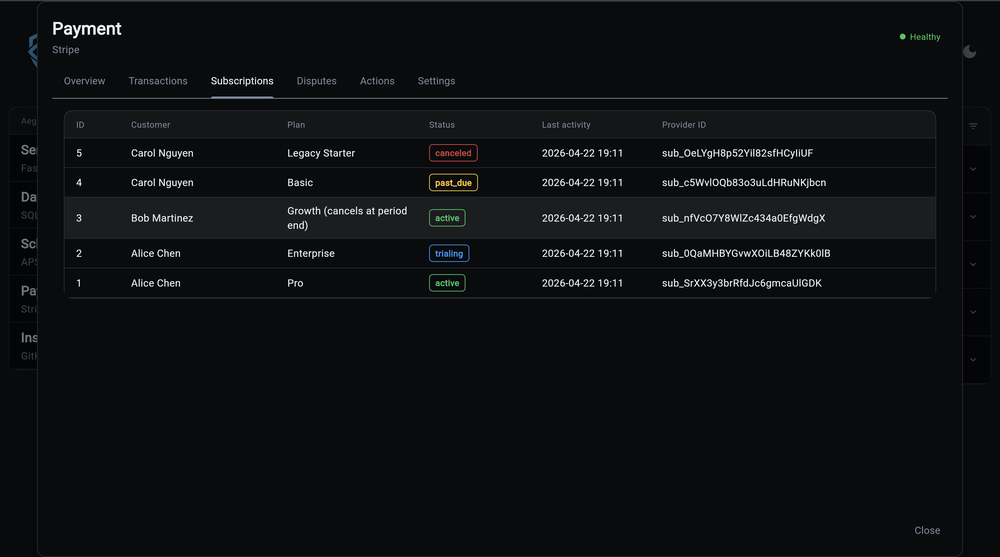
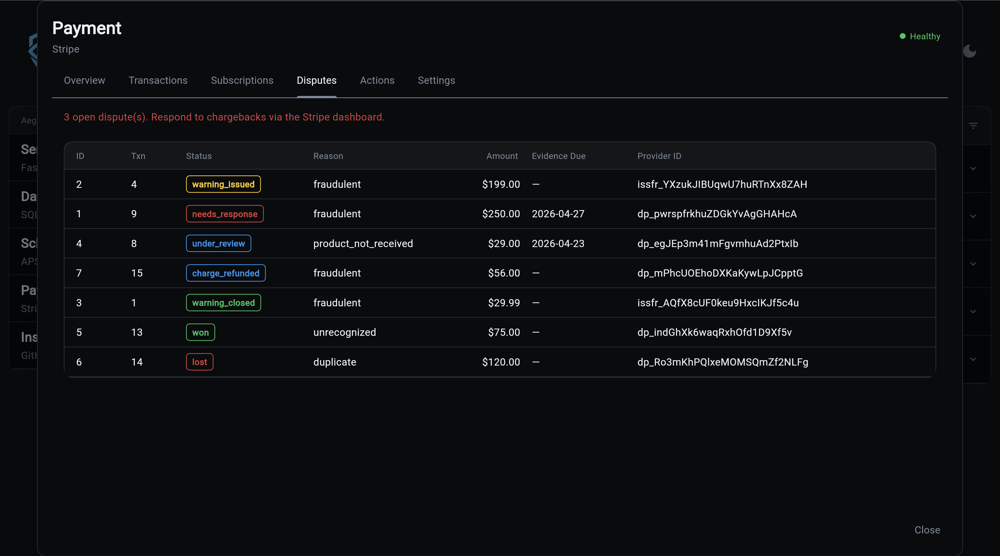
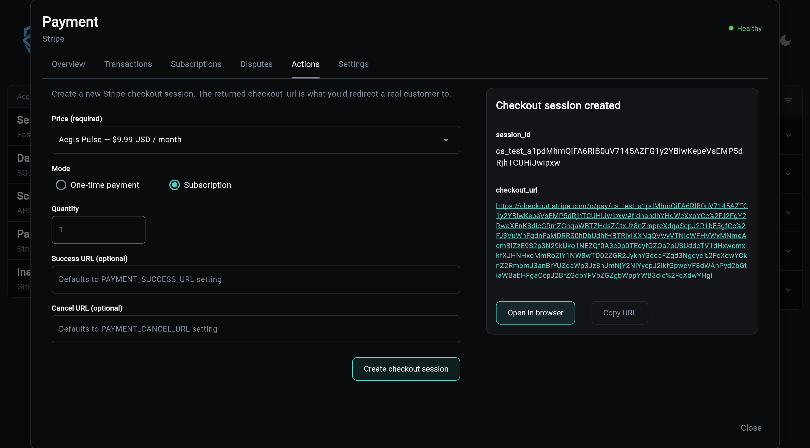

# Overseer Dashboard

Payments is the one part of your system where mistakes cost real money. The Overseer modal exists to shorten the distance between "something happened with a customer's payment" and you knowing about it. No Stripe dashboard context-switching, no database queries, no waiting on a CSV export.

## Overview Tab



Answers the only question that matters when you open the dashboard at 9am: *is the business making money and is anything broken?* Revenue trend, active paying customers, and the count of open disputes are all one click away. If the revenue line flattens or disputes tick up, you see it here first.

## Transactions Tab



When a customer emails "I was charged twice" or "my refund never came through", this is where you confirm it in seconds. Every movement of money is searchable, and refunds are one click instead of a Stripe dashboard round-trip. Stops the 20-minute detective work per support ticket.

## Subscriptions Tab



Tells you who is about to stop paying you. Trials that haven't converted, past-due accounts that need a dunning nudge, and subscriptions set to cancel at period end are all surfaced together. Catch churn before the cancellation email, not after.

## Disputes Tab



Missing a chargeback response deadline means automatically losing the money. The banner tells you how many disputes are on the clock and when evidence is due, so nothing falls through the cracks. Evidence submission itself happens in Stripe; this tab is about making sure you never forget to do it.

## Actions Tab



Before you push a new price to production, you want to know it actually works. This tab lets you trigger a real Stripe checkout session, open it in a browser, and walk through the flow a customer would see, all without writing code or running CLI commands. Smoke-test new products, reproduce bugs reported by users, and demo flows to stakeholders.

## Settings Tab

Confirms at a glance that test-mode isn't accidentally enabled in production, that your webhook secret is configured, and that the API key is live. The answer to "why aren't webhooks firing" or "why are no transactions showing up" is almost always visible here.

## API

The modal loads all data via the payment API, with no direct DB queries:

```
GET  /api/v1/payment/status
GET  /api/v1/payment/transactions?limit=50&offset=0
GET  /api/v1/payment/subscriptions
GET  /api/v1/payment/disputes
GET  /api/v1/payment/catalog
POST /api/v1/payment/checkout-session
POST /api/v1/payment/refund
```

Responses are server-cached with invalidation on webhook receipt, so repeated loads are cheap but new Stripe events surface within seconds.
