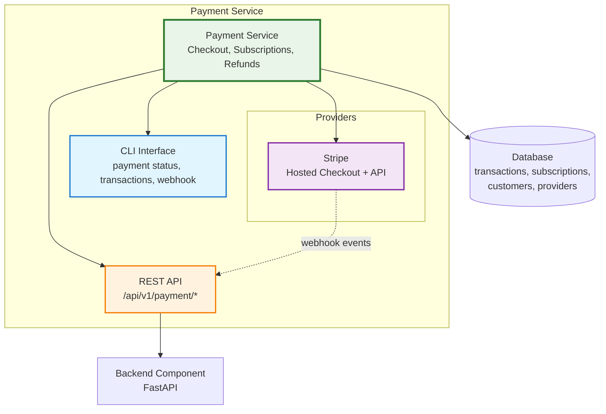

# Payment Service

!!! warning "Experimental Service"
    Payment is currently experimental. The checkout, subscription, refund, and dispute flows are wired up end-to-end and covered by tests, but the schema, API surface, and auth-integration behavior may still change before the first stable release. Generated projects ship with a working `payment_dispute` table, per-user scoping when auth is included, and default landing pages, but treat anything beyond that as subject to change.

Payment processing with Stripe: checkout sessions, subscriptions, webhooks, and refunds.

!!! info "Start Accepting Payments in Minutes"
    Generate a project with the payment service and test it end-to-end:

    ```bash
    aegis init my-app --services payment
    cd my-app
    uv sync && source .venv/bin/activate
    my-app payment status
    ```

    Stripe's free test mode requires no credit card. Sign up and copy your test secret key to get started.

## What You Get

- **Checkout sessions**: redirect users to Stripe's hosted payment page
- **Subscriptions**: recurring billing with plan management
- **Webhooks**: receive and process payment events from Stripe
- **Refunds**: full and partial refund processing
- **Transaction tracking**: local database record of all payment activity
- **CLI Interface**: status checks, transaction listing, local webhook forwarding
- **REST API**: full `/api/v1/payment/*` endpoint surface
- **Dashboard Card**: live status, revenue, subscription counts
- **Default landing pages**: styled `/payment/success` and `/payment/cancel` routes so a fresh project works end-to-end out of the box (overridable per-request or via settings)

## Architecture



## Provider Pattern

The service is designed for multi-provider support. Each provider implements a small abstract interface:

```python
class BasePaymentProvider(ABC):
    async def create_checkout(...) -> CheckoutResult
    async def get_transaction(...) -> TransactionResult
    async def refund(...) -> RefundResult
    async def create_customer(...) -> CustomerResult
    async def verify_webhook(...) -> WebhookEvent
    async def health_check(...) -> ProviderHealth
```

Currently supported: **Stripe**. Future candidates: Paddle, PayPal.

## Next Steps

- **[Setup Guide](setup.md)**: create a Stripe account, get your keys, run your first checkout
- **[CLI Commands](cli.md)**: `payment status`, `transactions`, `disputes`, `webhook` forwarding, `seed` (fake data for UI testing)
- **[API Reference](api.md)**: full REST endpoint documentation
- **[Examples](examples.md)**: one-time payments, subscriptions, refunds, webhook handlers

## Environment Variables

| Variable | Required | Description |
|----------|----------|-------------|
| `STRIPE_SECRET_KEY` | Yes | Stripe API secret key (`sk_test_...` or `sk_live_...`) |
| `STRIPE_WEBHOOK_SECRET` | Yes | Webhook endpoint signing secret (`whsec_...`) |
| `PAYMENT_SUCCESS_URL` | No | Default redirect after successful checkout. Defaults to the bundled page at `/payment/success`. |
| `PAYMENT_CANCEL_URL` | No | Default redirect after abandoned checkout. Defaults to the bundled page at `/payment/cancel`. |

## Database Models

| Table | Purpose |
|-------|---------|
| `payment_provider` | Configured providers (Stripe, etc.) |
| `payment_customer` | Links app users to provider customer IDs |
| `payment_transaction` | All charges, refunds, subscription payments |
| `payment_subscription` | Active subscription tracking |
| `payment_dispute` | Chargebacks and early fraud warnings with their lifecycle |

## Dashboard

The Overseer dashboard shows a **Payment card** with transaction count, revenue total, active subscription count, and provider health status (test/live mode indicator). Click the card for a detail modal with provider configuration and a transaction breakdown.
